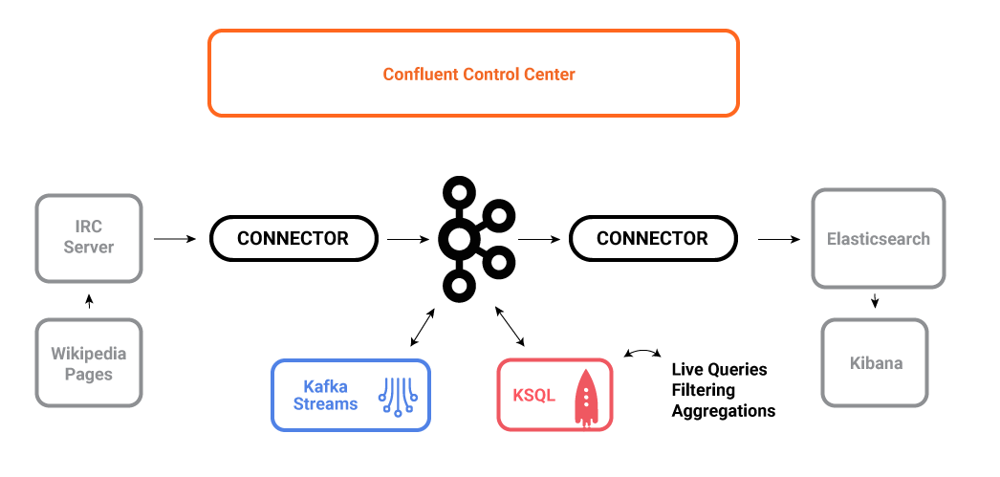

# Monitoring Kafka streaming ETL deployments

This demo shows users how to deploy a Kafka streaming ETL using [KSQL](https://www.confluent.io/product/ksql/) for stream processing and [Confluent Control Center](https://www.confluent.io/product/control-center/) for monitoring. All the components in the Confluent platform have security enabled end-to-end. Run the demo with the [playbook and video tutorials](https://docs.confluent.io/current/tutorials/cp-demo/docs/index.html).

**Table of Contents**

- [Overview](#overview)
- [Documentation](#documentation)

## Overview

The use case is a streaming ETL deployment on live edits to real Wikipedia pages. Wikimedia Foundation has IRC channels that publish edits happening to real wiki pages (e.g. #en.wikipedia, #en.wiktionary) in real time. Using [Kafka Connect](http://docs.confluent.io/current/connect/index.html), a Kafka source connector [kafka-connect-irc](https://github.com/cjmatta/kafka-connect-irc) streams raw messages from these IRC channels, and a custom Kafka Connect transform [kafka-connect-transform-wikiedit](https://github.com/cjmatta/kafka-connect-transform-wikiedit) transforms these messages and then the messages are written to a Kafka cluster. This demo uses [KSQL](https://www.confluent.io/product/ksql/) for data enrichment, or you can optionally develop and run your own [Kafka Streams](http://docs.confluent.io/current/streams/index.html) application. Then a Kafka sink connector [kafka-connect-elasticsearch](http://docs.confluent.io/current/connect/connect-elasticsearch/docs/elasticsearch_connector.html) streams the data out of Kafka, applying another custom Kafka Connect transform called NullFilter. The data is materialized into [Elasticsearch](https://www.elastic.co/products/elasticsearch) for analysis by [Kibana](https://www.elastic.co/products/kibana).

## Documentation

You can find the documentation for running this demo, playbook, and video tutorials at [https://docs.confluent.io/current/tutorials/cp-demo/docs/index.html](https://docs.confluent.io/current/tutorials/cp-demo/docs/index.html).
