**Table of Contents**

- [Overview](#overview)
- [Installation](#installation)
- [Start demo](#run-demo)
- [Playbook](#playbook)
    * [Tour of Confluent Control Center](#tour-of-confluent-control-center)
    * [KSQL](#ksql)
    * [Consumer rebalances](#consumer-rebalances)
    * [Slow consumers](#slow-consumers)
    * [Over consumption](#over-consumption)
    * [Under consumption](#under-consumption)
    * [Failed broker](#failed-broker)
    * [Alerting](#alerting)
    * [Security](#security)
    * [Replicator](#replicator)
- [Troubleshooting the demo](#troubleshooting-the-demo)
- [Teardown](#teardown)


## Overview

This demo shows users how to monitor secure Kafka streaming ETL deployments using [Confluent Control Center](http://docs.confluent.io/current/control-center/docs/index.html). Follow along with the playbook in this README and watch the video tutorials.

The use case is a streaming pipeline built around live edits to real Wikipedia pages. Wikimedia Foundation has IRC channels that publish edits happening to real wiki pages (e.g. #en.wikipedia, #en.wiktionary) in real time. Using [Kafka Connect](http://docs.confluent.io/current/connect/index.html), a Kafka source connector [kafka-connect-irc](https://github.com/cjmatta/kafka-connect-irc) streams raw messages from these IRC channels, and a custom Kafka Connect transform [kafka-connect-transform-wikiedit](https://github.com/cjmatta/kafka-connect-transform-wikiedit) transforms these messages and then the messages are written to Kafka. This demo uses [KSQL](https://github.com/confluentinc/ksql) for data enrichment, or you can optionally develop and run your own [Kafka Streams](http://docs.confluent.io/current/streams/index.html) application. Then a Kafka sink connector [kafka-connect-elasticsearch](http://docs.confluent.io/current/connect/connect-elasticsearch/docs/elasticsearch_connector.html) streams the data out of Kafka, applying another custom Kafka Connect transform called NullFilter. The data is materialized into [Elasticsearch](https://www.elastic.co/products/elasticsearch) for analysis by [Kibana](https://www.elastic.co/products/kibana).

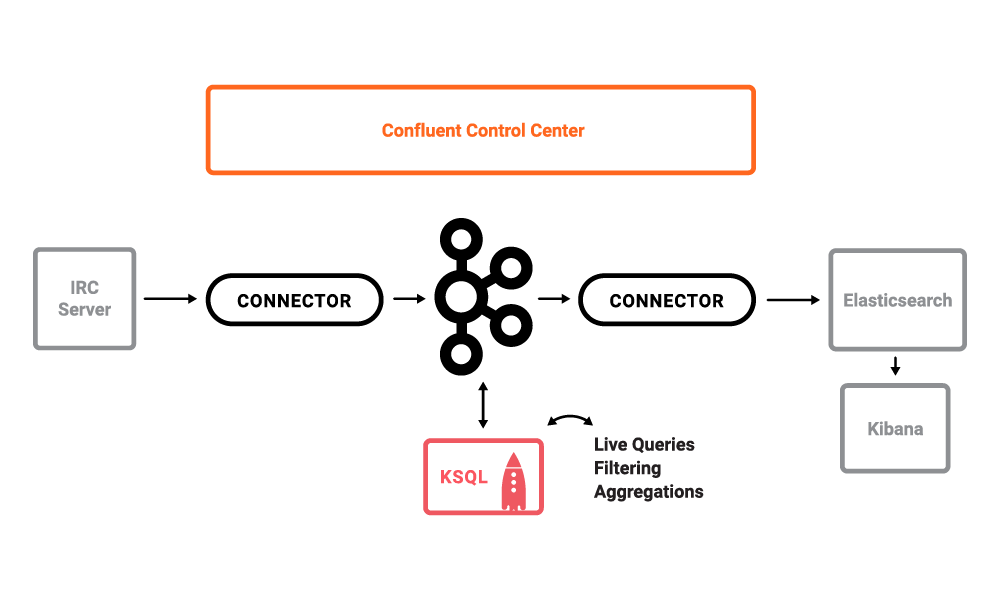

_Note_: this is a Docker environment and has all services running on one host. This demo is not to be used in production; this is exclusively to easily demo the Confluent Platform. In production, Confluent Control Center should be deployed with a valid license and with its own dedicated metrics cluster, separate from the cluster with production traffic. Using a dedicated metrics cluster is more resilient because it continues to provide system health monitoring even if the production traffic cluster experiences issues.

## Installation

Follow along with the video [](https://youtu.be/a4B5Oer1j2A)

This demo has been verified with:

* Docker version 17.06.1-ce
* Docker Compose version 1.14.0 with Docker Compose file format 2.1
* Java version 1.8.0_92
* MacOS 10.12


1. Download the repository with `git clone`:

	```
	$ git clone https://github.com/confluentinc/cp-demo
	```

2. From the `cp-demo` directory, generate certs used for security.

	```bash
        $ (cd security && ./create-certs.sh)
	```

3. In the advanced Docker preferences settings, increase the memory available to Docker to at least 8GB (default is 2GB).


## Run demo

1. Start Docker Compose. It will take about 2 minutes for all containers to start and for Confluent Control Center GUI to be ready.

	```bash
	$ docker-compose up -d
	```

2. Verify the status of the Docker containers show `Up` state, except for the `kafka-client` container which is expected to have `Exit 0` state. If any containers are not up, verify in the advanced Docker preferences settings that the memory available to Docker is at least 8GB (default is 2GB).

	```bash
	$ docker-compose ps
	         Name                        Command               State                              Ports                            
	------------------------------------------------------------------------------------------------------------------------------
	cpdemo_connect_1          /etc/confluent/docker/run        Up       0.0.0.0:8083->8083/tcp, 9091/tcp                           
	cpdemo_control-center_1   /etc/confluent/docker/run        Up       0.0.0.0:9021->9021/tcp                                     
	cpdemo_elasticsearch_1    /bin/bash bin/es-docker          Up       0.0.0.0:9200->9200/tcp, 0.0.0.0:9300->9300/tcp             
	cpdemo_kafka-client_1     bash -c echo Waiting for K ...   Exit 0                                                              
	cpdemo_kafka1_1           /etc/confluent/docker/run        Up       0.0.0.0:29091->29091/tcp, 0.0.0.0:9091->9091/tcp           
	cpdemo_kafka2_1           /etc/confluent/docker/run        Up       0.0.0.0:29092->29092/tcp, 9091/tcp, 0.0.0.0:9092->9092/tcp 
	cpdemo_kibana_1           /bin/sh -c /usr/local/bin/ ...   Up       0.0.0.0:5601->5601/tcp                                     
	cpdemo_ksql-cli_1         perl -e while(1){ sleep 99 ...   Up       0.0.0.0:9098->9098/tcp                                     
	cpdemo_schemaregistry_1   /etc/confluent/docker/run        Up       0.0.0.0:8081->8081/tcp                                     
	cpdemo_zookeeper_1        /etc/confluent/docker/run        Up       0.0.0.0:2181->2181/tcp, 2888/tcp, 3888/tcp    
	```

3. Wait till Confluent Control Center is running fully. Verify when it's ready when the logs show the following event

	```bash
	$ docker-compose logs -f control-center | grep -e "Started NetworkTrafficServerConnector"
	control-center_1       | [2017-09-06 16:37:33,133] INFO Started NetworkTrafficServerConnector@26a529dc{HTTP/1.1}{0.0.0.0:9021} (org.eclipse.jetty.server.NetworkTrafficServerConnector)
	```

4. Decide how you want to run the rest of the demo, with or without KSQL. The reason there are two ways to run the demo is because KSQL does not support Avro with [Schema Registry](http://docs.confluent.io/current/schema-registry/docs/index.html) at this time. When KSQL supports Avro with Schema Registry, we will collapse the workflows into one.

	```bash
	# With KSQL: data streams from Wikipedia IRC to KSQL to Elasticsearch. The Kafka source and sink connectors use Json
	$ export DEMOPATH=scripts_ksql
	```

	```bash
	# Without KSQL: data streams straight through Kafka from Wikipedia IRC to Elasticsearch without KSQL. The Kafka source and sink connectors use Avro with Confluent Schema Registry
	$ export DEMOPATH=scripts_pipeline
	```

5. Setup the cluster and connectors

	```bash
	$ ./$DEMOPATH/setup.sh
	```

6. Use Google Chrome to view the Confluent Control Center GUI at [http://localhost:9021](http://localhost:9021). 

	Click on the top right button that shows the current date, and change `Last 4 hours` to `Last 30 minutes`.

7. View the data in the Kibana dashboard at [http://localhost:5601/app/kibana#/dashboard/Wikipedia](http://localhost:5601/app/kibana#/dashboard/Wikipedia)


## Playbook

### Tour of Confluent Control Center

Follow along with the video [](https://youtu.be/D9nzAxxIv7A)

1. __**Monitoring --> System Health**__: Confluent Control Center landing page shows the overall [system health](https://docs.confluent.io/current/control-center/docs/systemhealth.html) of a given Kafka cluster. For capacity planning activities, view cluster utilization:

	* CPU: look at network and thread pool usage, produce and fetch request latencies 
	* Network utilization: look at throughput per broker or per cluster
	* Disk utilization: look at disk space used by all log segments, per broker

	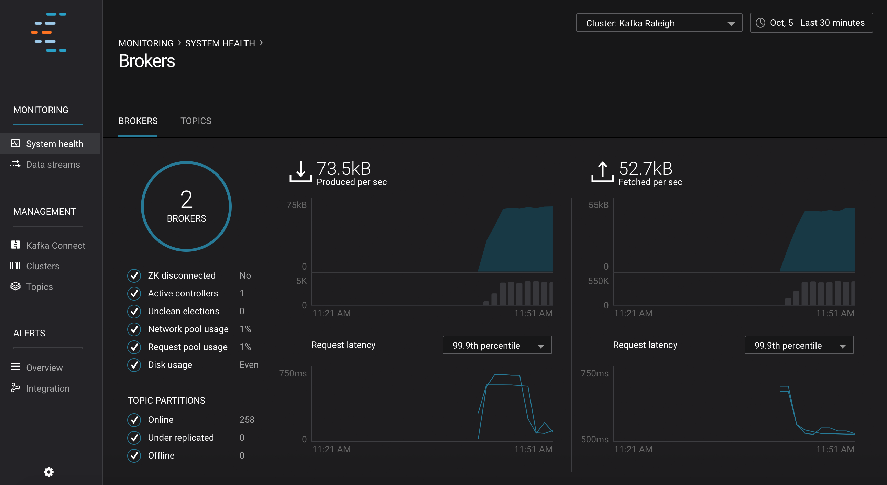

2. __**Management --> Kafka Connect**__: Confluent Control Center uses the Kafka Connect API to manage [Kafka connectors](https://docs.confluent.io/current/control-center/docs/connect.html). 

	* Kafka Connect **Sources** tab shows the connector `wikipedia-irc`. Click `Edit` to see the details of the connector configuration and custom transforms.

		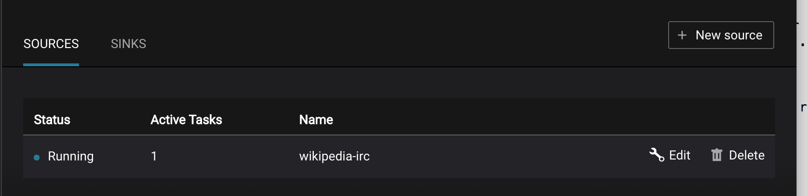

	* Kafka Connect **Sinks** tab shows the connector `elasticsearch-ksql` (or `elasticsearch-pipeline` if you are running without KSQL). Click `Edit` to see the details of the connector configuration and custom transforms.

		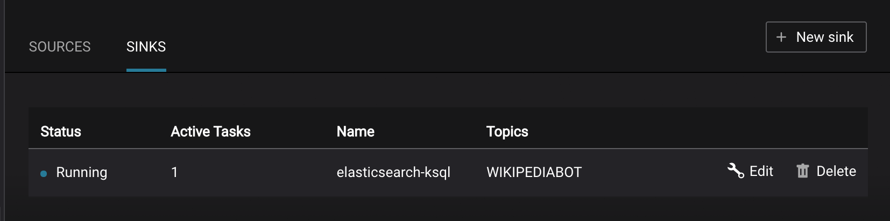

6. __**Monitoring --> Data Streams --> Message Delivery**__: hover over any chart to see number of messages and average latency within a minute time interval.

	

	The Kafka Connect sink connector has a corresponding consumer group `connect-elasticsearch-ksql` consuming from the configured Kafka topic. This consumer group will be in the consumer group statistics in the [stream monitoring](https://docs.confluent.io/current/control-center/docs/monitoring.html) charts.

	

5. __**Management --> Topics --> Topic Information**__: For a given topic, click on the three dots `...` next to the topic name and click on `View details`. View which brokers are leaders for which partitions and the number of consumer groups currently consuming from this topic. Click on the boxed consumer group count to select a consumer group for which to monitor its data streams and jump to it.

	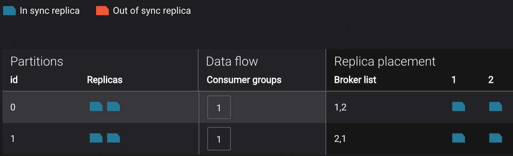

7. __**Monitoring --> System Health**__: to identify bottlenecks, you can see a breakdown of produce and fetch latencies through the entire [request lifecycle](https://docs.confluent.io/current/control-center/docs/systemhealth.html). Click on the line graph in the `Request latency` chart. The request latency values can be shown at the median, 95th, 99th, or 99.9th percentile. Depending on where the bottlenecks are, you can tune your brokers and clients appropriately.

	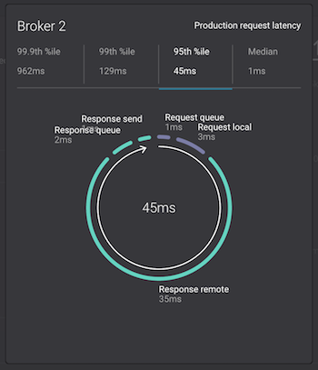


### KSQL

Follow along with the video [](https://youtu.be/U_ntFVXWBPc)

If you ran the demo with KSQL, i.e. `DEMOPATH=scripts_ksql`, then there are additional things you can look at. If you did not run the demo with KSQL, skip this section.

1. Run KSQL CLI to get more information on the queries, streams, and tables.

	```bash
	$ docker-compose exec ksql-cli ksql-cli remote http://localhost:8080
	...
	ksql> SHOW QUERIES;
	ksql> DESCRIBE WIKIPEDIABOT;
	ksql> SELECT * FROM WIKIPEDIABOT LIMIT 3;
	ksql> DESCRIBE EN_WIKIPEDIA_GT_1;
	ksql> SELECT * FROM EN_WIKIPEDIA_GT_1 LIMIT 3;
	```

	_By default when you run a `SELECT` in KSQL it will return new data that is added. If you want to view data already existing in the topic run this first (once per session):_

		SET 'auto.offset.reset' = 'earliest';

2. __**Monitoring --> Data Streams --> Message Delivery**__: all KSQL queries are materialized in Confluent Control Center as consumer groups with names `ksql_query_`<number>. To correlate these consumer groups to the actual KSQL query, note the query number and query string in the output of:

	```bash
	$ docker-compose exec ksql-cli ksql-cli remote http://localhost:8080 --exec "show queries;"
	```

3. __**Monitoring --> Data Streams --> Message Delivery**__: graphs for consumer groups `EN_WIKIPEDIA_GT_1_COUNTS-consumer` and `ksql_query_5` are displaying data at intervals instead of smoothly like the other consumer groups. This is because Confluent Control Center displays data based on message timestamps, and this particular stream of a data is a tumbling window with a window size of 5 minutes. Thus all its message timestamps are marked to the beginning of each 5-minute window and this is why the latency for these streams appears to be high. Kafka streaming tumbling windows are working as designed and Confluent Control Center is reporting them accurately.

	


### Consumer rebalances

Follow along with the video [](https://youtu.be/2Egh3I0q4dE)

Control Center shows which consumers in a consumer group are consuming from which partitions and on which brokers those partitions reside. Control Center updates as consumer rebalances occur in a consumer group.

1. Start consuming from topic `wikipedia.parsed` with a new consumer group `app` with one consumer `consumer_app_1`. It will run in the background.

	```bash
	$ ./$DEMOPATH/start_consumer_app.sh 1
	```

2. Let this consumer group run for 2 minutes until Control Center stream monitoring shows the consumer group `app` with steady consumption. Click on the box `View Details` above the bar graph to drill down into consumer group details. This consumer group `app` has a single consumer `consumer_app_1` consuming all of the partitions in the topic `wikipedia.parsed`. The first bar may be red because the consumer started in the middle of a time window and did not receive all messages produced during that window. This does not mean messages were lost.

	

3. Add a second consumer `consumer_app_2` to the existing consumer group `app`.

	```bash
	$ ./$DEMOPATH/start_consumer_app.sh 2
	```

4. Let this consumer group run for 2 minutes until Control Center stream monitoring shows the consumer group `app` with steady consumption. Notice that the consumers `consumer_app_1` and `consumer_app_2` now share consumption of the partitions in the topic `wikipedia.parsed`. When the second consumer was added, that bar may be red for both consumers because a consumer rebalance occurred during that time window. This does not mean messages were lost, as you can confirm at the consumer group level.

	


### Slow consumers

Follow along with the video [](https://youtu.be/HPIskKJjmNU)

Streams monitoring in Control Center can highlight consumers that are slow to keep up with the producers. This is critial to monitor for real-time applications where consumers should consume produced messages with as low latency as possible. To simulate a slow consumer, we will use Kafka's [quota feature](https://docs.confluent.io/current/kafka/post-deployment.html#enforcing-client-quotas) to rate-limit consumption from the broker side, for just one of two consumers in a consumer group.

1. Click on `Data streams`, and `View Details` for the consumer group `app`. Click on the left-hand blue circle on the consumption line to verify there are two consumers `consumer_app_1` and `consumer_app_2`, that were created in an earlier section. If these two consumers are not running, start them as described in the section [consumer rebalances](#consumer-rebalances).

	

2. Let this consumer group run for 2 minutes until Control Center stream monitoring shows the consumer group `app` with steady consumption.

3. Add a consumption quota for one of the consumers in the consumer group `app`.

	```bash
	$ ./$DEMOPATH/throttle_consumer.sh 1 add
	```

	_Note_: you are running a Docker demo environment with all services running on one host, which you would never do in production. Depending on your system resource availability, sometimes applying the quota may stall the consumer ([KAFKA-5871](https://issues.apache.org/jira/browse/KAFKA-5871)), thus you may need to adjust the quota rate. See the `./$DEMOPATH/throttle_consumer.sh` script for syntax on modifying the quota rate.

	* If consumer group `app` does not increase latency, decrease the quota rate
	* If consumer group `app` seems to stall, increase the quota rate

4. View the details of the consumer group `app` again, `consumer_app_1` now shows high latency, and `consumer_app_2` shows normal latency.

	

5. In the System Health dashboard, you see that the fetch request latency has likewise increased. This is the because the broker that has the partition that `consumer_app_1` is consuming from is taking longer to service requests.

	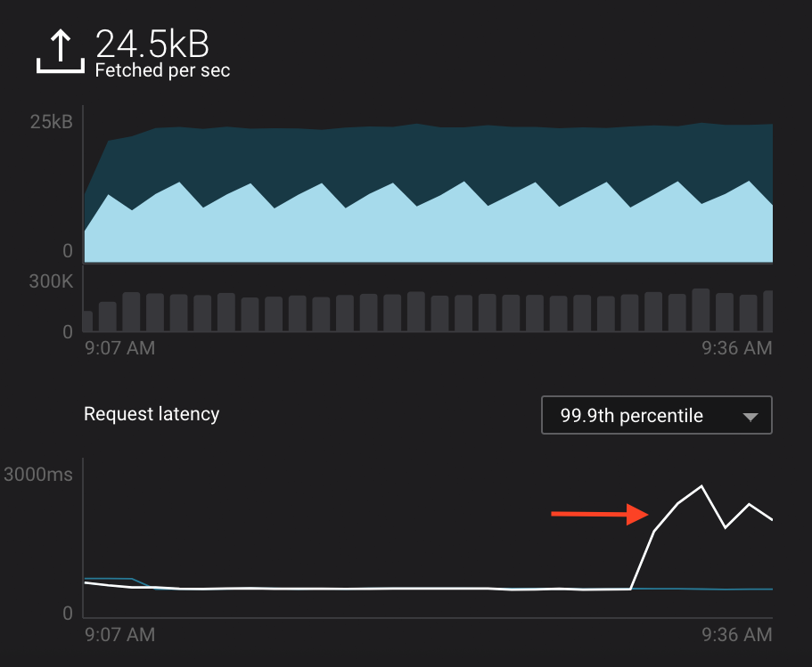

6. Click on the fetch request latency line graph to see a breakdown of produce and fetch latencies through the entire [request lifecycle](https://docs.confluent.io/current/control-center/docs/systemhealth.html). The middle number does not necessarily equal the sum of the percentiles of individual segments because it is the total percentile latency.

	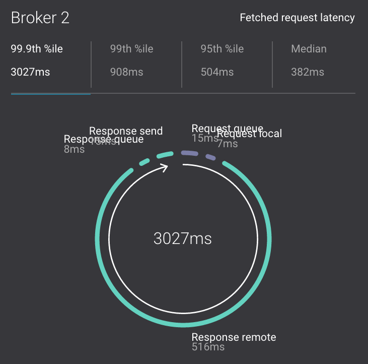

7. Remove the consumption quota for the consumer. Latency for `consumer_app_1` recovers to steady state values.

	```bash
	$ ./$DEMOPATH/throttle_consumer.sh 1 delete
	```

### Over consumption

Follow along with the video [](https://youtu.be/ZYnoG59xNCI)

Streams monitoring in Control Center can highlight consumers that are over consuming some messages, which is an indication that consumers are processing a set of messages more than once. This may happen intentionally, for example an application with a software bug consumed and processed Kafka messages incorrectly, got a fix, and then reprocesses previous messages correctly. This may also happen unintentionally if an application crashes before committing processed messages. To simulate over consumption, we will use Kafka's consumer offset reset tool to set the offset of the consumer group `app` to an earlier offset, thereby forcing the consumer group to reconsume messages it has previously read.

1. Click on `Data streams`, and `View Details` for the consumer group `app`. Click on the blue circle on the consumption line on the left to verify there are two consumers `consumer_app_1` and `consumer_app_2`, that were created in an earlier section. If these two consumers are not running and were never started, start them as described in the section [consumer rebalances](#consumer-rebalances).

	

2. Let this consumer group run for 2 minutes until Control Center stream monitoring shows the consumer group `app` with steady consumption.

3. Stop the consumer group `app` to stop consuming from topic `wikipedia.parsed`. Note that the command below stops the consumers gracefully with `kill -15`, so the consumers follow the shutdown sequence.

	```bash
	$ ./$DEMOPATH/stop_consumer_app_group_graceful.sh
	```

4. Wait for 2 minutes to let messages continue to be written to the topics for a while, without being consumed by the consumer group `app`. Notice the red bar which highlights that during the time window when the consumer group was stopped, there were some messages produced but not consumed. These messages are not missing, they are just not consumed because the consumer group stopped.

	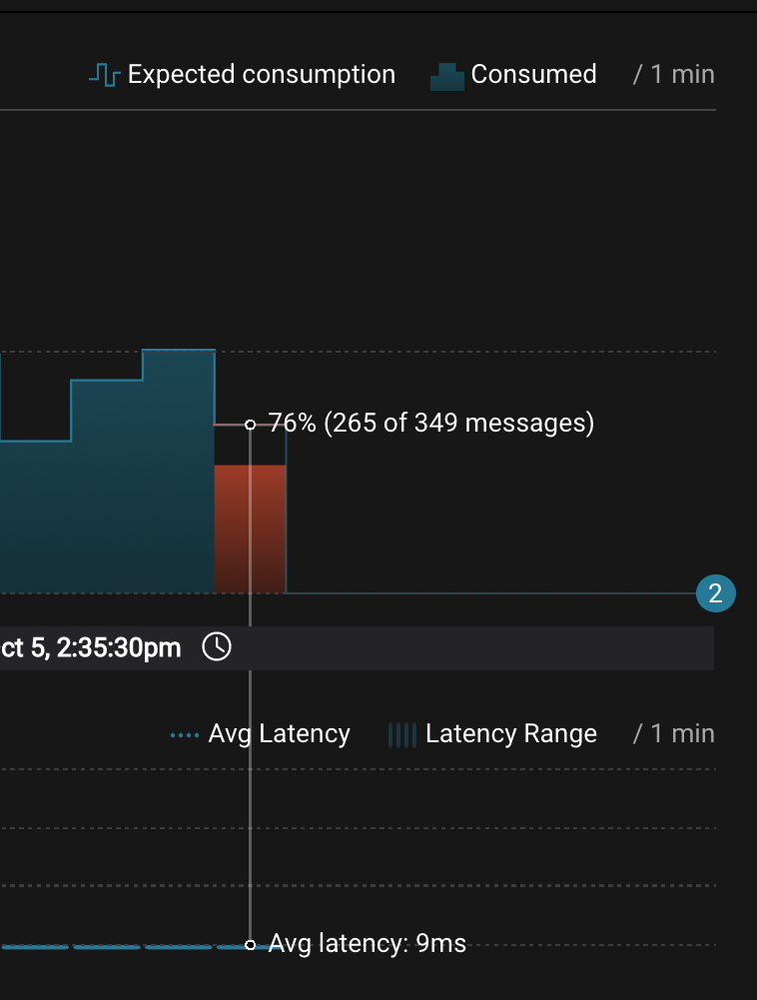

5. Reset the offset of the consumer group `app` by shifting 200 offsets backwards. The offset reset tool must be run when the consumer is completely stopped. Offset values in output shown below will vary.

	```bash
	$ docker-compose exec kafka1 kafka-consumer-groups --reset-offsets --group app --shift-by -200 --bootstrap-server kafka1:10091 --all-topics --execute

	TOPIC                          PARTITION  NEW-OFFSET     
	wikipedia.parsed               1          4071           
	wikipedia.parsed               0          7944 
	```

6. Restart consuming from topic `wikipedia.parsed` with the consumer group `app` with two consumers.

	```bash
	$ ./$DEMOPATH/start_consumer_app.sh 1
	$ ./$DEMOPATH/start_consumer_app.sh 2
	```

7. Let this consumer group run for 2 minutes until Control Center stream monitoring shows the consumer group `app` with steady consumption. Notice several things:

	* Even though the consumer group `app` was not running for some of this time, all messages are shown as delivered. This is because all bars are time windows relative to produce timestamp.
	* For some time intervals, the the bars are red and consumption line is above expected consumption because some messages were consumed twice due to rewinding offsets.
	* The latency peaks and then gradually decreases, because this is also relative to the produce timestamp.

	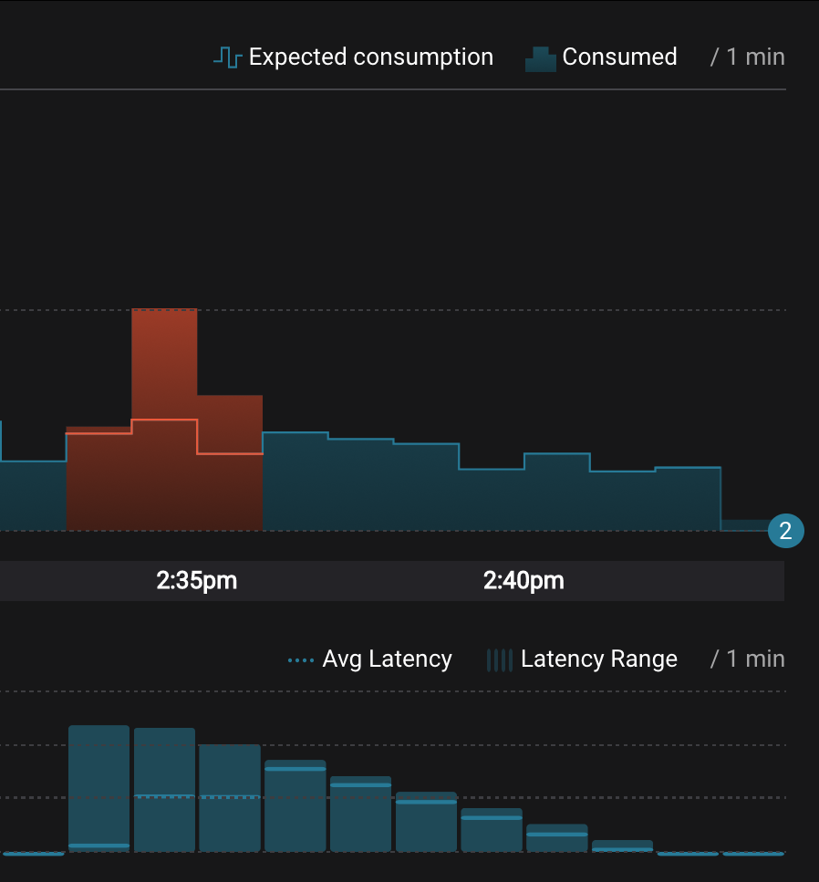


### Under consumption

Follow along with the video [](https://youtu.be/d0tZS5FxdM0)

Streams monitoring in Control Center can highlight consumers that are under consuming some messages. This may happen intentionally when consumers stop and restart and operators change the consumer offsets to the latest offset. This avoids delay processing messages that were produced while the consumers were stopped, especially when they care about real-time. This may also happen unintentionally if a consumer is offline for longer than the log retention period, or if a producer is configured for `acks=0` and a broker suddenly fails before having a chance to replicate data to other brokers. To simulate under consumption, we will use Kafka's consumer offset reset tool to set the offset of the consumer group `app` to the latest offset, thereby skipping messages that will never be read.

1. Click on Data Streams, and `View Details` for the consumer group `app`. Click on the blue circle on the consumption line on the left to verify there are two consumers `consumer_app_1` and `consumer_app_2`, that were created in an earlier section. If these two consumers are not running and were never started, start them as described in the section [consumer rebalances](#consumer-rebalances).

	

2. Let this consumer group run for 2 minutes until Control Center stream monitoring shows the consumer group `app` with steady consumption.

3. Stop the consumer group `app` to stop consuming from topic `wikipedia.parsed`. Note that the command below stops the consumers ungracefully with `kill -9`, so the consumers did not follow the shutdown sequence.

	```bash
	$ ./$DEMOPATH/stop_consumer_app_group_ungraceful.sh
	```

4. Wait for 2 minutes to let messages continue to be written to the topics for a while, without being consumed by the consumer group `app`. Notice the red bar which highlights that during the time window when the consumer group was stopped, there were some messages produced but not consumed. These messages are not missing, they are just not consumed because the consumer group stopped.

	

5. Wait for another few minutes and notice that the bar graph changes and there is a [herringbone](https://docs.confluent.io/current/control-center/docs/monitoring.html#missing-metrics-data) pattern to indicate that perhaps the consumer group stopped ungracefully.

	

6. Reset the offset of the consumer group `app` by setting it to latest offset. The offset reset tool must be run when the consumer is completely stopped. Offset values in output shown below will vary.

	```bash
	$ docker-compose exec kafka1 kafka-consumer-groups --reset-offsets --group app --to-latest --bootstrap-server kafka1:10091 --all-topics --execute

	TOPIC                          PARTITION  NEW-OFFSET     
	wikipedia.parsed               1          8601           
	wikipedia.parsed               0          15135
	```

7. Restart consuming from topic `wikipedia.parsed` with the consumer group `app` with two consumers.

	```bash
	$ ./$DEMOPATH/start_consumer_app.sh 1
	$ ./$DEMOPATH/start_consumer_app.sh 2
	```

8. Let this consumer group run for 2 minutes until Control Center stream monitoring shows the consumer group `app` with steady consumption. Notice that during the time period that the consumer group `app` was not running, no produced messages are shown as delivered.

	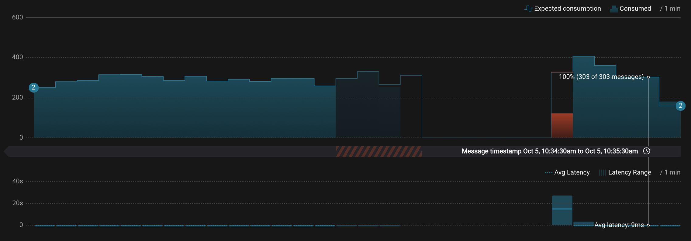


### Failed broker

Follow along with the video [](https://youtu.be/oxr1X0t5pLg)

To simulate a failed broker, stop the Docker container running one of the two Kafka brokers.

1. Stop the Docker container running Kafka broker 2.

	```bash
	$ docker-compose stop kafka2
	```

2. After a few minutes, observe the System Health shows the broker count has gone down from 2 to 1, and there are many under replicated partitions.

	

3. View topic details to see that there are out of sync replicas on broker 2.

	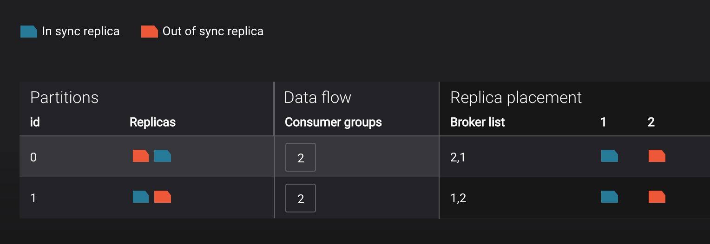

4. Restart the Docker container running Kafka broker 2.

	```bash
	$ docker-compose start kafka2
	```

5. After about a minute, observe the System Health view in Confluent Control Center. The broker count has recovered to 2, and the topic partitions are back to reporting no under replicated partitions.

	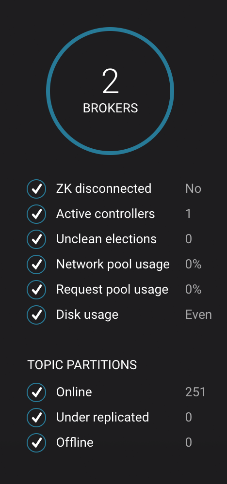

6. Click on the broker count `2` inside the circle to view when the broker counts changed.

	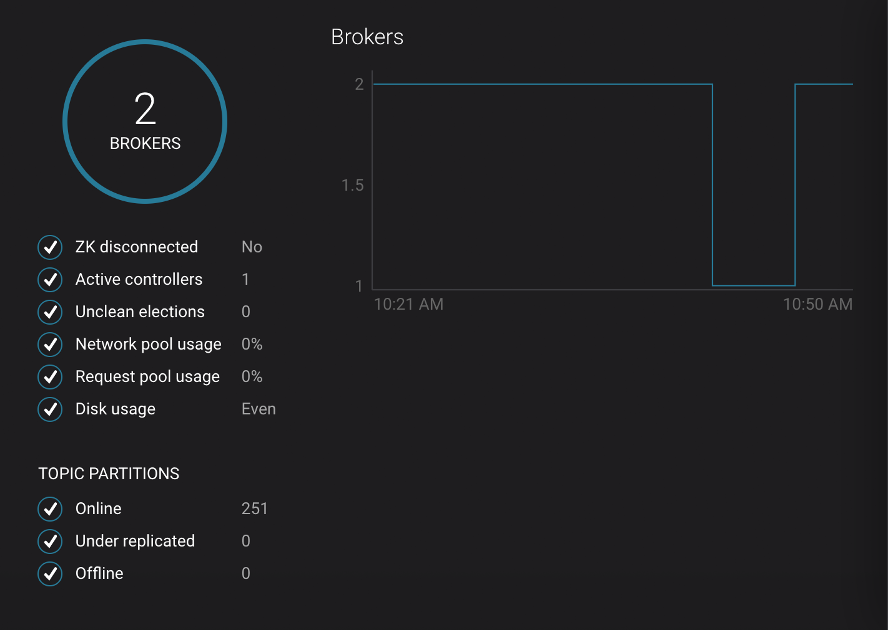


### Alerting

Follow along with the video [](https://youtu.be/523o_S8OOGo)

There are many types of Control Center [alerts](https://docs.confluent.io/current/control-center/docs/alerts.html) and many ways to configure them. Use the Alerts management page to define triggers and actions, or click on a streams monitoring graph for consumer groups or topics to setup alerts from there.

1. This demo already has pre-configured triggers and actions. View the Alerts `Triggers` screen, and click `Edit` against each trigger to see configuration details.

	* The trigger `Under Replicated Partitions` happens when a broker reports non-zero under replicated partitions, and it causes an action `Email Administrator`.
	* The trigger `Consumption Difference` happens when consumption difference for the Elasticsearch connector consumer group is greater than `0`, and it causes an action `Email Administrator`.

	

2. If you followed the steps in the [failed broker](#failed-broker) section, view the Alert history to see that the trigger `Under Replicated Partitions` happened and caused an alert when you stopped broker 2.

3. You can also trigger the `Consumption Difference` trigger. In the Kafka Connect -> Sinks screen, edit the running Elasticsearch sink connector.

4. In the Kafka Connect view, pause the Elasticsearch sink connector by pressing the pause icon in the top right. This will stop consumption for the related consumer group.

	

5. View the Alert history to see that this trigger happened and caused an alert.

	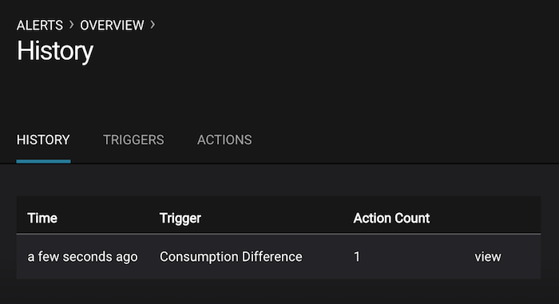

### Security

All the components in this demo are enabled with SSL for encryption and SASL/PLAIN for authentication, except for ZooKeeper which does not support SSL. ACLs are also enabled in the cluster. Read [details](https://docs.confluent.io/current/security.html) to deploy Confluent Platform with SSL, SASL, ACLs, and other security features.

Each broker has four listener ports:

* PLAINTEXT port called `PLAINTEXT` for clients with no security enabled
* SSL port port called `SSL` for clients with just SSL without SASL
* SASL_SSL port called `SASL_SSL` for communication between services inside Docker containers
* SASL_SSL port called `SASL_SSL_HOST` for communication between any potential services outside of Docker that communicate to the Docker containers

|port |kafka1 |kafka2
|-----|-------|------
|PLAINTEXT |10091 |10092
|SSL |11091 |11092
|SASL_SSL |9091 |9092
|SASL_SSL_HOST |29091 |29092

1. Verify the ports on which the Kafka brokers are listening with the following command, and they should match the table shown below:

	```bash
	$ docker-compose logs kafka1 | grep "Registered broker 1"
	$ docker-compose logs kafka2 | grep "Registered broker 2"
	```

2. This demo [automatically generates](security/create-certs.sh) simple SSL certificates and creates keystores, truststores, and secures them with a password. To communicate with the brokers, Kafka clients may use any of the ports on which the brokers are listening. To use a security-enabled port, they must specify security parameters for keystores, trustores, password, or authentication so the Kafka command line client tools pass the security configuration file [with interceptors](security/client_with_interceptors.config) or [without interceptors](security/client_without_interceptors.config) with these security parameters. As an example, to communicate with the Kafka cluster to view all the active consumer groups:

a. Communicate with brokers via the PLAINTEXT port

	# PLAINTEXT port
	$ docker-compose exec kafka1 kafka-consumer-groups --list --bootstrap-server kafka1:10091

b. Communicate with brokers via the SASL_SSL port, and SASL_SSL parameters configured via the `--command-config` argument for command line tools or `--consumer.config` for kafka-console-consumer.

	# SASL_SSL port with SASL_SSL parameters
	$ docker-compose exec kafka1 kafka-consumer-groups --list --bootstrap-server kafka1:9091 --command-config /etc/kafka/secrets/client_without_interceptors.config

c. If you try to communicate with brokers via the SASL_SSL port but don't specify the SASL_SSL parameters, it will fail

	# SASL_SSL port without SASL_SSL parameters
	$ docker-compose exec kafka1 kafka-consumer-groups --list --bootstrap-server kafka1:9091


3. All the components in this demo authenticate with the username ``client``, which is authorized to communicate with the cluster per the ACL configuration parameter ``super.users``. All other clients are not authorized to communicate with the cluster.

a. Consume some messages from topic ``wikipedia.parsed`` using the authorized user ``client``. It should return some messages.

	```bash
	$ ./$DEMOPATH/listen_wikipedia.parsed.sh client
	```

b. Consume some messages from topic ``wikipedia.parsed`` using the unauthorized user ``badclient``. The client should fail with an exception ``org.apache.kafka.common.errors.TopicAuthorizationException: Not authorized to access topics: [wikipedia.parsed]`` and broker's Authorizer logger will log the event.

	```bash
        # The `badclient` access to Kafka fails because `badclient` is unauthorized
	$ ./$DEMOPATH/listen_wikipedia.parsed.sh badclient

        # Authorizer logger logs an event that `badclient` tried to access Kafka
        $ docker-compose logs kafka1 | grep kafka.authorizer.logger
	```

c. Add an ACL that authorizes user ``badclient``, and list the updated ACLs.

	```bash
	$ docker exec cpdemo_connect_1 /usr/bin/kafka-acls --authorizer-properties zookeeper.connect=zookeeper:2181 \
            --add --topic wikipedia.parsed --allow-principal User:badclient --operation Read --group test
        $ docker exec cpdemo_connect_1 /usr/bin/kafka-acls --authorizer-properties zookeeper.connect=zookeeper:2181 \
	    --list --topic wikipedia.parsed
	```

d. Again consume some messages from topic ``wikipedia.parsed`` using the now-authorized user ``badclient``. It should now return some messages.

	```bash
	$ ./$DEMOPATH/listen_wikipedia.parsed.sh badclient
	```

### Replicator

Confluent Replicator copies data from a source Kafka cluster to a destination Kafka cluster. The source and destination clusters are typically different clusters, but in this demo, Replicator is doing intra-cluster replication, _i.e._, the source and destination Kafka clusters are the same. As with the rest of the components in the solution, Confluent Replicator is also configured with security.

1. __**Monitoring --> Data Streams --> Message Delivery**__: monitor throughput and latency of Confluent Replicator in the Data streams monitoring view. Replicator is a Kafka Connect source connector and has a corresponding consumer group `connect-replicator`.

	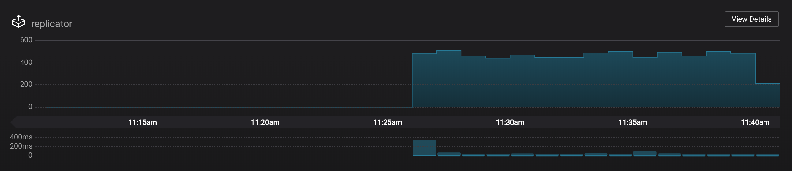

2. __**Management --> Topics**__: scroll down to view the topics called `wikipedia.parsed` (Replicator is consuming data from this topic) and `wikipedia.parsed.replica` (Replicator is copying data to this topic). Click on `Consumer Groups` for the topic `wikipedia.parsed` and observe that one of the consumer groups is called `connect-replicator`.

	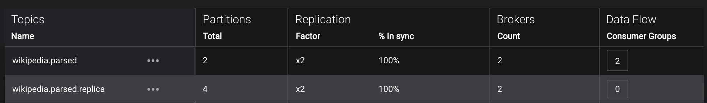

3. __**Management --> Kafka Connect**__: pause the Replicator connector by pressing the pause icon in the top right. This will stop consumption for the related consumer group.

	

4. Observe that the `connect-replicator` consumer group has stopped consumption.

	

5. Restart the Replicator connector.

6. Observe that the `connect-replicator` consumer group has resumed consumption. Notice several things:

        * Even though the consumer group `connect-replicator` was not running for some of this time, all messages are shown as delivered. This is because all bars are time windows relative to produce timestamp.
        * The latency peaks and then gradually decreases, because this is also relative to the produce timestamp.


## Troubleshooting the demo

1. To view live messages from the `wikipedia.parsed` topic:

	```bash
	$ ./$DEMOPATH/listen_wikipedia.parsed.sh
	```

2. If the data streams monitoring appears to stop for the Kafka source connector, restart the connect container.

	```bash
	$ docker-compose restart connect
	```

## Teardown

1.  Stop the consumer group `app` to stop consuming from topic `wikipedia.parsed`. Note that the command below stops the consumers gracefully with `kill -15`, so the consumers follow the shutdown sequence.

	```bash
	$ ./$DEMOPATH/stop_consumer_app_group_graceful.sh
	```

2. Stop the Docker demo, destroy all components and clear all Docker volumes.

	```bash
	$ ./$DEMOPATH/reset_demo.sh
	```
