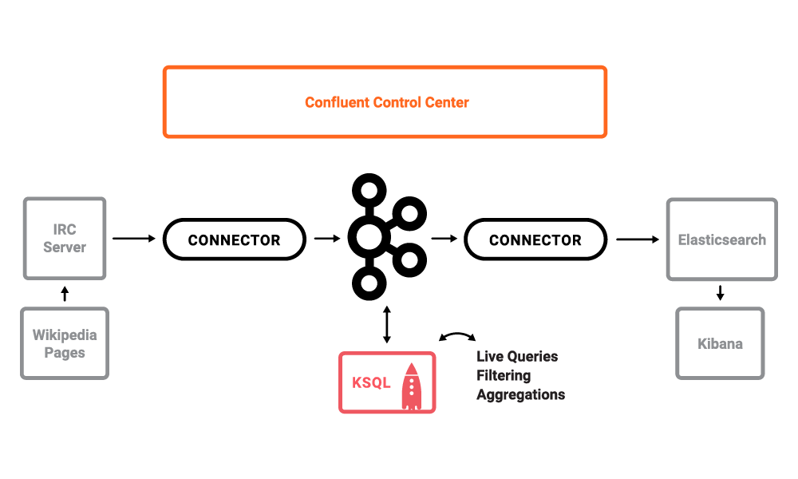
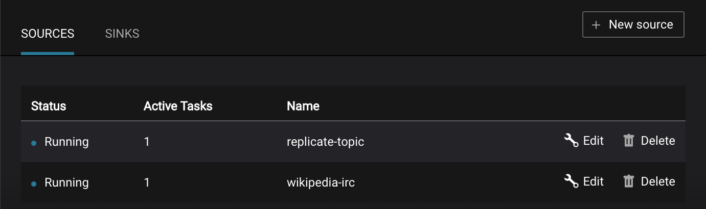
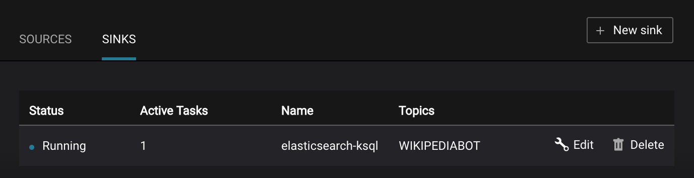

**Table of Contents**

- [Overview](#overview)
- [Installation](#installation)
- [Start demo](#run-demo)
- [Playbook](#playbook)
    * [Tour of Confluent Control Center](#tour-of-confluent-control-center)
    * [KSQL](#ksql)
    * [Consumer rebalances](#consumer-rebalances)
    * [Slow consumers](#slow-consumers)
    * [Over consumption](#over-consumption)
    * [Under consumption](#under-consumption)
    * [Failed broker](#failed-broker)
    * [Alerting](#alerting)
- [View topic data](#view-topic-data)
- [Teardown](#teardown)


## Overview

This demo shows users how to monitor Kafka streaming ETL deployments using [Confluent Control Center](http://docs.confluent.io/current/control-center/docs/index.html).

The use case is a streaming pipeline built around live edits to real Wikipedia pages. Wikimedia Foundation has IRC channels that publish edits happening to real wiki pages (e.g. #en.wikipedia, #en.wiktionary) in real time. Using [Kafka Connect](http://docs.confluent.io/current/connect/index.html), a Kafka source connector [kafka-connect-irc](https://github.com/cjmatta/kafka-connect-irc) streams raw messages from these IRC channels, and a custom Kafka Connect transform [kafka-connect-transform-wikiedit](https://github.com/cjmatta/kafka-connect-transform-wikiedit) transforms these messages and then the messages are written to Kafka. This demo uses [KSQL](https://github.com/confluentinc/ksql) for data enrichment, or you can optionally develop and run your own [Kafka Streams](http://docs.confluent.io/current/streams/index.html) application. Then a Kafka sink connector [kafka-connect-elasticsearch](http://docs.confluent.io/current/connect/connect-elasticsearch/docs/elasticsearch_connector.html) streams the data out of Kafka, applying another custom Kafka Connect transform called NullFilter. The data is materialized into [Elasticsearch](https://www.elastic.co/products/elasticsearch) for analysis by [Kibana](https://www.elastic.co/products/kibana).



_Note_: this is a Docker environment and has all services running on one host. This demo is not to be used in production; this is exclusively to easily demo the Confluent Platform. In production, Confluent Control Center should be deployed with a valid license and with its own dedicated metrics cluster, separate from the cluster with production traffic. Using a dedicated metrics cluster is more resilient because it continues to provide system health monitoring even if the production traffic cluster experiences issues.

## Installation

1. Since this repository uses submodules, `git clone` with the `--recursive` option:

```
$ git clone --recursive git@github.com:confluentinc/cp-demo.git
```

Otherwise, `git clone` and then use the `submodule` commands to initialize and update:

```
$ git clone git@github.com:confluentinc/cp-demo.git
$ cd cp-demo
$ git submodule init
Submodule 'kafka-connect-irc' (https://github.com/cjmatta/kafka-connect-irc) registered for path 'kafka-connect-irc'
Submodule 'kafka-connect-transform-wikiedit' (https://github.com/cjmatta/kafka-connect-transform-wikiedit) registered for path 'kafka-connect-transform-wikiedit'
$ git submodule update
```

2. In the advanced Docker preferences settings, increase the memory available to Docker to at least 8GB (default is 2GB).

3. Run `make clean all` to build the IRC connector and the transformer that will parse the Wikipedia edit messages to data. These are saved to `connect-plugins` path, which is a shared volume to the `connect` docker container.

```bash
$ make clean all
...
$ ls connect-plugins
```

_Note_: If `make` has a `FATAL` error as shown below, it means this git repo was not cloned with the submodules. Please go back to step 1 above and correct this.

```bash
[FATAL] Non-readable POM /private/tmp/cp-demo/kafka-connect-irc/pom.xml: /private/tmp/cp-demo/kafka-connect-irc/pom.xml (No such file or directory)
```

## Run demo

1. Start Docker Compose. It will take about 2 minutes for all containers to start and for Confluent Control Center GUI to be ready.

```bash
$ docker-compose up -d
```

2. Verify the status of the Docker containers show "Up" state, except for the `kafka-client` container which is expected to have "Exit 0" state. If any containers are not up, verify in the advanced Docker preferences settings that the memory available to Docker is at least 8GB (default is 2GB).

```bash
$ docker-compose ps
         Name                        Command               State                              Ports                            
------------------------------------------------------------------------------------------------------------------------------
cpdemo_connect_1          /etc/confluent/docker/run        Up       0.0.0.0:8083->8083/tcp, 9092/tcp                           
cpdemo_control-center_1   /etc/confluent/docker/run        Up       0.0.0.0:9021->9021/tcp                                     
cpdemo_elasticsearch_1    /bin/bash bin/es-docker          Up       0.0.0.0:9200->9200/tcp, 0.0.0.0:9300->9300/tcp             
cpdemo_kafka-client_1     bash -c echo Waiting for K ...   Exit 0                                                              
cpdemo_kafka1_1           /etc/confluent/docker/run        Up       0.0.0.0:29092->29092/tcp, 0.0.0.0:9092->9092/tcp           
cpdemo_kafka2_1           /etc/confluent/docker/run        Up       0.0.0.0:29093->29093/tcp, 9092/tcp, 0.0.0.0:9093->9093/tcp 
cpdemo_kibana_1           /bin/sh -c /usr/local/bin/ ...   Up       0.0.0.0:5601->5601/tcp                                     
cpdemo_ksql-cli_1         perl -e while(1){ sleep 99 ...   Up       0.0.0.0:9098->9098/tcp                                     
cpdemo_schemaregistry_1   /etc/confluent/docker/run        Up       0.0.0.0:8081->8081/tcp                                     
cpdemo_zookeeper_1        /etc/confluent/docker/run        Up       0.0.0.0:2181->2181/tcp, 2888/tcp, 3888/tcp    
```

3. Wait till Confluent Control Center is running fully. Verify when it's ready when the logs show the following event

```bash
$ docker-compose logs -f control-center | grep -e HTTP
control-center_1       | [2017-09-06 16:37:33,133] INFO Started NetworkTrafficServerConnector@26a529dc{HTTP/1.1}{0.0.0.0:9021} (org.eclipse.jetty.server.NetworkTrafficServerConnector)
```

4. Decide how you want to run the rest of the demo, without or with KSQL. The reason there are two ways to run the demo is because KSQL does not support Avro with [Schema Registry](http://docs.confluent.io/current/schema-registry/docs/index.html) at this time. When KSQL supports Avro with Schema Registry, we will collapse the workflows into one.

```bash
# Without KSQL: data streams straight through Kafka from Wikipedia IRC to Elasticsearch without KSQL. The Kafka source and sink connectors use Avro with Confluent Schema Registry
$ export DEMOPATH=scripts_pipeline
```

```bash
# With KSQL: data streams from Wikipedia IRC to KSQL to Elasticsearch. The Kafka source and sink connectors use Json instead of Avro
$ export DEMOPATH=scripts_ksql
```

5. Setup the cluster and connectors

```bash
$ ./$DEMOPATH/setup.sh
```

6. Use Google Chrome to view the Confluent Control Center GUI at [http://localhost:9021](http://localhost:9021). Click on the top right button that shows the current date, and change `Last 4 hours` to `Last 30 minutes`.

7. View the data in the Kibana dashboard at [http://localhost:5601/app/kibana#/dashboard/Wikipedia](http://localhost:5601/app/kibana#/dashboard/Wikipedia)


## Playbook

### Tour of Confluent Control Center

1. __**Monitoring --> System Health**__: Confluent Control Center landing page shows the overall [system health](https://docs.confluent.io/current/control-center/docs/systemhealth.html) of a given Kafka cluster. For capacity planning activities, view cluster utilization:

* CPU: look at network and thread pool usage, produce and fetch request latencies 
* Network utilization: look at throughput per broker or per cluster
* Disk utilization: look at disk space used by all log segments, per broker


2. __**Management --> Kafka Connect**__: Confluent Control Center uses the Kafka Connect API to manage [Kafka connectors](https://docs.confluent.io/current/control-center/docs/connect.html). Kafka Connect Sources tab shows the connector `wikipedia-irc`. Click "Edit" to see the details of the connector configuration and custom transforms.



3. Kafka Connect Sinks tab shows the connector `elasticsearch-ksql` (or `elasticsearch-pipeline` if you are running without KSQL). Click "Edit" to see the details of the connector configuration and custom transforms.



4. __**Monitoring --> Data Streams --> Message Delivery**__: The Kafka Connect sink connector has a corresponding consumer group `connect-elasticsearch-ksql` consuming from the configured Kafka topic. This consumer group will be in the consumer group statistics in the [stream monitoring](https://docs.confluent.io/current/control-center/docs/monitoring.html) charts.


5. __**Management --> Topics --> Topic Information**__: For a given topic, click on the three dots "..." next to the topic name and click on "View details". View which brokers are leaders for which partitions and the number of consumer groups currently consuming from this topic. Click on the boxed consumer group count to select a consumer group for which to monitor its data streams and jump to it.


6. __**Monitoring --> Data Streams --> Message Delivery**__: hover over any chart to see number of messages and average latency within a minute time interval.


7. __**Monitoring --> System Health**__: to identify bottlenecks, you can see a breakdown of produce and fetch latencies through the entire [request lifecycle](https://docs.confluent.io/current/control-center/docs/systemhealth.html). Click on the line graph in the "Request latency" chart. The request latency values can be shown at the median, 95th, 99th, or 99.9th percentile. Depending on where the bottlenecks are, you can tune your brokers and clients appropriately.


### KSQL

If you ran the demo with KSQL, i.e. `DEMOPATH=scripts_ksql`, then there are additional things you can look at. If you did not run the demo with KSQL, skip this section.

1. Run KSQL CLI to get more information on the queries, streams, and tables.

```bash
$ docker-compose exec ksql-cli ksql-cli remote http://localhost:8080
...
ksql> show queries;
ksql> describe wikipediabot;
ksql> select * from wikipediabot limit 3;
ksql> describe en_wikipedia_gt_1;
ksql> select * from en_wikipedia_gt_1 limit 3;
```

2. __**Monitoring --> Data Streams --> Message Delivery**__: all KSQL queries are materialized in Confluent Control Center as consumer groups with names `ksql_query_`<number>. To correlate these consumer groups to the actual KSQL query, note the query number and query string in the output of:

```bash
$ docker-compose exec ksql-cli ksql-cli remote http://localhost:8080 --exec "show queries;"
```

3. __**Monitoring --> Data Streams --> Message Delivery**__: graphs for consumer groups `EN_WIKIPEDIA_GT_1_COUNTS-consumer` and `ksql_query_5` are displaying data at intervals instead of smoothly like the other consumer groups. This is because Confluent Control Center displays data based on message timestamps, and this particular stream of a data is a tumbling window with a window size of 5 minutes. Thus all its message timestamps are marked to the beginning of each 5-minute window and this is why the latency for these streams appears to be high. Kafka streaming tumbling windows are working as designed and Confluent Control Center is reporting them accurately.


### Consumer rebalances

Control Center shows which consumers in a consumer group are consuming from which partitions and on which brokers those partitions reside. Control Center updates as consumer rebalances occur in a consumer group.

1. If your consumer group `app` is not running, start consuming from topic `wikipedia.parsed` with a new consumer group `app` with one consumer `consumer_app_1`. It will run in the background.

```bash
$ ./$DEMOPATH/start_consumer_app.sh 1
```

2. Let this consumer group run for 2 minutes until Control Center stream monitoring shows the consumer group `app` with steady consumption. Click on the box "View Details" above the bar graph to drill down into consumer group details. This consumer group `app` has a single consumer `consumer_app_1` consuming all of the partitions in the topic `wikipedia.parsed`. The first bar may be red because the consumer started in the middle of a time window and did not receive all messages produced during that window. This does not mean messages were lost.


3. Add a second consumer `consumer_app_2` to the existing consumer group `app`.

```bash
$ ./$DEMOPATH/start_consumer_app.sh 2
```

4. Let this consumer group run for 2 minutes until Control Center stream monitoring shows the consumer group `app` with steady consumption. Notice that the consumers `consumer_app_1` and `consumer_app_2` now share consumption of the partitions in the topic `wikipedia.parsed`. When the second consumer was added, that bar may be red for both consumers because a consumer rebalance occurred during that time window. This does not mean messages were lost, as you can confirm at the consumer group level.


### Slow consumers

Streams monitoring in Control Center can highlight consumers that are slow to keep up with the producers. This is critial to monitor for real-time applications where consumers should consume produced messages with as low latency as possible. To simulate a slow consumer, we will use Kafka's [quota feature](https://docs.confluent.io/current/kafka/post-deployment.html#enforcing-client-quotas) to rate-limit consumption from the broker side, for just one of two consumers in a consumer group.

1. Click on Data Streams, and "View Details" for the consumer group `app`. Click on the blue circle on the consumption line on the left to verify there are two consumers `consumer_app_1` and `consumer_app_2`, that were created in an earlier section. If these two consumers are not running, start them as described in the section [consumer rebalances](#consumer-rebalances).


2. Let this consumer group run for 2 minutes until Control Center stream monitoring shows the consumer group `app` with steady consumption.

3. Add a consumption quota for one of the consumers in the consumer group `app`.

```bash
$ ./$DEMOPATH/throttle_consumer.sh 1 add
```

_Note_: you are running a Docker demo environment with all services running on one host, which you would never do in production. Depending on your system resource availability, sometimes applying the quota may stall the consumer ([KAFKA-5871](https://issues.apache.org/jira/browse/KAFKA-5871)), thus you may need to adjust the quota rate. See the `./$DEMOPATH/throttle_consumer.sh` script for syntax on modifying the quota rate.

* If consumer group `app` does not increase latency, decrease the quota rate
* If consumer group `app` seems to stall, increase the quota rate

4. View the details of the consumer group `app` again, `consumer_app_1` now shows high latency, and `consumer_app_2` shows normal latency.


5. In the System Health dashboard, you see that the fetch request latency has likewise increased. This is the because the broker that has the partition that `consumer_app_1` is consuming from is taking longer to service requests.


6. Click on the fetch request latency line graph to see a breakdown of produce and fetch latencies through the entire [request lifecycle](https://docs.confluent.io/current/control-center/docs/systemhealth.html). The middle number does not necessarily equal the sum of the percentiles of individual segments because it is the total percentile latency.


7. Remove the consumption quota for the consumer. Latency for `consumer_app_1` recovers to steady state values.

```bash
$ ./$DEMOPATH/throttle_consumer.sh 1 delete
```

### Over consumption

Streams monitoring in Control Center can highlight consumers that are over-consuming some messages. This is an indication that consumers may be processing a set of messages more than once which may have impact on their applications. To simulate this, we will use Kafka's consumer offset reset tool to set the offset of the consumer group `app` to an earlier offset, thereby forcing the consumer group to reconsume messages it has previously read.

1. Click on Data Streams, and "View Details" for the consumer group `app`. Click on the blue circle on the consumption line on the left to verify there are two consumers `consumer_app_1` and `consumer_app_2`, that were created in an earlier section. If these two consumers are not running and were never started, start them as described in the section [consumer rebalances](#consumer-rebalances).


2. Let this consumer group run for 2 minutes until Control Center stream monitoring shows the consumer group `app` with steady consumption.

3. Stop the consumer group `app` to stop consuming from topic `wikipedia.parsed`. Note that the command below stops the consumers gracefully with `kill -15`, so the consumers follow the shutdown sequence.

```bash
$ ./$DEMOPATH/stop_consumer_app_group_graceful.sh
```

4. Wait for 2 minutes to let messages continue to be written to the topics for a while, without being consumed by the consumer group `app`. Notice the red bar which highlights that during the time window when the consumer group was stopped, there were some messages produced but not consumed. These messages are not missing, they are just not consumed because the consumer group stopped.


5. Reset the offset of the consumer group `app` by shifting 200 offsets backwards. The offset reset tool must be run when the consumer is completely stopped. Offset values in output shown below will vary.

```bash
$ docker-compose exec kafka1 kafka-consumer-groups --reset-offsets --group app --shift-by -200 --bootstrap-server kafka1:9092 --all-topics --execute

TOPIC                          PARTITION  NEW-OFFSET     
wikipedia.parsed               1          4071           
wikipedia.parsed               0          7944 
```

6. Restart consuming from topic `wikipedia.parsed` with the consumer group `app` with two consumers.

```bash
$ ./$DEMOPATH/start_consumer_app.sh 1
$ ./$DEMOPATH/start_consumer_app.sh 2
```

7. Let this consumer group run for 2 minutes until Control Center stream monitoring shows the consumer group `app` with steady consumption. Notice several things:

* Even though the consumer group `app` was not running for some of this time, all messages are shown as delivered. This is because all bars are time windows relative to produce timestamp.
* For some time intervals, the the bars are red and consumption line is above expected consumption because some messages were consumed twice due to rewinding offsets.
* The latency peaks and then gradually decreases, because this is also relative to the produce timestamp.


### Under consumption

Streams monitoring in Control Center can highlight consumers that are under consuming some messages. This may happen intentionally when consumers stop and restart and operators change the consumer offsets to the latest offset. This avoids delay processing messages that were produced while the consumers were stopped, especially when they care about real-time. To simulate this, we will use Kafka's consumer offset reset tool to set the offset of the consumer group `app` to the latest offset, thereby skipping messages that will never be read.

1. Click on Data Streams, and "View Details" for the consumer group `app`. Click on the blue circle on the consumption line on the left to verify there are two consumers `consumer_app_1` and `consumer_app_2`, that were created in an earlier section. If these two consumers are not running and were never started, start them as described in the section [consumer rebalances](#consumer-rebalances).


2. Let this consumer group run for 2 minutes until Control Center stream monitoring shows the consumer group `app` with steady consumption.

3. Stop the consumer group `app` to stop consuming from topic `wikipedia.parsed`. Note that the command below stops the consumers ungracefully with `kill -9`, so the consumers did not follow the shutdown sequence.

```bash
$ ./$DEMOPATH/stop_consumer_app_group_ungraceful.sh
```

4. Wait for 2 minutes to let messages continue to be written to the topics for a while, without being consumed by the consumer group `app`. Notice the red bar which highlights that during the time window when the consumer group was stopped, there were some messages produced but not consumed. These messages are not missing, they are just not consumed because the consumer group stopped.


5. Wait for another few minutes and notice that the bar graph changes and there is a [herringbone](https://docs.confluent.io/current/control-center/docs/monitoring.html#missing-metrics-data) pattern to indicate that perhaps the consumer group stopped ungracefully.


6. Reset the offset of the consumer group `app` by setting it to latest offset. The offset reset tool must be run when the consumer is completely stopped. Offset values in output shown below will vary.

```bash
$ docker-compose exec kafka1 kafka-consumer-groups --reset-offsets --group app --to-latest --bootstrap-server kafka1:9092 --all-topics --execute

TOPIC                          PARTITION  NEW-OFFSET     
wikipedia.parsed               1          8601           
wikipedia.parsed               0          15135
```

7. Restart consuming from topic `wikipedia.parsed` with the consumer group `app` with two consumers.

```bash
$ ./$DEMOPATH/start_consumer_app.sh 1
$ ./$DEMOPATH/start_consumer_app.sh 2
```

8. Let this consumer group run for 2 minutes until Control Center stream monitoring shows the consumer group `app` with steady consumption. Notice that during the time period that the consumer group `app` was not running, no produced messages are shown as delivered.


### Failed broker

To simulate a failed broker, stop the Docker container running one of the two Kafka brokers.

1. Stop the Docker container running Kafka broker 2.

```bash
$ docker-compose stop kafka2
```

2. After a few minutes, observe the System Health shows the broker count has gone down from 2 to 1, and there are many under replicated partitions.


3. View topic details to see that there are out of sync replicas on broker 2.


4. Restart the Docker container running Kafka broker 2.

```bash
$ docker-compose start kafka2
```

5. After about a minute, observe the System Health view in Confluent Control Center. The broker count has recovered to 2, and the topic partitions are back to reporting no under replicated partitions.


6. Click on the broker count `2` inside the circle to view when the broker counts changed.


### Alerting

There are many types of Control Center [alerts](https://docs.confluent.io/current/control-center/docs/alerts.html) and many ways to configure them. Use the Alerts management page to define triggers and actions, or click on a streams monitoring graph for consumer groups or topics to setup alerts from there.

1. This demo already has pre-configured triggers and actions. View the Alerts "Overview" screen, and click "Edit" to see configuration details.

* The trigger `Under Replicated Partitions` happens when a broker reports non-zero under replicated partitions, and it causes an action `Email Administrator`.
* The trigger `Consumption Difference` happens when consumption difference for the Elasticsearch connector consumer group is greater than `0`, and it causes an action `Email Administrator`.


2. If you followed the steps in the [failed broker](#failed-broker) section, view the Alert history to see that the trigger `Under Replicated Partitions` happened and caused an alert when you stopped broker 2.

3. You can also trigger the `Consumption Difference` trigger. In the Kafka Connect -> Sinks screen, edit the running Elasticsearch sink connector.

4. Pause the Elasticsearch sink connector by pressing the pause icon in the top left. This will stop consumption for the related consumer group.


5. View the Alert history to see that this trigger happened and caused an alert.


## View topic data

* __**Viewing topic data**__: if you want to watch the live messages from the `wikipedia.parsed` topic:

```bash
$ ./$DEMOPATH/listen_wikipedia.parsed.sh
```

## Teardown

1.  Stop the consumer group `app` to stop consuming from topic `wikipedia.parsed`. Note that the command below stops the consumers gracefully with `kill -15`, so the consumers follow the shutdown sequence.

```bash
$ ./$DEMOPATH/stop_consumer_app_group_graceful.sh
```

2. Stop the Docker demo, destroy all components and clear all Docker volumes.

```bash
$ ./$DEMOPATH/reset_demo.sh
```
