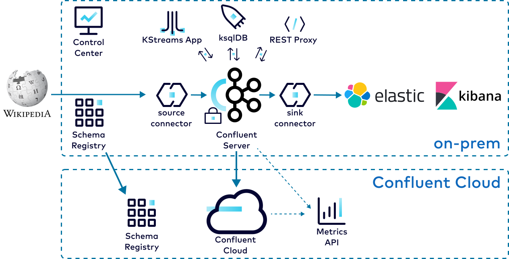

.. _cp-demo-hybrid:

Module 2: Hybrid Deployment to |ccloud| Tutorial
================================================

=============================
Hybrid Deployment to |ccloud|
=============================

In a hybrid |ak-tm| deployment scenario, you can have both an on-prem |cp| deployment as well as a
`Confluent Cloud <https://confluent.cloud>`__ deployment.
In this module, you will use `Cluster Linking <https://docs.confluent.io/cloud/current/multi-cloud/cluster-linking/index.html>`__
and `Schema Linking <https://docs.confluent.io/platform/current/schema-registry/schema-linking-cp.html>`__ to send data and schemas to
|ccloud|, and monitor both deployments with `Confluent Health+ <https://docs.confluent.io/platform/current/health-plus/index.html#confluent-health>`__ and the `Confluent Cloud Metrics API <https://docs.confluent.io/cloud/current/monitoring/metrics-api.html>`__.

Before you begin this module, make sure the cp-demo ``start.sh`` script successfully completed and |cp| is already running :ref:`(see the on-prem module) <cp-demo-run>`.

Cost to Run
-----------

Caution
~~~~~~~

.. include:: ../../examples/ccloud/docs/includes/ccloud-examples-caution.rst

|ccloud| Promo Code
~~~~~~~~~~~~~~~~~~~

To receive an additional $50 free usage in |ccloud|, enter promo code ``CPDEMO50`` in the |ccloud| Console's `Billing and payment` section (`details <https://www.confluent.io/confluent-cloud-promo-disclaimer>`__).
This promo code should sufficiently cover up to one day of running this |ccloud| example, beyond which you may be billed for the services that have an hourly charge until you destroy the |ccloud| resources created by this example.

.. _cp-demo-setup-ccloud:

Set Up |ccloud|
----------------------

#. Create a |ccloud| account at https://confluent.cloud.

#. Enter the promo code ``CPDEMO50`` in the |ccloud| UI `Billing and payment` section to receive an additional $50 free usage.

#. Go to https://confluent.cloud/environments and click "+ Add cloud environment". Name the environment **cp-demo-env**.

#. Inside the "cp-demo-env" environment, create a **Dedicated** |ccloud| cluster named **cp-demo-cluster** in the region of your choice. Cluster linking requires a dedicated cluster.

#. Create a Schema Registry for the "cp-demo-env" environment in the same region as your cluster.

Set Up Confluent CLI and variables
----------------------------------

#. Install `Confluent CLI <https://docs.confluent.io/confluent-cli/current/install.html>`__ locally, version 2.14.0 or later.

#. Using the CLI, log in to |ccloud| with the command ``confluent login``, and use your |ccloud| username and password. The ``--save`` argument saves your |ccloud| user login credentials to the local ``~/.netrc`` file.

   .. code:: shell

      confluent login --save

#. Use the demo |ccloud| environment.

   .. code:: shell

      CC_ENV=$(confluent environment list -o json \
               | jq -r '.[] | select(.name | contains("cp-demo")) | .id')
      confluent environment use $CC_ENV

#. Get the |ccloud| cluster ID and use the cluster.

   .. code:: shell

      CCLOUD_CLUSTER_ID=$(confluent kafka cluster list -o json \
                        | jq -r '.[] | select(.name | contains("cp-demo")) | .id')
      confluent kafka cluster use $CCLOUD_CLUSTER_ID

#. Get the bootstrap endpoint for the |ccloud| cluster.

   .. code:: shell

      CC_BOOTSTRAP_ENDPOINT=$(confluent kafka cluster describe -o json | jq -r .endpoint)

#. Create a |ccloud| service account for CP Demo and get its ID.

   .. code:: shell

      confluent iam service-account create cp-demo-sa --description "service account for cp-demo"
      SERVICE_ACCOUNT_ID=$(confluent iam service-account list -o json \
                           | jq -r '.[] | select(.name | contains("cp-demo")) | .id')

#. Get the cluster ID and endpoint URL for your Schema Registry

   .. code:: shell

      CC_SR_CLUSTER_ID=$(confluent sr cluster describe -o json | jq -r .cluster_id)
      CC_SR_ENDPOINT=$(confluent sr cluster describe -o json | jq -r .endpoint_url)

#. Create a Schema Registry API key for the cp-demo service account.

   .. code:: shell

      confluent api-key create \
         --service-account $SERVICE_ACCOUNT_ID \
         --resource $CC_SR_CLUSTER_ID \
         --description "SR key for cp-demo schema link"

   Verify your output resembles

   .. code:: text

      It may take a couple of minutes for the API key to be ready.
      Save the API key and secret. The secret is not retrievable later.
      +---------+------------------------------------------------------------------+
      | API Key | SZBKJLD67XK5NZNZ                                                 |
      | Secret  | NTqs/A3Mt0Ohkk4fkaIsC0oLQ5Q/F0lLowYo/UrsTrEAM5ozxY7fjqxDdVwMJz99 |
      +---------+------------------------------------------------------------------+

   Set variables to reference the Schema Registry credentials returned in the previous step.

   .. code:: shell

      SR_API_KEY=SZBKJLD67XK5NZNZ
      SR_API_SECRET=NTqs/A3Mt0Ohkk4fkaIsC0oLQ5Q/F0lLowYo/UrsTrEAM5ozxY7fjqxDdVwMJz99

#. Create a Kafka cluster API key for the cp-demo service account.

   .. code:: shell

      confluent api-key create \
         --service-account $SERVICE_ACCOUNT_ID \
         --resource $CCLOUD_CLUSTER_ID \
         --description "Kafka key for cp-demo cluster link"

   Verify your output resembles

   .. code:: text

      It may take a couple of minutes for the API key to be ready.
      Save the API key and secret. The secret is not retrievable later.
      +---------+------------------------------------------------------------------+
      | API Key | SZBKLMG61XK9NZAB                                                 |
      | Secret  | QTpi/A3Mt0Ohkk4fkaIsGR3ATQ5Q/F0lLowYo/UrsTr3AMsozxY7fjqxDdVwMJz02 |
      +---------+------------------------------------------------------------------+

   Set variables to reference the Kafka credentials returned in the previous step.

   .. code:: shell

      CCLOUD_CLUSTER_API_KEY=SZBKLMG61XK9NZAB
      CCLOUD_CLUSTER_API_SECRET=QTpi/A3Mt0Ohkk4fkaIsGR3ATQ5Q/F0lLowYo/UrsTr3AMsozxY7fjqxDdVwMJz02

#. We will also need the cluster ID for the on-prem |cp| cluster.

   .. code:: shell

      CP_CLUSTER_ID=$(curl -s https://localhost:8091/v1/metadata/id \
                     --tlsv1.2 --cacert ./scripts/security/snakeoil-ca-1.crt \
                     | jq -r ".id")

.. _cp-demo-schema-linking:

Export Schemas to |ccloud| with Schema Linking
----------------------------------------------

Confluent Schema Registry is critical for evolving schemas alongside your business needs and ensuring high data quality.
With `Schema Linking <https://docs.confluent.io/platform/current/schema-registry/schema-linking-cp.html>`__
, you can easily export your schemas from your on-prem Schema Registry to |ccloud|.
In this section, you will export the schema subjects ``wikipedia.parsed-value`` and ``wikipedia.parsed.count-by-domain-value``
from |cp| to |ccloud| with schema linking.
These schema subjects will be exported to a new `schema context <https://docs.confluent.io/platform/current/schema-registry/schema-linking-cp.html#what-is-a-schema-context>`__
called "cp-demo", so their qualified subject names in |ccloud| will be ``:.cp-demo:wikipedia.parsed-value`` and ``:.cp-demo:wikipedia.parsed.count-by-domain-value``.

#. Use Confluent Server's embedded REST API to create a schema exporter called "cp-cc-schema-exporter" for the on-prem Schema Registry.

   .. code:: shell

      curl -X POST -H "Content-Type: application/json" \
         -d @<(cat <<-EOF
      {
         "name": "cp-cc-schema-exporter",
         "contextType": "CUSTOM",
         "context": "cp-demo",
         "subjects": ["wikipedia.parsed*"],
         "config": {
            "schema.registry.url": "${CC_SR_ENDPOINT}",
            "basic.auth.credentials.source": "USER_INFO",
            "basic.auth.user.info": "${SR_API_KEY}:${SR_API_SECRET}"
         }
      }
      EOF
      ) \
         --user schemaregistryUser:schemaregistryUser \
         --cacert scripts/security/snakeoil-ca-1.crt \
         https://localhost:8085/exporters

   Notice we can use a wildcard ``*`` to export multiple subjects. A successful response will show

   .. code:: json

      {"name":"cp-cc-schema-exporter"}

   .. note::
      The ``cURL`` command is used for educational purposes to emphasize that schema exporters are managed via REST API,
      but like usual, it is easier in practice to use the ``confluent`` CLI. Here is an equivallent command from the ``confluent`` CLI,
      assuming the CLI user is logged into the source |cp| and has proper authorization on the source Schema Registry cluster to create the exporter:

      .. code:: shell

         confluent schema-registry exporter create cp-cc-schema-exporter \
            --subjects wikipedia* \
            --context cp-demo \
            --config-file scripts/ccloud/schema-link.properties
      
      The configuration file provided to ``--config-file`` just provides credentials to access the destination Schema Registry cluster.
      See the :devx-cp-demo:`example configuration file|scripts/ccloud/schema-link-example.properties` for reference.
      If the source were also a |ccloud| |sr|, then the CLI command would also require ``--api-key`` and ``--api-secret`` options to access it.

#. Verify that the schema subjects are being exported to |ccloud|.

   .. code:: shell

      confluent sr subject list \
         --api-key $SR_API_KEY --api-secret $SR_API_SECRET \
         --prefix ":.cp-demo:"

   The output should resemble

   .. code:: text

                                 Subject                  
      ----------------------------------------------------
      :.cp-demo:wikipedia.parsed-value                  
      :.cp-demo:wikipedia.parsed.count-by-domain-value

Schema subjects have been successfully exported from |cp| to 
|ccloud| with schema linking! As schemas evolve on-prem, those changes will
automatically propagate to |ccloud| as long as the exporter is running.

.. _cp-demo-cluster-linking:

Mirror Data to |ccloud| with Cluster Linking
--------------------------------------------

In this section, you will create a source-initiated cluster link
to mirror the topic ``wikipedia.parsed`` from |cp| to |ccloud|.
For security reasons, most on-prem datacenters don't
allow inbound connections,
so Confluent recommends source-initiated cluster linking to easily and securely
mirror Kafka topics from your on-prem cluster to |ccloud|.

#. Give the cp-demo service account the ``CloudClusterAdmin`` role
   to authorize it to create cluster links and mirror topics in |ccloud|.

   .. code:: shell

      confluent iam rbac role-binding create \
         --principal User:$SERVICE_ACCOUNT_ID \
         --role CloudClusterAdmin \
         --cloud-cluster $CCLOUD_CLUSTER_ID --environment $CC_ENV
   
   Verify that the role-binding was created. The output should show the role has been created.

   .. code:: shell

      confluent iam rbac role-binding list \
         --principal User:$SERVICE_ACCOUNT_ID

#. Inspect the file ``scripts/ccloud/cluster-link-ccloud.properties``
   and use it to create the |ccloud| half of the cluster link with the name **cp-cc-cluster-link**.

   .. code:: shell

      confluent kafka link create cp-cc-cluster-link \
         --cluster $CCLOUD_CLUSTER_ID \
         --source-cluster-id $CP_CLUSTER_ID \
         --config-file ./scripts/ccloud/cluster-link-ccloud.properties

#. Inspect the file ``scripts/ccloud/cluster-link-cp-example.properties`` and read the comments to understand what each property does.
   Copy the file to ``scripts/ccloud/cluster-link-cp.properties``
   with credentials and bootstrap endpoint for your own |ccloud| cluster.

   .. code:: shell

      sed -e "s|<confluent cloud cluster link api key>|${CCLOUD_CLUSTER_API_KEY}|g" \
         -e "s|<confluent cloud cluster link api secret>|${CCLOUD_CLUSTER_API_SECRET}|g" \
         -e "s|<confluent cloud bootstrap endpoint>|${CC_BOOTSTRAP_ENDPOINT}|g" \
            scripts/ccloud/cluster-link-cp-example.properties > scripts/ccloud/cluster-link-cp.properties

#. From here, we will switch back and forth between using |ccloud|
   and |cp|. We can streamline this "context switching"
   with the ``confluent context`` CLI subcommand.
   Here let's create a context called "ccloud" from the current context.

   .. code:: shell

      confluent context update --name ccloud

#. Next, log into |cp| and create a context called "cp".
   To create a cluster link, the CLI user must have ``ClusterAdmin``
   privileges. For simplicity, sign in as a super user using the username **superUser**
   and password **superUser**

   .. code:: shell

      confluent login --save --url https://localhost:8091 \
         --ca-cert-path scripts/security/snakeoil-ca-1.crt
   
   and create a CLI context called "cp".

   .. code:: shell

      confluent context update --name cp

#. The cluster link itself needs the ``DeveloperRead`` and ``DeveloperManage``
   roles for any topics it plans to mirror, as well as the ``ClusterAdmin`` role for the Kafka cluster.
   Our cluster link uses the ``connectorSA`` principal, which already has 
   ``ResourceOwner`` permissions on the ``wikipedia.parsed`` topic, so we just
   need to add the ``ClusterAdmin`` role.

   .. code:: shell

      confluent iam rbac role-binding create \
         --principal User:connectorSA \
         --role ClusterAdmin \
         --kafka-cluster-id $CP_CLUSTER_ID

#. Create the |cp| half of the cluster link, still called **cp-cc-cluster-link**.

   .. code:: shell

      confluent kafka link create cp-cc-cluster-link \
         --destination-bootstrap-server $CC_BOOTSTRAP_ENDPOINT \
         --destination-cluster-id $CCLOUD_CLUSTER_ID \
         --config-file ./scripts/ccloud/cluster-link-cp.properties \
         --url https://localhost:8091/kafka --ca-cert-path scripts/security/snakeoil-ca-1.crt 

#. Switch contexts back to "ccloud" and create the mirror topic for ``wikipedia.parsed`` in |ccloud|.

   .. code:: shell

      confluent context use ccloud
      confluent kafka mirror create wikipedia.parsed --link cp-cc-cluster-link

#. Consume records from the mirror topic using the schema context "cp-demo".
   Press ``Ctrl+C`` to stop the consumer when you are ready.

   .. code:: shell

      confluent kafka topic consume \
         --api-key $CCLOUD_CLUSTER_API_KEY \
         --api-secret $CCLOUD_CLUSTER_API_SECRET \
         --sr-endpoint $CC_SR_ENDPOINT/contexts/:.cp-demo: \
         --sr-api-key $SR_API_KEY --sr-api-secret $SR_API_SECRET \
         --value-format avro \
            wikipedia.parsed | jq

You successfully created a source-initiated cluster link to seamlessly
move data from on-prem to cloud in real time. Cluster linking opens up
real-time hybrid cloud, multi-cloud, and disaster recovery use cases.
See the `Cluster Linking documentation <https://docs.confluent.io/cloud/current/multi-cloud/overview.html>`__
for more information.

.. _cp-demo-ccloud-ksqldb:

|ccloud| ksqlDB
---------------

In this section, you will create a |ccloud| ksqlDB cluster to processes data from the ``wikipedia.parsed`` mirror topic.

#. Log into the |ccloud| Console at https://confluent.cloud and navigate to the **cp-demo-env** environment and then to the **cp-demo-cluster** cluster within that environment.

#. Select "ksqlDB" from the left side menu, click "Create cluster myself". Select "Global access". Name the cluster **cp-demo-ksql** and choose a cluster size of 1 CSU. It will take a minute or so to provision.

#. Once the ksqlDB cluster is provisioned, click into it and enter these query statements into the editor:

   .. code:: sql

      CREATE STREAM wikipedia WITH (kafka_topic='wikipedia.parsed', value_format='AVRO');
      CREATE STREAM wikipedianobot AS
         SELECT *, (length->new - length->old) AS BYTECHANGE
         FROM wikipedia
            WHERE bot = false
               AND length IS NOT NULL
               AND length->new IS NOT NULL
               AND length->old IS NOT NULL;

#. Click the "Flow" tab to see the stream processing topology.

   .. figure:: images/ccloud_ksqldb_flow.png

#. View the events in the ksqlDB streams in |ccloud| by pasting in ``SELECT * FROM WIKIPEDIANOBOT EMIT CHANGES;`` and clicking "Run query". Stop the query when you are finished.

   .. figure:: images/ccloud_ksqldb_stream.png

.. important:: The ksqlDB cluster in |ccloud| has hourly charges even if you are not actively using it. Make sure to go to :ref:`cp-demo-ccloud-cleanup`
   in the Teardown module to destroy all cloud resources when you are finished.

.. _cp-demo-metrics-api:

Metrics API
-----------

.. include:: includes/metrics-api-intro.rst

.. _cp-demo-telemetry-reporter:

Configure Confluent Health+ with the Telemetry Reporter
~~~~~~~~~~~~~~~~~~~~~~~~~~~~~~~~~~~~~~~~~~~~~~~~~~~~~~~

#. Create a new ``Cloud`` API key and secret to authenticate to |ccloud|. These credentials will be used to configure the Telemetry Reporter in |cp| for Health+, as well as to access the |ccloud| Metrics API directly.

   .. code:: shell

      confluent api-key create --resource cloud -o json \
         --service-account $SERVICE_ACCOUNT_ID \
         --description "cloud api key for cp-demo"

   Verify your output resembles:

   .. code-block:: text

      {
         "key": "QX7X4VA4DFJTTOIA",
         "secret": "fjcDDyr0Nm84zZr77ku/AQqCKQOOmb35Ql68HQnb60VuU+xLKiu/n2UNQ0WYXp/D"
      }

   The value of the API key, in this case ``QX7X4VA4DFJTTOIA``, and API secret,
   in this case ``fjcDDyr0Nm84zZr77ku/AQqCKQOOmb35Ql68HQnb60VuU+xLKiu/n2UNQ0WYXp/D``,
   will differ in your output.

#. Set variables to reference these credentials returned in the previous step.

   .. code-block:: text

      METRICS_API_KEY=QX7X4VA4DFJTTOIA
      METRICS_API_SECRET=fjcDDyr0Nm84zZr77ku/AQqCKQOOmb35Ql68HQnb60VuU+xLKiu/n2UNQ0WYXp/D

#. :ref:`Dynamically configure <kafka-dynamic-configurations>` the ``cp-demo`` cluster to use the Telemetry Reporter, which sends metrics to |ccloud|. This requires setting 3 configuration parameters: ``confluent.telemetry.enabled=true``, ``confluent.telemetry.api.key``, and ``confluent.telemetry.api.secret``.

   .. code-block:: text

      docker-compose exec kafka1 kafka-configs \
        --bootstrap-server kafka1:12091 \
        --alter \
        --entity-type brokers \
        --entity-default \
        --add-config confluent.telemetry.enabled=true,confluent.telemetry.api.key=${METRICS_API_KEY},confluent.telemetry.api.secret=${METRICS_API_SECRET}

#. Check the broker logs to verify the brokers were dynamically configured.

   .. sourcecode:: bash

      docker logs --since=5m kafka1 | grep confluent.telemetry.api

   Your output should resemble the following, but the ``confluent.telemetry.api.key`` value will be different in your environment.

   .. code-block:: text

      ...
      kafka1            | 	confluent.telemetry.api.key = QX7X4VA4DFJTTOIA
      kafka1            | 	confluent.telemetry.api.secret = [hidden]
      ...

#. Navigate to the Health+ section of the |ccloud| Console at https://confluent.cloud/health-plus and verify you see your cluster's Health+ dashboard.

   .. figure:: images/hosted-monitoring.png

.. _cp-demo-query-metrics:

Query Metrics
~~~~~~~~~~~~~

#. For the on-prem metrics: view the :devx-cp-demo:`metrics query file|scripts/ccloud/metrics_query_onprem.json`, which requests ``io.confluent.kafka.server/received_bytes`` for the topic ``wikipedia.parsed`` in the on-prem cluster (for all queryable metrics examples, see `Metrics API <https://docs.confluent.io/cloud/current/monitoring/metrics-api.html>`__).

   .. literalinclude:: ../scripts/ccloud/metrics_query_onprem.json

#. Send this query to the Metrics API endpoint at https://api.telemetry.confluent.cloud/v2/metrics/health-plus/query.

   .. code-block:: text

      curl -s -u ${METRICS_API_KEY}:${METRICS_API_SECRET} \
           --header 'content-type: application/json' \
           --data @scripts/ccloud/metrics_query_onprem.json \
           https://api.telemetry.confluent.cloud/v2/metrics/health-plus/query \
              | jq .

#. Your output should resemble the output below, showing metrics for the on-prem topic ``wikipedia.parsed``:

   .. code-block:: text

      {
        "data": [
          {
            "timestamp": "2020-12-14T20:52:00Z",
            "value": 1744066,
            "metric.topic": "wikipedia.parsed"
          },
          {
            "timestamp": "2020-12-14T20:53:00Z",
            "value": 1847596,
            "metric.topic": "wikipedia.parsed"
          }
        ]
      }

#. For the |ccloud| metrics: view the :devx-cp-demo:`metrics query file|scripts/ccloud/metrics_query_ccloud.json`, which requests ``io.confluent.kafka.server/cluster_link_mirror_topic_bytes`` for the cluster link ``cp-cc-cluster-link`` in |ccloud|, which includes metrics for the ``wikipedia.parsed`` mirror topic.

   .. literalinclude:: ../scripts/ccloud/metrics_query_ccloud.json

#. Send this query to the Metrics API endpoint at https://api.telemetry.confluent.cloud/v2/metrics/cloud/query.

   .. code-block:: text

      sed "s/<CCLOUD_CLUSTER_ID>/${CCLOUD_CLUSTER_ID}/g" scripts/ccloud/metrics_query_ccloud.json \
      | curl -s -u ${METRICS_API_KEY}:${METRICS_API_SECRET} \
           --header 'content-type: application/json' \
           --data @- \
           https://api.telemetry.confluent.cloud/v2/metrics/cloud/query \
              | jq .

#. Your output should resemble the output below, showing metrics for the cluster link ``cp-cc-cluster-link``, including the |ccloud| mirror topic ``wikipedia.parsed``:

   .. code-block:: text

      {
        "data": [
          {
            "timestamp": "2020-12-14T20:00:00Z",
            "value": 1690522,
            "metric.topic": "wikipedia.parsed"
          }
        ]
      }

.. tip::

   See `Metrics and Monitoring for Cluster Linking <https://docs.confluent.io/cloud/current/multi-cloud/cluster-linking/metrics-cc.html#metrics-and-monitoring-for-cluster-linking>`__
   for more information about monitoring cluster links, including how to monitor mirror lag.

Cleanup
-------

.. include:: ../../examples/ccloud/docs/includes/ccloud-examples-terminate.rst

Follow the clean up procedure in :ref:`cp-demo-ccloud-cleanup` to avoid unexpected |ccloud| charges.
