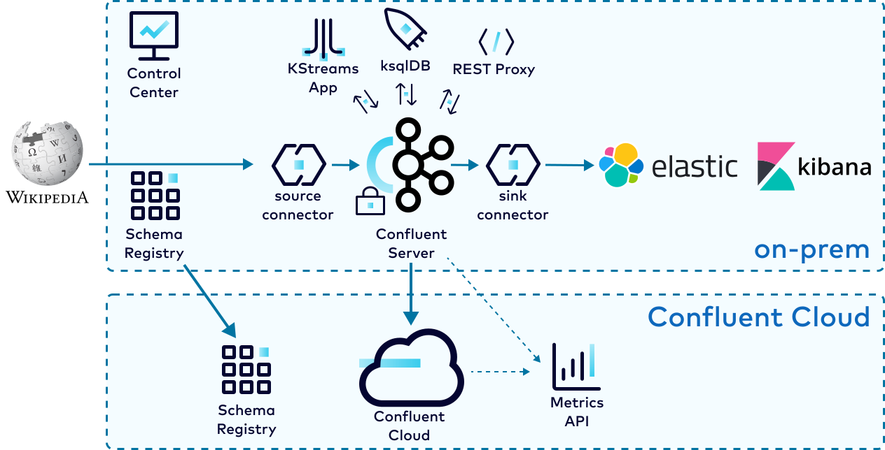

.. _cp-demo-hybrid:

Module 2: Hybrid Deployment to |ccloud| Tutorial
================================================

=============================
Hybrid Deployment to |ccloud|
=============================

In a hybrid |ak-tm| deployment scenario, you can have both an on-prem Confluent Platform deployment as well as a
`Confluent Cloud <https://confluent.cloud>`__ deployment.
In this module, you will use `Cluster Linking <https://docs.confluent.io/cloud/current/multi-cloud/cluster-linking/index.html>`__
and `Schema Linking <https://docs.confluent.io/platform/current/schema-registry/schema-linking-cp.html>`__ to send data and schemas to
|ccloud|, and monitor both deployments with `Confluent Health+ <https://docs.confluent.io/platform/current/health-plus/index.html#confluent-health>`__ and the `Confluent Cloud Metrics API <https://docs.confluent.io/cloud/current/monitoring/metrics-api.html>`__.

Before you begin this module, make sure the cp-demo ``start.sh`` script successfully completed and Confluent Platform is already running :ref:`(see the on-prem module) <cp-demo-run>`.

Cost to Run
-----------

Caution
~~~~~~~

.. include:: ../../examples/ccloud/docs/includes/ccloud-examples-caution.rst

|ccloud| Promo Code
~~~~~~~~~~~~~~~~~~~

To receive an additional $50 free usage in |ccloud|, enter promo code ``CPDEMO50`` in the |ccloud| Console's `Billing and payment` section (`details <https://www.confluent.io/confluent-cloud-promo-disclaimer>`__).
This promo code should sufficiently cover up to one day of running this |ccloud| example, beyond which you may be billed for the services that have an hourly charge until you destroy the |ccloud| resources created by this example.

.. _cp-demo-setup-ccloud:

Set Up |ccloud|
----------------------

#. Create a |ccloud| account at https://confluent.cloud.

#. Enter the promo code ``CPDEMO50`` in the |ccloud| UI `Billing and payment` section to receive an additional $50 free usage.

#. Go to https://confluent.cloud/environments and click "+ Add cloud environment". Name the environment **cp-demo-env**.

#. Inside the "cp-demo-env" environment, create a **Dedicated** |ccloud| cluster named **cp-demo-cluster** in the region of your choice. Cluster linking requires a dedicated cluster.

#. Create a Schema Registry for the "cp-demo-env" environment in the same region as your cluster.

Set Up Confluent CLI and variables
----------------------------------

#. Install `Confluent CLI <https://docs.confluent.io/confluent-cli/current/install.html>`__ locally, v2.13.3 or later.

#. Using the CLI, log in to |ccloud| with the command ``confluent login``, and use your |ccloud| username and password. The ``--save`` argument saves your |ccloud| user login credentials to the local ``~/.netrc`` file.

   .. code:: shell

      confluent login --save

#. Use the demo environment.

   .. code:: shell

      CC_ENV=$(confluent environment list -o json \
               | jq -r '.[] | select(.name | contains("cp-demo")) | .id')
      confluent environment use $CC_ENV

#. Get the cluster ID and use the cluster.

   .. code:: shell

      CCLOUD_CLUSTER_ID=$(confluent kafka cluster list -o json \
                        | jq -r '.[] | select(.name | contains("cp-demo")) | .id')
      confluent kafka cluster use $CCLOUD_CLUSTER_ID

#. Get the bootstrap endpoint.

   .. code:: shell

      CC_BOOTSTRAP_ENDPOINT=$(confluent kafka cluster describe -o json | jq -r .endpoint)

#. Create a |ccloud| service account for CP Demo and get its ID.

   .. code:: shell

      confluent iam service-account create cp-demo-sa --description "service account for cp demo"
      SERVICE_ACCOUNT_ID=$(confluent iam service-account list -o json \
                           | jq -r '.[] | select(.name | contains("cp-demo")) | .id')

#. Get the cluster ID and endpoint URL for your Schema Registry

   .. code:: shell

      CC_SR_CLUSTER_ID=$(confluent sr cluster describe -o json | jq -r .cluster_id)
      CC_SR_ENDPOINT=$(confluent sr cluster describe -o json | jq -r .endpoint_url)

#. Create a Schema Registry API key for the cp-demo service account we created earlier.

   .. code:: shell

      confluent api-key create \
         --service-account $SERVICE_ACCOUNT_ID \
         --resource $CC_SR_CLUSTER_ID \
         --description "SR key for cp-demo schema link"

#. Verify your putput will resembles

   .. code:: text

      It may take a couple of minutes for the API key to be ready.
      Save the API key and secret. The secret is not retrievable later.
      +---------+------------------------------------------------------------------+
      | API Key | SZBKJLD67XK5NZNZ                                                 |
      | Secret  | NTqs/A3Mt0Ohkk4fkaIsC0oLQ5Q/F0lLowYo/UrsTrEAM5ozxY7fjqxDdVwMJz99 |
      +---------+------------------------------------------------------------------+

#. Set variables to reference the Schema Registry credentials returned in the previous step.

   .. code:: shell

      SR_API_KEY=SZBKJLD67XK5NZNZ
      SR_API_SECRET=NTqs/A3Mt0Ohkk4fkaIsC0oLQ5Q/F0lLowYo/UrsTrEAM5ozxY7fjqxDdVwMJz99

.. _cp-demo-schema-linking:

Export Schemas to |ccloud| with Schema Linking
----------------------------------------------

Confluent Schema Registry is critical for evolving schemas alongside your business needs and ensuring high data quality.
With `Schema Linking <https://docs.confluent.io/platform/current/schema-registry/schema-linking-cp.html>`__
, you can easily export your schemas from your on-prem Schema Registry to |ccloud|.
In this section, you will export the schema subjects ``wikipedia.parsed-value`` and ``wikipedia.parsed.count-by-domain-value``
from Confluent Platform to Confluent Cloud with schema linking.
These schema subjects will be exported to a new `schema context <https://docs.confluent.io/platform/current/schema-registry/schema-linking-cp.html#what-is-a-schema-context>`__
called "cp-demo", so their qualified subject names in |ccloud| will be ``:.cp-demo:wikipedia.parsed-value`` and ``:.cp-demo:wikipedia.parsed.count-by-domain-value``.

#. Use the Confluent Server REST API to create a schema exporter for the on-prem Schema Registry.

   .. code:: shell

      curl -X POST -H "Content-Type: application/json" \
         -d @<(cat <<-EOF
      {
         "name": "cp-cc-schema-exporter",
         "contextType": "CUSTOM",
         "context": "cp-demo",
         "subjects": ["wikipedia.parsed*"],
         "config": {
            "schema.registry.url": "${CC_SR_ENDPOINT}",
            "basic.auth.credentials.source": "USER_INFO",
            "basic.auth.user.info": "${SR_API_KEY}:${SR_API_SECRET}"
         }
      }
      EOF
      ) \
         --user schemaregistryUser:schemaregistryUser \
         --cacert scripts/security/snakeoil-ca-1.crt \
         https://localhost:8085/exporters

   Notice we can use a wildcard ``*`` to export multiple subjects. A successful response will show

   .. code:: json

      {"name":"cp-cc-schema-exporter"}

   .. note::
      TODO: replace curl with confluent CLI when functionality becomes available

#. Verify that the schema subjects are being exported to |ccloud|.

   .. code:: shell

      confluent sr subject list \
         --api-key $SR_API_KEY --api-secret $SR_API_SECRET \
         --prefix ":.cp-demo:"

   The output should resemble

   .. code:: text

                                 Subject                  
      ----------------------------------------------------
      :.cp-demo:wikipedia.parsed-value                  
      :.cp-demo:wikipedia.parsed.count-by-domain-value
#. 

   .. code:: shell

.. _cp-demo-cluster-linking:

Mirror Data to |ccloud| with Cluster Linking
--------------------------------------------

.. _cp-demo-ccloud-ksqldb:

|ccloud| ksqlDB
---------------

In this section, you will create a |ccloud| ksqlDB cluster to processes data from the ``wikipedia.parsed`` mirror topic.

#. Log into the Confluent Cloud Console at https://confluent.cloud and navigate to the **cp-demo-env** environment and then to the **cp-demo-cluster** cluster within that environment.

#. Select "ksqlDB" from the left side menu, click "Create cluster myself". Select "Global access". Name the cluster **cp-demo-ksql** and choose a cluster size of 1 CSU. It will take a minute or so to provision.

#. Once the ksqlDB cluster is provisioned, click into it and enter these query statements into the editor:

   .. code:: sql

      CREATE STREAM wikipedia WITH (kafka_topic='wikipedia.parsed', value_format='AVRO');
      CREATE STREAM wikipedianobot AS
         SELECT *, (length->new - length->old) AS BYTECHANGE
         FROM wikipedia
            WHERE bot = false
               AND length IS NOT NULL
               AND length->new IS NOT NULL
               AND length->old IS NOT NULL;

#. Click the "Flow" tab to see the stream processing topology.

   .. figure:: images/ccloud_ksqldb_flow.png

#. View the events in the ksqlDB streams in |ccloud| by pasting in ``SELECT * FROM WIKIPEDIANOBOT EMIT CHANGES;`` and clicking "Run query". Stop the query when you are finished.

   .. figure:: images/ccloud_ksqldb_stream.png

#. Go to :ref:`cp-demo-ccloud-cleanup` and destroy the demo resources used. Important: 

.. important:: The ksqlDB cluster in |ccloud| has hourly charges even if you are not actively using it. Make sure to go to :ref:`cp-demo-ccloud-cleanup`
   in the Teardown module to destroy all cloud resources when you are finished.

.. _cp-demo-metrics-api:

Metrics API
-----------

.. include:: includes/metrics-api-intro.rst

.. _cp-demo-telemetry-reporter:

Configure Confluent Health+ with the Telemetry Reporter
~~~~~~~~~~~~~~~~~~~~~~~~~~~~~~~~~~~~~~~~~~~~~~~~~~~~~~~

#. Create a new ``Cloud`` API key and secret to authenticate to |ccloud|. These credentials will be used to configure the Telemetry Reporter and used by the Metrics API.

   .. code:: shell

      confluent api-key create --resource cloud -o json

#. Verify your output resembles:

   .. code-block:: text

      {
         "key": "QX7X4VA4DFJTTOIA",
         "secret": "fjcDDyr0Nm84zZr77ku/AQqCKQOOmb35Ql68HQnb60VuU+xLKiu/n2UNQ0WYXp/D"
      }

   The value of the API key, in this case ``QX7X4VA4DFJTTOIA``, and API secret,
   in this case ``fjcDDyr0Nm84zZr77ku/AQqCKQOOmb35Ql68HQnb60VuU+xLKiu/n2UNQ0WYXp/D``,
   will differ in your output.

#. Set variables to reference these credentials returned in the previous step.

   .. code-block:: text

      METRICS_API_KEY='QX7X4VA4DFJTTOIA'
      METRICS_API_SECRET='fjcDDyr0Nm84zZr77ku/AQqCKQOOmb35Ql68HQnb60VuU+xLKiu/n2UNQ0WYXp/D'

#. :ref:`Dynamically configure <kafka-dynamic-configurations>` the ``cp-demo`` cluster to use the Telemetry Reporter, which sends metrics to |ccloud|. This requires setting 3 configuration parameters: ``confluent.telemetry.enabled=true``, ``confluent.telemetry.api.key``, and ``confluent.telemetry.api.secret``.

   .. code-block:: text

      docker-compose exec kafka1 kafka-configs \
        --bootstrap-server kafka1:12091 \
        --alter \
        --entity-type brokers \
        --entity-default \
        --add-config confluent.telemetry.enabled=true,confluent.telemetry.api.key=${METRICS_API_KEY},confluent.telemetry.api.secret=${METRICS_API_SECRET}

#. Check the broker logs to verify the brokers were dynamically configured.

   .. sourcecode:: bash

      docker-compose logs kafka1 | grep confluent.telemetry.api

   Your output should resemble the following, but the ``confluent.telemetry.api.key`` value will be different in your environment.

   .. code-block:: text

      ...
      kafka1            | 	confluent.telemetry.api.key = QX7X4VA4DFJTTOIA
      kafka1            | 	confluent.telemetry.api.secret = [hidden]
      ...

#. Navigate to the Health+ section of the |ccloud| Console at https://confluent.cloud/health-plus and verify you see this cluster dashboard.

   .. figure:: images/hosted-monitoring.png

.. _cp-demo-query-metrics:

Query Metrics
~~~~~~~~~~~~~

#. To define the time interval when querying the Metrics API, get the current time minus 1 hour and current time plus 1 hour. The ``date`` utility varies between operating systems, so use the ``tools`` Docker container to get consistent and reliable dates.

   .. code-block:: text

      CURRENT_TIME_MINUS_1HR=$(docker exec tools date -Is -d '-1 hour' | tr -d '\r')
      CURRENT_TIME_PLUS_1HR=$(docker exec tools date -Is -d '+1 hour' | tr -d '\r')

#. For the on-prem metrics: view the :devx-cp-demo:`metrics query file|scripts/ccloud/metrics_query_onprem.json`, which requests ``io.confluent.kafka.server/received_bytes`` for the topic ``wikipedia.parsed`` in the on-prem cluster (for all queryable metrics examples, see `Metrics API <https://docs.confluent.io/cloud/current/monitoring/metrics-api.html>`__).

   .. literalinclude:: ../scripts/ccloud/metrics_query_onprem.json

#. Substitute values into the query json file. For this substitution to work, you must have set the following parameters in your environment:

   - ``CURRENT_TIME_MINUS_1HR``
   - ``CURRENT_TIME_PLUS_1HR``

   .. code-block:: text

      DATA=$(eval "cat <<EOF
      $(<./scripts/ccloud/metrics_query_onprem.json)
      EOF
      ")

      # View this parameter
      echo $DATA

#. Send this query to the Metrics API endpoint at https://api.telemetry.confluent.cloud/v2/metrics/hosted-monitoring/query. For this query to work, you must have set the following parameters in your environment:

   - ``METRICS_API_KEY``
   - ``METRICS_API_SECRET``

   .. code-block:: text

      curl -s -u ${METRICS_API_KEY}:${METRICS_API_SECRET} \
           --header 'content-type: application/json' \
           --data "${DATA}" \
           https://api.telemetry.confluent.cloud/v2/metrics/hosted-monitoring/query \
              | jq .

#. Your output should resemble the output below, showing metrics for the on-prem topic ``wikipedia.parsed``:

   .. code-block:: text

      {
        "data": [
          {
            "timestamp": "2020-12-14T20:52:00Z",
            "value": 1744066,
            "metric.topic": "wikipedia.parsed"
          },
          {
            "timestamp": "2020-12-14T20:53:00Z",
            "value": 1847596,
            "metric.topic": "wikipedia.parsed"
          }
        ]
      }

#. For the |ccloud| metrics: view the :devx-cp-demo:`metrics query file|scripts/ccloud/metrics_query_ccloud.json`, which requests ``io.confluent.kafka.server/received_bytes`` for the topic ``wikipedia.parsed.ccloud.replica`` in |ccloud| (for all queryable metrics examples, see `Metrics API <https://docs.confluent.io/cloud/current/monitoring/metrics-api.html>`__).

   .. literalinclude:: ../scripts/ccloud/metrics_query_ccloud.json

#. Substitute values into the query json file. For this substitution to work, you must have set the following parameters in your environment:

   - ``CURRENT_TIME_MINUS_1HR``
   - ``CURRENT_TIME_PLUS_1HR``
   - ``CCLOUD_CLUSTER_ID``

   .. code-block:: text

      DATA=$(eval "cat <<EOF
      $(<./scripts/ccloud/metrics_query_ccloud.json)
      EOF
      ")

      # View this parameter
      echo $DATA

#. Send this query to the Metrics API endpoint at https://api.telemetry.confluent.cloud/v2/metrics/cloud/query. For this query to work, you must have set the following parameters in your environment:

   - ``METRICS_API_KEY``
   - ``METRICS_API_SECRET`` 

   .. code-block:: text

      curl -s -u ${METRICS_API_KEY}:${METRICS_API_SECRET} \
           --header 'content-type: application/json' \
           --data "${DATA}" \
           https://api.telemetry.confluent.cloud/v2/metrics/cloud/query \
              | jq .

#. Your output should resemble the output below, showing metrics for the |ccloud| mirror topic ``wikipedia.parsed``:

   .. code-block:: text

      {
        "data": [
          {
            "timestamp": "2020-12-14T20:00:00Z",
            "value": 1690522,
            "metric.topic": "wikipedia.parsed"
          }
        ]
      }

Cleanup
-------

.. include:: ../../examples/ccloud/docs/includes/ccloud-examples-terminate.rst

Follow the clean up procedure in :ref:`cp-demo-ccloud-cleanup` to avoid unexpected |ccloud| charges.
