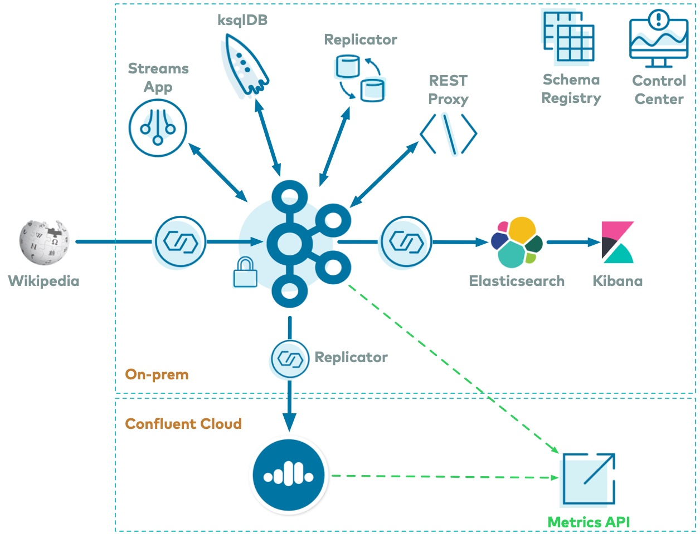

.. _cp-demo-hybrid:

Module 2: Hybrid Deployment to |ccloud| Tutorial
================================================

=============================
Hybrid Deployment to |ccloud|
=============================

In a hybrid |ak-tm| deployment scenario, you can have both an on-prem and `Confluent Cloud <https://confluent.cloud>`__ deployment.
This part of the tutorial runs |crep| to send |ak| data to |ccloud|, and uses a common method, the `Metrics API <https://docs.confluent.io/cloud/current/monitoring/metrics-api.html>`__, for collecting metrics for both.

Run this part of the tutorial only after you have completed the cp-demo :ref:`initial bring-up <cp-demo-run>`, because the initial bring-up deploys the on-prem cluster.
The steps in this section bring up the |ccloud| instance and interconnects it to your on-prem cluster.

Cost to Run
-----------

Caution
~~~~~~~

.. include:: ../../examples/ccloud/docs/includes/ccloud-examples-caution.rst

|ccloud| Promo Code
~~~~~~~~~~~~~~~~~~~

To receive an additional $50 free usage in |ccloud|, enter promo code ``CPDEMO50`` in the |ccloud| UI `Billing and payment` section (`details <https://www.confluent.io/confluent-cloud-promo-disclaimer>`__).
This promo code should sufficiently cover up to one day of running this |ccloud| example, beyond which you may be billed for the services that have an hourly charge until you destroy the |ccloud| resources created by this example.

.. _cp-demo-setup-ccloud:

Setup |ccloud| and CLI
----------------------

#. Create a |ccloud| account at https://confluent.cloud.

#. Setup a payment method for your |ccloud| account and optionally enter the promo code ``CPDEMO50`` in the |ccloud| UI `Billing and payment` section to receive an additional $50 free usage.

#. Install `Confluent Cloud CLI <https://docs.confluent.io/ccloud-cli/current/install.html>`__ v1.21.0 or later.

#. Using the CLI, log in to |ccloud| with the command ``ccloud login``, and use your |ccloud| username and password. The ``--save`` argument saves your |ccloud| user login credentials or refresh token (in the case of SSO) to the local ``netrc`` file.

   .. code:: shell

      ccloud login --save

#. The remainder of the |ccloud| portion of this tutorial must be completed sequentially. We recommend that you manually complete all the steps in the following sections. However, you may also run the script :devx-cp-demo:`scripts/ccloud/create-ccloud-workflow.sh|scripts/ccloud/create-ccloud-workflow.sh` which automates those steps. This option is recommended for users who have run this tutorial before and want to quickly bring it up.

   .. code-block:: text

      (cd scripts/ccloud/ && ./create-ccloud-workflow.sh)

.. _cp-demo-ccloud-stack:

ccloud-stack
------------

Use the :ref:`ccloud-stack` for a quick, automated way to create resources in |ccloud|.  Executed with a single command, it uses the |ccloud| CLI to:

-  Create a new environment.
-  Create a new service account.
-  Create a new Kafka cluster and associated credentials.
-  Enable |sr-ccloud| and associated credentials.
-  Create ACLs with a wildcard for the service account.
-  Create a new ksqlDB app and associated credentials
-  Generate a local configuration file with all above connection information.

#. Get a bash library of useful functions for interacting with |ccloud| (one of which is ``cloud-stack``). This library is community-supported and not supported by Confluent.

   .. code-block:: text

      curl -sS -o ccloud_library.sh https://raw.githubusercontent.com/confluentinc/examples/latest/utils/ccloud_library.sh

#. Using ``ccloud_library.sh`` which you downloaded in the previous step, create a new ``ccloud-stack`` (see :ref:`ccloud-stack` for advanced options). It creates real resources in |ccloud| and takes a few minutes to complete.

   .. note:: The ``true`` flag adds creation of a ksqlDB application in |ccloud|, which has hourly charges even if you are not actively using it.

   .. code-block:: text

      source ./ccloud_library.sh
      ccloud::create_ccloud_stack true
 
#. When ``ccloud-stack`` completes, view the local configuration file at ``stack-configs/java-service-account-<SERVICE_ACCOUNT_ID>.config`` that was auto-generated. It contains connection information for connecting to your newly created |ccloud| environment.

   .. code-block:: text

      cat stack-configs/java-service-account-*.config

#. In the current shell, set the environment variable ``SERVICE_ACCOUNT_ID`` to the <SERVICE_ACCOUNT_ID> in the filename. For example, if the filename is called ``stack-configs/java-service-account-154143.config``, then set ``SERVICE_ACCOUNT_ID=154143``. This environment variable is used later in the tutorial.

   .. code-block:: text

      SERVICE_ACCOUNT_ID=<fill in>

#. The |crep| :devx-cp-demo:`configuration file|scripts/connectors/submit_replicator_to_ccloud_config.sh` has parameters that specify how to connect to |ccloud|.  You could set these parameters manually, but to do this in an automated fashion, use another script to set env parameters customized for the |ccloud| instance created above. It reads your local |ccloud| configuration file, i.e., the auto-generated ``stack-configs/java-service-account-<SERVICE_ACCOUNT_ID>.config``, and creates files useful for |cp| components and clients connecting to |ccloud|.

   Get the script, which is also community-supported and not supported by Confluent.

   .. code-block:: text

      curl -sS -o ccloud-generate-cp-configs.sh https://raw.githubusercontent.com/confluentinc/examples/latest/ccloud/ccloud-generate-cp-configs.sh

#. Run the script against your auto-generated configuration file (the file created by ``ccloud-stack``).

   .. code-block:: text

      chmod 744 ./ccloud-generate-cp-configs.sh
      ./ccloud-generate-cp-configs.sh stack-configs/java-service-account-$SERVICE_ACCOUNT_ID.config

#. The output of the script is a folder called ``delta_configs`` with sample configurations for all components and clients, which you can easily apply to any |ak| client or |cp| component. View the ``delta_configs/env.delta`` file.

   .. code-block:: text

      cat delta_configs/env.delta

#. Source the ``delta_configs/env.delta`` file into your environment. These environment variables will be used in a few sections when you run |crep| to copy data from your on-prem cluster to your |ccloud| cluster.

   .. code-block:: text

      source delta_configs/env.delta

.. _cp-demo-telemetry-reporter:

Telemetry Reporter
------------------

Enable :ref:`telemetry_reporter` on the on-prem cluster, and configure it to send metrics to the |ccloud| instance created above..

#. Create a new ``Cloud`` API key and secret to authenticate to |ccloud|. These credentials will be used to configure the Telemetry Reporter and used by the Metrics API.

   .. code:: shell

      ccloud api-key create --resource cloud -o json

#. Verify your output resembles:

   .. code-block:: text

      {
         "key": "QX7X4VA4DFJTTOIA",
         "secret": "fjcDDyr0Nm84zZr77ku/AQqCKQOOmb35Ql68HQnb60VuU+xLKiu/n2UNQ0WYXp/D"
      }

   The value of the API key, in this case ``QX7X4VA4DFJTTOIA``, and API secret,
   in this case ``fjcDDyr0Nm84zZr77ku/AQqCKQOOmb35Ql68HQnb60VuU+xLKiu/n2UNQ0WYXp/D``,
   will differ in your output.

#. Set parameters to reference these credentials returned in the previous step.

   .. code-block:: text

      METRICS_API_KEY='QX7X4VA4DFJTTOIA'
      METRICS_API_SECRET='fjcDDyr0Nm84zZr77ku/AQqCKQOOmb35Ql68HQnb60VuU+xLKiu/n2UNQ0WYXp/D'

#. :ref:`Dynamically configure <kafka-dynamic-configurations>` the ``cp-demo`` cluster to use the Telemetry Reporter, which sends metrics to |ccloud|. This requires setting 3 configuration parameters: ``confluent.telemetry.enabled=true``, ``confluent.telemetry.api.key``, and ``confluent.telemetry.api.secret``.

   .. code-block:: text

      docker-compose exec kafka1 kafka-configs \
        --bootstrap-server kafka1:12091 \
        --alter \
        --entity-type brokers \
        --entity-default \
        --add-config confluent.telemetry.enabled=true,confluent.telemetry.api.key=${METRICS_API_KEY},confluent.telemetry.api.secret=${METRICS_API_SECRET}

#. Check the broker logs to verify the brokers were dynamically configured.

   .. sourcecode:: bash

      docker-compose logs kafka1 | grep confluent.telemetry.api

   Your output should resemble the following, but the ``confluent.telemetry.api.key`` value will be different in your environment.

   .. code-block:: text

      ...
      kafka1            | 	confluent.telemetry.api.key = QX7X4VA4DFJTTOIA
      kafka1            | 	confluent.telemetry.api.secret = [hidden]
      ...

.. _cp-demo-replicator-to-ccloud:

|crep| to |ccloud|
------------------

Deploy |crep| to copy data from the on-prem cluster to the |ak| cluster running in |ccloud|.
It is configured to copy from the |ak| topic ``wikipedia.parsed`` (on-prem) to the cloud topic ``wikipedia.parsed.ccloud.replica`` in |ccloud|. 
The Replicator instance is running on the existing Connect worker in the on-prem cluster.

#. If you have been running ``cp-demo`` for a long time, you may need to refresh your local token to log back into MDS:

   .. sourcecode:: bash

      ./scripts/helper/refresh_mds_login.sh

#. Create a role binding to permit a new instance of |crep| to be submitted to the local connect cluster with id ``connect-cluster``.

   Get the |ak| cluster ID:

   .. literalinclude:: includes/get_kafka_cluster_id_from_host.sh

   Create the role bindings:

   .. code-block:: text

      docker-compose exec tools bash -c "confluent iam rolebinding create \
          --principal User:connectorSubmitter \
          --role ResourceOwner \
          --resource Connector:replicate-topic-to-ccloud \
          --kafka-cluster-id $KAFKA_CLUSTER_ID \
          --connect-cluster-id connect-cluster"

#. View the |crep| :devx-cp-demo:`configuration file|scripts/connectors/submit_replicator_to_ccloud_config.sh`. Note that it uses the local connect cluster (the origin site), so the |crep| configuration has overrides for the producer. The configuration parameters that use variables are read from the environment variables you sourced in an earlier step.

#. Submit the |crep| connector to the local connect cluster.

   .. code-block:: text

      ./scripts/connectors/submit_replicator_to_ccloud_config.sh

#. It takes about 1 minute to show up in the Connectors view in |c3|.  When it does, verify |crep| to |ccloud| has started properly, and there are now 4 connectors:

   .. figure:: images/connectors-with-rep-to-ccloud.png

#. Log into `Confluent Cloud <https://confluent.cloud>`__ UI and verify you see the topic ``wikipedia.parsed.ccloud.replica`` and its messages.

#. View the schema for this topic that is already registered in |ccloud| |sr|. In ``cp-demo``, in the :devx-cp-demo:`Replicator configuration file|scripts/connectors/submit_replicator_to_ccloud_config.sh`, ``value.converter`` is configured to use ``io.confluent.connect.avro.AvroConverter``, therefore it automatically registers new schemas, as needed, while copying data. The schema ID in the on-prem |sr| will not match the schema ID in the |ccloud| |sr|. (See documentation for other :ref:`schema migration options <schemaregistry_migrate>`)

   .. figure:: images/ccloud-schema.png

.. _cp-demo-metrics-api:

Metrics API
-----------

.. include:: includes/metrics-api-intro.rst

#. To define the time interval when querying the Metrics API, get the current time minus 1 hour and current time plus 1 hour. The ``date`` utility varies between operating systems, so use the ``tools`` Docker container to get consistent and reliable dates.

   .. code-block:: text

      CURRENT_TIME_MINUS_1HR=$(docker-compose exec tools date -Is -d '-1 hour' | tr -d '\r')
      CURRENT_TIME_PLUS_1HR=$(docker-compose exec tools date -Is -d '+1 hour' | tr -d '\r')

#. For the on-prem metrics: view the :devx-cp-demo:`metrics query file|scripts/ccloud/metrics_query_onprem.json`, which requests ``io.confluent.kafka.server/received_bytes`` for the topic ``wikipedia.parsed`` in the on-prem cluster (for all queryable metrics examples, see `Metrics API <https://docs.confluent.io/cloud/current/monitoring/metrics-api.html>`__).

   .. literalinclude:: ../scripts/ccloud/metrics_query_onprem.json

#. Substitute values into the query json file. For this substitution to work, you must have set the following parameters in your environment:

   - ``CURRENT_TIME_MINUS_1HR``
   - ``CURRENT_TIME_PLUS_1HR``

   .. code-block:: text

      DATA=$(eval "cat <<EOF
      $(<./scripts/ccloud/metrics_query_onprem.json)
      EOF
      ")

      # View this parameter
      echo $DATA

#. Send this query to the Metrics API endpoint at https://api.telemetry.confluent.cloud/v1/metrics/hosted-monitoring/query. For this query to work, you must have set the following parameters in your environment:

   - ``METRICS_API_KEY``
   - ``METRICS_API_SECRET``

   .. code-block:: text

      curl -s -u ${METRICS_API_KEY}:${METRICS_API_SECRET} \
           --header 'content-type: application/json' \
           --data "${DATA}" \
           https://api.telemetry.confluent.cloud/v1/metrics/hosted-monitoring/query \
              | jq .

#. Your output should resemble the output below, showing metrics for the on-prem topic ``wikipedia.parsed``:

   .. code-block:: text

      {
        "data": [
          {
            "timestamp": "2020-12-14T20:52:00Z",
            "value": 1744066,
            "metric.label.topic": "wikipedia.parsed"
          },
          {
            "timestamp": "2020-12-14T20:53:00Z",
            "value": 1847596,
            "metric.label.topic": "wikipedia.parsed"
          }
        ]
      }

#. For the |ccloud| metrics: view the :devx-cp-demo:`metrics query file|scripts/ccloud/metrics_query_ccloud.json`, which requests ``io.confluent.kafka.server/received_bytes`` for the topic ``wikipedia.parsed.ccloud.replica`` in |ccloud| (for all queryable metrics examples, see `Metrics API <https://docs.confluent.io/cloud/current/monitoring/metrics-api.html>`__).

   .. literalinclude:: ../scripts/ccloud/metrics_query_ccloud.json

#. Get the |ak| cluster ID in |ccloud|, derived from the ``$SERVICE_ACCOUNT_ID``.

   .. code-block:: text

      CCLOUD_CLUSTER_ID=$(ccloud kafka cluster list -o json | jq -c -r '.[] | select (.name == "'"demo-kafka-cluster-${SERVICE_ACCOUNT_ID}"'")' | jq -r .id)

#. Substitute values into the query json file. For this substitution to work, you must have set the following parameters in your environment:

   - ``CURRENT_TIME_MINUS_1HR``
   - ``CURRENT_TIME_PLUS_1HR``
   - ``CCLOUD_CLUSTER_ID``

   .. code-block:: text

      DATA=$(eval "cat <<EOF
      $(<./scripts/ccloud/metrics_query_ccloud.json)
      EOF
      ")

      # View this parameter
      echo $DATA

#. Send this query to the Metrics API endpoint at https://api.telemetry.confluent.cloud/v1/metrics/cloud/query. For this query to work, you must have set the following parameters in your environment:

   - ``METRICS_API_KEY``
   - ``METRICS_API_SECRET`` 

   .. code-block:: text

      curl -s -u ${METRICS_API_KEY}:${METRICS_API_SECRET} \
           --header 'content-type: application/json' \
           --data "${DATA}" \
           https://api.telemetry.confluent.cloud/v1/metrics/cloud/query \
              | jq .

#. Your output should resemble the output below, showing metrics for the |ccloud| topic ``wikipedia.parsed.ccloud.replica``:

   .. code-block:: text

      {
        "data": [
          {
            "timestamp": "2020-12-14T20:00:00Z",
            "value": 1690522,
            "metric.label.topic": "wikipedia.parsed.ccloud.replica"
          }
        ]
      }

.. _cp-demo-ccloud-ksqldb:

|ccloud| ksqlDB
---------------

This section shows how to create queries in the |ccloud| ksqlDB application that processes data from the ``wikipedia.parsed.ccloud.replica`` topic that |crep| copied from the on-prem cluster.
You must have completed :ref:`cp-demo-ccloud-stack` before proceeding.

#. Get the |ccloud| ksqlDB application ID and save it to the parameter ``ksqlDBAppId``.

   .. code-block:: text

      ksqlDBAppId=$(ccloud ksql app list | grep "$KSQLDB_ENDPOINT" | awk '{print $1}')

#. Verify the |ccloud| ksqlDB application has transitioned from ``PROVISIONING`` to ``UP`` state. This may take a few minutes.

   .. code-block:: text

      ccloud ksql app describe $ksqlDBAppId -o json

#. Configure ksqlDB ACLs to permit the ksqlDB application to read from ``wikipedia.parsed.ccloud.replica``.

   .. code-block:: text

      ccloud ksql app configure-acls $ksqlDBAppId wikipedia.parsed.ccloud.replica

#. Create new ksqlDB queries in |ccloud| from the :devx-cp-demo:`scripts/ccloud/statements.sql|scripts/ccloud/statements.sql` file. Note: depending on which folder you are in, you may need to modify the relative path to the ``statements.sql`` file.

   .. code-block:: text

       while read ksqlCmd; do
         echo -e "\n$ksqlCmd\n"
         curl -X POST $KSQLDB_ENDPOINT/ksql \
              -H "Content-Type: application/vnd.ksql.v1+json; charset=utf-8" \
              -u $KSQLDB_BASIC_AUTH_USER_INFO \
              --silent \
              -d @<(cat <<EOF
       {
         "ksql": "$ksqlCmd",
         "streamsProperties": {}
       }
       EOF
       )
       done <scripts/ccloud/statements.sql

#. Log into `Confluent Cloud <https://confluent.cloud>`__ UI and view the ksqlDB application Flow.

   .. figure:: images/ccloud_ksqldb_flow.png

#. View the events in the ksqlDB streams in |ccloud|.

   .. figure:: images/ccloud_ksqldb_stream.png

#. Go to :ref:`cp-demo-ccloud-cleanup` and destroy the demo resources used. Important: The ksqlDB application in |ccloud| has hourly charges even if you are not actively using it.

.. _cp-demo-ccloud-cleanup:

Cleanup
-------

.. include:: ../../examples/ccloud/docs/includes/ccloud-examples-terminate.rst

#. Remove the |crep| connector that was replicating data to |ccloud|.

   .. code-block:: text

      docker-compose exec connect curl -X DELETE \
        --cert /etc/kafka/secrets/connect.certificate.pem \
        --key /etc/kafka/secrets/connect.key \
        --tlsv1.2 \
        --cacert /etc/kafka/secrets/snakeoil-ca-1.crt \
        -u connectorSubmitter:connectorSubmitter \
        https://connect:8083/connectors/replicate-topic-to-ccloud

#. Disable Telemetry Reporter in both |ak| brokers.

   .. code-block:: text

      docker-compose exec kafka1 kafka-configs \
        --bootstrap-server kafka1:12091 \
        --alter \
        --entity-type brokers \
        --entity-default \
        --delete-config confluent.telemetry.enabled,confluent.telemetry.api.key,confluent.telemetry.api.secret

#. Delete the ``Cloud`` API key.

   .. code-block:: text

      ccloud api-key delete ${METRICS_API_KEY}

#. Destroy your |ccloud| environment. Even if you stop ``cp-demo``, the resources in |ccloud| continue to incur charges until you destroy all the resources.

   .. code-block:: text

      source ./ccloud_library.sh
      source delta_configs/env.delta
      ccloud::destroy_ccloud_stack $SERVICE_ACCOUNT_ID

#. Log into `Confluent Cloud <https://confluent.cloud>`__ UI and verify all your resources have been destroyed.

.. _cp-demo-monitoring:

==========
Monitoring
==========

This tutorial has demonstrated how |c3| helps users manage their |cp| deployment and how it provides monitoring capabilities for the cluster and applications.
For a practical guide to optimizing your |ak| deployment for various service goals including throughput, latency, durability and availability, and useful metrics to monitor for performance and cluster health for on-prem |ak| clusters, see the `Optimizing Your Apache Kafka Deployment <https://www.confluent.io/white-paper/optimizing-your-apache-kafka-deployment/>`__ whitepaper.

For most |cp| users the |c3| monitoring and integrations are sufficient for production usage in their on-prem |ak-tm| deployments.
There are additional monitoring solutions for various use cases, as described below.

Metrics API
-----------

.. include:: includes/metrics-api-intro.rst

See :ref:`cp-demo-hybrid` for more information.

JMX
---

Some users wish to integrate with other monitoring solutions like Prometheus, Grafana, Datadog, and Splunk.
The following JMX-based monitoring stacks help users setup a 'single pane of glass' monitoring solution for all their organization's services and applications, including |ak|.

Here are some examples of monitoring stacks that integrate with |cp|:

#. `JMX Exporter + Prometheus + Grafana <https://github.com/confluentinc/jmx-monitoring-stacks>`__ (runnable with cp-demo from https://github.com/confluentinc/jmx-monitoring-stacks):

   .. figure:: images/monitoring/jmxexporter-prometheus-grafana-1.png
      :alt: image
      :width: 500px

   .. figure:: images/monitoring/jmxexporter-prometheus-grafana-2.png
      :alt: image
      :width: 500px

   .. figure:: images/monitoring/jmxexporter-prometheus-grafana-3.png
      :alt: image
      :width: 500px

#. `Jolokia + Elasticsearch + Kibana <https://github.com/confluentinc/jmx-monitoring-stacks>`__ (runnable with cp-demo from https://github.com/confluentinc/jmx-monitoring-stacks):

   .. figure:: images/monitoring/jolokia-elastic-kibana-1.png
      :alt: image
      :width: 500px

   .. figure:: images/monitoring/jolokia-elastic-kibana-2.png
      :alt: image
      :width: 500px

   .. figure:: images/monitoring/jolokia-elastic-kibana-3.png
      :alt: image
      :width: 500px

#. `Monitoring Confluent Platform with Datadog <https://www.confluent.io/blog/confluent-datadog-integration-kafka-monitoring-metrics>`__:

   .. figure:: images/monitoring/datadog-dashboard.png
      :alt: image
      :width: 500px

.. _cp-demo-teardown:
      
========
Teardown
========

#. Stop the consumer group ``app`` to stop consuming from topic
   ``wikipedia.parsed``. Note that the command below stops the consumers
   gracefully with ``kill -15``, so the consumers follow the shutdown
   sequence.

   .. code:: bash

         ./scripts/app/stop_consumer_app_group_graceful.sh

#. Stop the Docker environment, destroy all components and clear all Docker
   volumes.

   .. sourcecode:: bash

          ./scripts/stop.sh

#. If you ran the :ref:`cp-demo-hybrid` portion of this tutorial, which included creating resources in |ccloud|, follow the clean up procedure in :ref:`cp-demo-ccloud-cleanup` to avoid unexpected |ccloud| charges.

.. _cp-demo-troubleshooting:

===============
Troubleshooting
===============

If the start script does not complete successfully, please go through the following troubleshooting steps.

Docker
------

#. Verify that the status of all the Docker containers show ``Up`` state.

   .. code-block:: bash

      docker-compose ps

#. In the advanced Docker preferences settings, verify the following resources are allocated to Docker:

   - Memory: at least 8 GB (default is 2 GB)
   - CPU cores: at least 2 cores

#. Verify you have not run out of disk storage needed for Docker's "disk image" file (`Docker documentation <https://docs.docker.com/docker-for-mac/space/>`__).

Logs
----

#. If the script errors out before completing, or if there are Docker containers that are not in ``Up`` state, view the container's logs with the command ``docker-compose logs [container]`` and look for error messages and exceptions.

   .. sourcecode:: bash

      docker-compose logs

#. If there are any errors that indicate issues with TLS communication, verify that the TLS certificates were properly generated and that there are no errors in the following files:

   .. code-block:: bash

      ls scripts/security/*.log

Security
--------

#. If there are any errors that indicate issues with TLS communication, force TLS certificates to be regenerated by starting the script with ``CLEAN=true``:

   .. sourcecode:: bash

      CLEAN=true ./scripts/start.sh

#. If a command that communicates with |zk| appears to be failing with the error ``org.apache.zookeeper.KeeperException$NoAuthException``,
   change the container you are running the command from to be either ``kafka1`` or ``kafka2``.  This is because |zk| is configured for
   :ref:`SASL/DIGEST-MD5 <sasl_plain_zk>`, and
   any commands that communicate with |zk| need properties set for |zk| authentication.

Validate
--------

#. Verify there are messages in the |ak|  topics, including ``wikipedia.parsed``:

   .. sourcecode:: bash

      ./scripts/consumers/listen.sh

#. Run the :devx-cp-demo:`validation scripts|scripts/validate/` to verify that they pass.

   .. sourcecode:: bash

      cd scripts/validate/

CLI Login
---------

#. If you are running ``cp-demo`` for a long time and issuing Confluent CLI commands on the ``tools`` container that error out with:

   .. sourcecode:: bash

          Your token has expired. You are now logged out.
          Error: You must log in to run that command.

   Then run the following command, which refreshes the token by logging back in to MDS:

   .. sourcecode:: bash

          ./scripts/helper/refresh_mds_login.sh 
