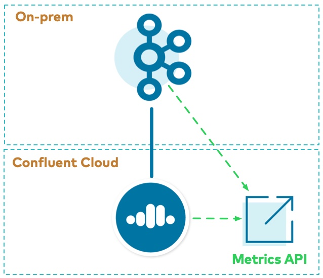

As a complement to monitoring solutions you may have already deployed, use the Metrics API to get data for both the on-prem cluster as well as the |ccloud| cluster.
The Metrics API provides a queryable HTTP API in which the user can POST a query written in JSON and get back a time series of metrics specified by the query.
It can be used for both:

- On-prem metrics from Telemetry Reporter from the endpoint https://api.telemetry.confluent.cloud/v1/metrics/hosted-monitoring/query (this is in preview and the API may change)
- |ccloud| metrics from the endpoint https://api.telemetry.confluent.cloud/v1/metrics/cloud/query

