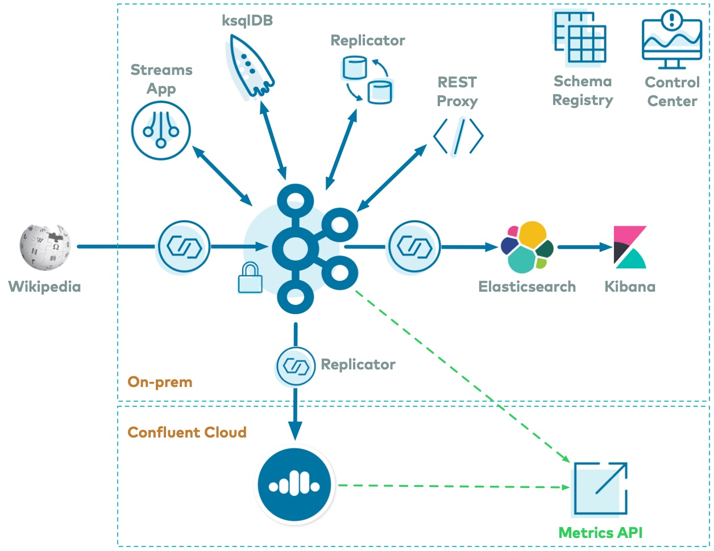

.. _cp-demo:

Confluent Platform Demo (cp-demo)
=================================

This example builds a full |cp| deployment with an |ak-tm| event streaming application using `ksqlDB <https://www.confluent.io/product/ksql/>`__ and `Kafka Streams <https://docs.confluent.io/current/streams/index.html>`__ for stream processing, and all the components have security enabled end-to-end.
Follow the accompanying guided tutorial that steps through the example so that you can learn how it all works together.

========
Overview
========

Use Case
--------

The use case is an |ak-tm| event streaming application that processes real-time edits to real Wikipedia pages.

The full event streaming platform based on |cp| is described as follows.
Wikimedia's `EventStreams <https://wikitech.wikimedia.org/wiki/Event_Platform/EventStreams>`__ publishes a continuous stream of real-time edits happening to real wiki pages.
A Kafka source connector `kafka-connect-sse <https://www.confluent.io/hub/cjmatta/kafka-connect-sse>`__ streams the server-sent events (SSE) from https://stream.wikimedia.org/v2/stream/recentchange, and a custom |kconnect| transform `kafka-connect-json-schema <https://www.confluent.io/hub/jcustenborder/kafka-connect-json-schema>`__ extracts the JSON from these messages and then are written to a |ak| cluster.
This example uses `ksqlDB <https://www.confluent.io/product/ksql/>`__ and a :ref:`Kafka Streams <kafka_streams>` application for data processing.
Then a Kafka sink connector `kafka-connect-elasticsearch <http://docs.confluent.io/kafka-connect-elasticsearch/index.html>`__ streams the data out of Kafka and is materialized into `Elasticsearch <https://www.elastic.co/products/elasticsearch>`__ for analysis by `Kibana <https://www.elastic.co/products/kibana>`__.
|crep-full| is also copying messages from a topic to another topic in the same cluster.
All data is using |sr-long| and Avro, and `Confluent Control Center <https://www.confluent.io/product/control-center/>`__ is managing and monitoring the deployment.

Data Pattern
------------

Data pattern is as follows:

+-------------------------------------+--------------------------------+---------------------------------------+
| Components                          | Consumes From                  | Produces To                           |
+=====================================+================================+=======================================+
| SSE source connector                | Wikipedia                      | ``wikipedia.parsed``                  |
+-------------------------------------+--------------------------------+---------------------------------------+
| ksqlDB                              | ``wikipedia.parsed``           | ksqlDB streams and tables             |
+-------------------------------------+--------------------------------+---------------------------------------+
| Kafka Streams application           | ``wikipedia.parsed``           | ``wikipedia.parsed.count-by-domain``  |
+-------------------------------------+--------------------------------+---------------------------------------+
| Confluent Replicator                | ``wikipedia.parsed``           | ``wikipedia.parsed.replica``          |
+-------------------------------------+--------------------------------+---------------------------------------+
| Elasticsearch sink connector        | ``WIKIPEDIABOT`` (from ksqlDB) | Elasticsearch/Kibana                  |
+-------------------------------------+--------------------------------+---------------------------------------+

===========
Run cp-demo
===========

``cp-demo`` is a Docker environment and has all services running on one host.
It is meant exclusively to easily demo |CP|, but in production, do not deploy all |cp| services on a single host.

Also, in production, |c3| should be deployed with a valid license and with its own dedicated metrics cluster, separate from the cluster with production data.
Using a dedicated metrics cluster is more resilient because it continues to provide system health monitoring even if the production traffic cluster experiences issues.

If you prefer non-Docker examples, please go to `confluentinc/examples GitHub repository <https://github.com/confluentinc/examples>`__.

After you run through the guided tutorial below, apply the concepts you learn here to build your own event streaming pipeline in |ccloud|, a fully managed, cloud-native event streaming platform powered by |ak|. When you sign up for `Confluent Cloud <https://confluent.cloud>`__, use the promo code ``C50INTEG`` to receive an additional $50 free usage (`details <https://www.confluent.io/confluent-cloud-promo-disclaimer>`__).

Prerequisites
-------------

This example has been validated with:

-  Docker version 17.06.1-ce
-  Docker Compose version 1.16.0 with Docker Compose file format 2.3
-  Java version 1.8.0_92
-  MacOS 10.15.3 (note for `Ubuntu environments <https://github.com/confluentinc/cp-demo/issues/53>`__)
-  OpenSSL 1.1.1d
-  git
-  jq

Setup
-----

#. In Docker's advanced `settings <https://docs.docker.com/docker-for-mac/#advanced>`__, increase the memory dedicated to Docker to at least 8 GB (default is 2 GB) and ensure Docker is allocated at least 2 CPU cores.

#. Clone the `confluentinc/cp-demo GitHub repository <https://github.com/confluentinc/cp-demo>`__:

   .. sourcecode:: bash

       git clone https://github.com/confluentinc/cp-demo

#. Navigate to the ``cp-demo`` directory and switch to the |cp| release branch:

   .. codewithvars:: bash

      cd cp-demo
      git checkout |release_post_branch|

Start
-----

Within the ``cp-demo`` directory, there is a single :devx-cp-demo:`script|scripts/start.sh` that runs the ``cp-demo`` workflow end-to-end.
It generates the keys and certificates, brings up the Docker containers, and configures and validates the environment.
You can run it with optional settings:

- ``CLEAN``: controls whether certificates and the locally built |kconnect| image are regenerated in between runs
- ``C3_KSQLDB_HTTPS``: sets |c3| and ksqlDB server to use ``HTTP`` or ``HTTPS`` (default: ``HTTP``)
- ``VIZ``: enables Elasticsearch and Kibana (default: ``true``)

#. To run ``cp-demo`` the first time with defaults, run the following command. This takes a few minutes to complete.

   .. sourcecode:: bash

      ./scripts/start.sh

#. On subsequent runs, if you have not deleted the generated certificates and the locally built |kconnect| image, they will be reused. To force them to be regenerated, you can set ``CLEAN=true``.

   .. sourcecode:: bash

      CLEAN=true ./scripts/start.sh

#. ``cp-demo`` supports access to the |c3| GUI via either ``http://`` (the default) or secure ``https://``, the latter employing a self-signed CA and certificates generated during deployment. Due to |c3| integrations to other components include ksqlDB server, only one mode at a time is fully supported. To run ``cp-demo`` in ``https`` mode, set ``C3_KSQLDB_HTTPS=true`` when starting ``cp-demo``:

   .. sourcecode:: bash

      C3_KSQLDB_HTTPS=true ./scripts/start.sh

#. Elasticsearch and Kibana increase localhost memory requirements for ``cp-demo``. For users who want to run ``cp-demo`` with a smaller memory footprint, opt-out of these components by setting ``VIZ=false`` when starting ``cp-demo``.

   .. sourcecode:: bash

      VIZ=false ./scripts/start.sh

Pre-flight Checks
-----------------

Before going through the tutorial, check that the environment has started correctly.
If any of these pre-flight checks fails, consult the :ref:`cp-demo-troubleshooting` section.

#. Verify the status of the Docker containers show ``Up`` state.

   .. code-block:: bash

        docker-compose ps

   Your output should resemble:

   .. code-block:: text

                 Name                          Command                  State                                           Ports                                     
      ------------------------------------------------------------------------------------------------------------------------------------------------------------
      connect                       bash -c sleep 10 && cp /us ...   Up             0.0.0.0:8083->8083/tcp, 9092/tcp
      control-center                /etc/confluent/docker/run        Up (healthy)   0.0.0.0:9021->9021/tcp, 0.0.0.0:9022->9022/tcp
      elasticsearch                 /bin/bash bin/es-docker          Up             0.0.0.0:9200->9200/tcp, 0.0.0.0:9300->9300/tcp
      kafka1                        bash -c if [ ! -f /etc/kaf ...   Up (healthy)   0.0.0.0:10091->10091/tcp, 0.0.0.0:11091->11091/tcp, 0.0.0.0:12091->12091/tcp,
                                                                                    0.0.0.0:8091->8091/tcp, 0.0.0.0:9091->9091/tcp, 9092/tcp
      kafka2                        bash -c if [ ! -f /etc/kaf ...   Up (healthy)   0.0.0.0:10092->10092/tcp, 0.0.0.0:11092->11092/tcp, 0.0.0.0:12092->12092/tcp,
                                                                                    0.0.0.0:8092->8092/tcp, 0.0.0.0:9092->9092/tcp
      kibana                        /bin/sh -c /usr/local/bin/ ...   Up             0.0.0.0:5601->5601/tcp
      ksqldb-cli                    /bin/sh                          Up
      ksqldb-server                 /etc/confluent/docker/run        Up (healthy)   0.0.0.0:8088->8088/tcp
      openldap                      /container/tool/run --copy ...   Up             0.0.0.0:389->389/tcp, 636/tcp
      restproxy                     /etc/confluent/docker/run        Up             8082/tcp, 0.0.0.0:8086->8086/tcp
      schemaregistry                /etc/confluent/docker/run        Up             8081/tcp, 0.0.0.0:8085->8085/tcp
      streams-demo                  /app/start.sh                    Up             9092/tcp
      tools                         /bin/bash                        Up
      zookeeper                     /etc/confluent/docker/run        Up (healthy)   0.0.0.0:2181->2181/tcp, 2888/tcp, 3888/tcp

#. Jump to the end of the entire ``cp-demo`` pipeline and view the Kibana dashboard at http://localhost:5601/app/kibana#/dashboard/Wikipedia .  This is a cool view and validates that the ``cp-demo`` start script completed successfully.

   .. figure:: images/kibana-dashboard.png

#. View the full |cp| configuration in the :devx-cp-demo:`docker-compose.yml|docker-compose.yml` file.

#. View the |kstreams| application configuration in the :devx-cp-demo:`client configuration|env_files/streams-demo.env` file, set with security parameters to the |ak| cluster and |sr|.

===============
Guided Tutorial
===============

Log into |c3| 
-------------

#. If you ran ``cp-demo`` with default of ``C3_KSQLDB_HTTPS=false`` (which is the default), log into the |c3| GUI from a web browser at the following URL:

   .. code-block:: text

      http://localhost:9021

#. If you ran ``cp-demo`` with ``C3_KSQLDB_HTTPS=true``, log into the |c3| GUI from a web browser at the following URL:

   .. code-block:: text

      https://localhost:9022

   The browser will detect a self-signed, untrusted certificate and certificate authority, and issue a privacy warning as shown below. To proceed, accept this certificate using your browser's process for this, which will then last for the duration of that browser session.

   - Chrome: click on ``Advanced`` and when the window expands, click on ``Proceed to localhost (unsafe)``.

     .. figure:: images/c3-chrome-cert-warning.png

   - Safari: open a new private browsing window (``Shift + ⌘ + N``), click on ``Show Details`` and when the window expands, click on ``visit this website``.

     .. figure:: images/c3-safari-cert-warning.png

#. At the login screen, log into |c3| as ``superUser`` and password ``superUser``, which has super user access to the cluster. You may also log in as :devx-cp-demo:`other users|scripts//security/ldap_users` to learn how each user's view changes depending on their permissions.

   .. figure:: images/c3-login.png

Brokers 
-------

#. Select the cluster named "Kafka Raleigh".

   .. figure:: images/cluster_raleigh.png

#. Click on "Brokers".

#. View the status of the Brokers in the cluster:

   .. figure:: images/landing_page.png

#. Click through on Production or Consumption to view: Production and Consumption metrics, Broker uptime, Partitions: online, under replicated, total replicas, out of sync replicas, Disk utilization, System: network pool usage, request pool usage.

   .. figure:: images/broker_metrics.png

Topics
------

#. |c3| can manage topics in a Kafka cluster. Click on "Topics".

#. Scroll down and click on the topic ``wikipedia.parsed``.

   .. figure:: images/topic_list_wikipedia.png
         :alt: image

#. View an overview of this topic:

   - Throughput
   - Partition replication status

   .. figure:: images/topic_actions.png
      :alt: image

#. View which brokers are leaders for which partitions and where all partitions reside.

   .. figure:: images/topic_info.png
      :alt: image

#. Inspect messages for this topic, in real-time.

   .. figure:: images/topic_inspect.png
      :alt: image

#. View the schema for this topic. For ``wikipedia.parsed``, the topic value is using a Schema registered with |sr| (the topic key is just a string).

   .. figure:: images/topic_schema.png
      :alt: image

#. View configuration settings for this topic.

   .. figure:: images/topic_settings.png
      :alt: image

#. Return to "All Topics", click on ``wikipedia.parsed.count-by-domain`` to view the output topic from the |kstreams| application.

   .. figure:: images/count-topic-view.png
      :alt: image

#. Return to the ``All topics`` view and click the **+ Add a topic** button on the top right to create a new topic in your Kafka cluster. You can also view and edit settings of Kafka topics in the cluster. Read more on |c3| :ref:`topic management <controlcenter_userguide_topics>`.

   .. figure:: images/create_topic.png
         :alt: image

|kconnect-long|
---------------

This example runs three connectors:

- SSE source connector
- Elasticsearch sink connector
- |crep-full|

They are running on a |kconnect| worker that is configured with |cp| security features.
The |kconnect| worker's embedded producer is configured to be idempotent, exactly-once in order semantics per partition (in the event of an error that causes a producer retry, the same message—which is still sent by the producer multiple times—will only be written to the Kafka log on the broker once).

#. The |kconnect-long| Docker container is running a custom image built from ``cp-server-connect-base``, with additional connectors and transformations specific to this example. The custom image is built as part of the start script, as defined by :devx-cp-demo:`this Dockerfile|Dockerfile-confluenthub`.

#. |c3| uses the |kconnect-long| API to manage multiple :ref:`connect clusters <kafka_connect>`.  Click on "Connect".

#. Select ``connect1``, the name of the cluster of |kconnect| workers.

   .. figure:: images/connect_default.png

#. Verify the connectors running in this example:

   - source connector ``wikipedia-sse``: view the example's SSE source connector :devx-cp-demo:`configuration file|scripts/connectors/submit_wikipedia_sse_config.sh`.
   - source connector ``replicate-topic``: view the example's |crep| connector :devx-cp-demo:`configuration file|scripts/connectors/submit_replicator_config.sh`.
   - sink connector ``elasticsearch-ksqldb`` consuming from the Kafka topic ``WIKIPEDIABOT``: view the example's Elasticsearch sink connector :devx-cp-demo:`configuration file|scripts/connectors/submit_elastic_sink_config.sh`.

   .. figure:: images/connector_list.png

#. Click any connector name to view or modify any details of the connector configuration and custom transforms.

   .. figure:: images/connect_replicator_settings.png

.. _ksql-demo-3:

ksqlDB
------

In this example, ksqlDB is authenticated and authorized to connect to the secured Kafka cluster, and it is already running queries as defined in the :devx-cp-demo:`ksqlDB command file|scripts/ksqlDB/statements.sql` .
Its embedded producer is configured to be idempotent, exactly-once in order semantics per partition (in the event of an error that causes a producer retry, the same message—which is still sent by the producer multiple times—will only be written to the Kafka log on the broker once).

#. In the navigation bar, click **ksqlDB**.

#. From the list of ksqlDB applications, select ``wikipedia``.

   .. figure:: images/ksql_link.png
      :alt: image

#. View the ksqlDB Flow to see the streams and tables created in the example, and how they relate to one another.

   .. figure:: images/ksqldb_flow.png
      :alt: image

#. Use |c3| to interact with ksqlDB, or run ksqlDB CLI to get to the ksqlDB CLI prompt.

   .. sourcecode:: bash

        docker-compose exec ksqldb-cli bash -c 'ksql -u ksqlDBUser -p ksqlDBUser http://ksqldb-server:8088'

#. View the existing ksqlDB streams. (If you are using the ksqlDB CLI, at the ``ksql>`` prompt type ``SHOW STREAMS;``)

   .. figure:: images/ksql_streams_list.png
      :alt: image

#. Click on ``WIKIPEDIA`` to describe the schema (fields or columns) of an existing ksqlDB stream. (If you are using the ksqlDB CLI, at the ``ksql>`` prompt type ``DESCRIBE WIKIPEDIA;``)

   .. figure:: images/wikipedia_describe.png
      :alt: image

#. View the existing ksqlDB tables. (If you are using the ksqlDB CLI, at the ``ksql>`` prompt type ``SHOW TABLES;``).

   .. figure:: images/ksql_tables_list.png
      :alt: image

#. View the existing ksqlDB queries, which are continuously running. (If you are using the ksqlDB CLI, at the ``ksql>`` prompt type ``SHOW QUERIES;``).

   .. figure:: images/ksql_queries_list.png
      :alt: image

#. View messages from different ksqlDB streams and tables. Click on your stream of choice and then click **Query stream** to open the Query Editor. The editor shows a pre-populated query, like ``select * from WIKIPEDIA EMIT CHANGES;``, and it shows results for newly arriving data.

   .. figure:: images/ksql_query_topic.png
      :alt: image

#. Click **ksqlDB Editor** and run the ``SHOW PROPERTIES;`` statement. You can see the configured ksqlDB server properties and check these values with the :devx-cp-demo:`docker-compose.yml|docker-compose.yml` file.

   .. figure:: images/ksql_properties.png
      :alt: image

#. This example creates two streams ``EN_WIKIPEDIA_GT_1`` and ``EN_WIKIPEDIA_GT_1_COUNTS`` to demonstrate how ksqlDB windows work. ``EN_WIKIPEDIA_GT_1`` counts occurrences with a tumbling window, and for a given key it writes a `null` into the table on the first seen message.  The underlying Kafka topic for ``EN_WIKIPEDIA_GT_1`` does not filter out those nulls, but to send just the counts greater than one downstream, there is a separate Kafka topic for ``EN_WIKIPEDIA_GT_1_COUNTS`` which does filter out those nulls (e.g., the query has a clause ``where ROWTIME is not null``).  From the bash prompt, view those underlying Kafka topics.

- View messages in the topic ``EN_WIKIPEDIA_GT_1`` (jump to offset 0/partition 0), and notice the nulls:

  .. figure:: images/messages_in_EN_WIKIPEDIA_GT_1.png
     :alt: image

- For comparison, view messages in the topic ``EN_WIKIPEDIA_GT_1_COUNTS`` (jump to offset 0/partition 0), and notice no nulls:

  .. figure:: images/messages_in_EN_WIKIPEDIA_GT_1_COUNTS.png
     :alt: image

11. The `ksqlDB processing log <https://docs.confluent.io/current/ksql/docs/developer-guide/processing-log.html>`__ captures per-record errors during processing to help developers debug their ksqlDB queries. In this example, the processing log uses mutual TLS (mTLS) authentication, as configured in the custom :devx-cp-demo:`log4j properties file|scripts/helper/log4j-secure.properties`, to write entries into a Kafka topic. To see it in action, in the ksqlDB editor run the following "bad" query for 20 seconds:

.. sourcecode:: bash

      SELECT ucase(cast(null as varchar)) FROM wikipedia EMIT CHANGES;

No records should be returned from this query. ksqlDB writes errors into the processing log for each record. View the processing log topic ``ksql-clusterksql_processing_log`` with topic inspection (jump to offset 0/partition 0) or the corresponding ksqlDB stream ``KSQL_PROCESSING_LOG`` with the ksqlDB editor (set ``auto.offset.reset=earliest``).

.. sourcecode:: bash

      SELECT * FROM KSQL_PROCESSING_LOG EMIT CHANGES;

Consumers
---------

#. |c3| enables you to monitor consumer lag and throughput performance. Consumer lag is the topic's high water mark (latest offset for the topic that has been written) minus the current consumer offset (latest offset read for that topic by that consumer group). Keep in mind the topic's write rate and consumer group's read rate when you consider the significance the consumer lag's size. Click on "Consumers".

#. Consumer lag is available on a `per-consumer basis <https://docs.confluent.io/current/control-center/consumers.html#view-consumer-lag-details-for-a-consumer-group>`__, including the embedded Connect consumers for sink connectors (e.g., ``connect-elasticsearch-ksqldb``), ksqlDB queries (e.g., consumer groups whose names start with ``_confluent-ksql-default_query_``), console consumers (e.g., ``WIKIPEDIANOBOT-consumer``), etc.  Consumer lag is also available on a `per-topic basis <https://docs.confluent.io/current/control-center/topics/view.html#view-consumer-lag-for-a-topic>`__.

   .. figure:: images/consumer_group_list.png
      :alt: image

#. View consumer lag for the persistent ksqlDB "Create Stream As Select" query ``CSAS_WIKIPEDIABOT``, which is displayed as ``_confluent-ksql-ksql-clusterquery_CSAS_WIKIPEDIABOT_5`` in the consumer group list.

   .. figure:: images/ksql_query_CSAS_WIKIPEDIABOT_consumer_lag.png
      :alt: image

#. View consumer lag for the |kstreams| application under the consumer group id ``wikipedia-activity-monitor``. This application is run by the `cnfldemos/cp-demo-kstreams <https://hub.docker.com/r/cnfldemos/cp-demo-kstreams>`__ Docker container (application :devx-cp-demo:`source code|kstreams-app/src/main/java/io/confluent/demos/common/wiki/WikipediaActivityMonitor.java`). The |kstreams| application is configured to connect to the |ak| cluster with the following :devx-cp-demo:`client configuration|env_files/streams-demo.env` file.

   .. figure:: images/activity-monitor-consumer.png
      :alt: image

#. Consumption metrics are available on a `per-consumer basis <https://docs.confluent.io/current/control-center/consumers.html#view-consumption-details-for-a-consumer-group>`__. These consumption charts are only populated if `Confluent Monitoring Interceptors <https://docs.confluent.io/current/control-center/installation/clients.html>`__ are configured, as they are in this example. You can view ``% messages consumed`` and ``end-to-end latency``.  View consumption metrics for the persistent ksqlDB "Create Stream As Select" query ``CSAS_WIKIPEDIABOT``, which is displayed as ``_confluent-ksql-default_query_CSAS_WIKIPEDIABOT_0`` in the consumer group list.

   .. figure:: images/ksql_query_CSAS_WIKIPEDIABOT_consumption.png
      :alt: image

#. |c3| shows which consumers in a consumer group are consuming from which partitions and on which brokers those partitions reside.  |c3| updates as consumer rebalances occur in a consumer group.  Start consuming from topic ``wikipedia.parsed`` with a new consumer group ``app`` with one consumer ``consumer_app_1``. It runs in the background.

   .. sourcecode:: bash

          ./scripts/app/start_consumer_app.sh 1

#. Let this consumer group run for 2 minutes until |c3|
   shows the consumer group ``app`` with steady consumption.
   This consumer group ``app`` has a single consumer ``consumer_app_1`` consuming all of the partitions in the topic ``wikipedia.parsed``. 

   .. figure:: images/consumer_start_one.png
      :alt: image

#. Add a second consumer ``consumer_app_2`` to the existing consumer
   group ``app``.

   .. sourcecode:: bash

          ./scripts/app/start_consumer_app.sh 2

#. Let this consumer group run for 2 minutes until |c3|
   shows the consumer group ``app`` with steady consumption.
   Notice that the consumers ``consumer_app_1`` and ``consumer_app_2``
   now share consumption of the partitions in the topic
   ``wikipedia.parsed``.

   .. figure:: images/consumer_start_two.png
      :alt: image

#. From the **Brokers -> Consumption** view, click on a point in the Request latency
   line graph to view a breakdown of latencies through the entire :ref:`request lifecycle <c3_brokers_consumption_metrics>`.

   .. figure:: images/slow_consumer_produce_latency_breakdown.png
      :alt: image

|crep-full|
-----------

|crep-full| copies data from a source Kafka cluster to a
destination Kafka cluster. The source and destination clusters are
typically different clusters, but in this example, |crep| is doing
intra-cluster replication, *i.e.*, the source and destination Kafka
clusters are the same. As with the rest of the components in the
solution, |crep-full| is also configured with security.

#. View |crep| status and throughput in a dedicated view in |c3|.

   .. figure:: images/replicator_c3_view.png
      :alt: image

#. **Consumers**: monitor throughput and latency of |crep-full|.
   |crep| is a |kconnect-long| source connector and has a corresponding consumer group ``connect-replicator``.

   .. figure:: images/replicator_consumer_group_list.png
      :alt: image

#. View |crep| Consumer Lag.

   .. figure:: images/replicator_consumer_lag.png
      :alt: image

#. View |crep| Consumption metrics.

   .. figure:: images/replicator_consumption.png
      :alt: image

#. **Connect**: pause the |crep| connector in **Settings**
   by pressing the pause icon in the top right and wait for 10 seconds until it takes effect.  This stops
   consumption for the related consumer group.

   .. figure:: images/pause_connector_replicator.png
      :alt: image

#. Observe that the ``connect-replicator`` consumer group has stopped
   consumption.

   .. figure:: images/replicator_stopped.png

#. Restart the |crep| connector.

#. Observe that the ``connect-replicator`` consumer group has resumed consumption. Notice several things:

   * Even though the consumer group `connect-replicator` was not running for some of this time, all messages are shown as delivered. This is because all bars are time windows relative to produce timestamp.
   * The latency peaks and then gradually decreases, because this is also relative to the produce timestamp.

#. Next step: Learn more about |crep| with the :ref:`Replicator Tutorial <replicator>`.

Security
--------

All the |cp| components and clients in this example are enabled with many :ref:`security features <security>`.

-  :ref:`Metadata Service (MDS) <rbac-mds-config>` which is the central authority for authentication and authorization. It is configured with the |csa| and talks to LDAP to authenticate clients.
-  :ref:`SSL <kafka_ssl_authentication>` for encryption and mTLS. The example :devx-cp-demo:`automatically generates|scripts/security/certs-create.sh` SSL certificates and creates keystores, truststores, and secures them with a password. 
-  :ref:`Role-Based Access Control (RBAC) <rbac-overview>` for authorization. If a resource has no associated ACLs, then users are not allowed to access the resource, except super users.
-  |zk| is configured for :ref`SSL <zk-mtls>` AND `SASL/DIGEST-MD5 <zk-auth-sasl>` (Note: no |crest| and |sr| TLS support with `trial licenses <https://docs.confluent.io/5.5.0/release-notes/index.html#schema-registry>`__).
-  :ref:`HTTPS for Control Center <https_settings>`.
-  :ref:`HTTPS for Schema Registry <schemaregistry_security>`.
-  :ref:`HTTPS for Connect <connect_security>`.

You can see each component's security configuration in the example's :devx-cp-demo:`docker-compose.yml|docker-compose.yml` file.

.. note::
    This example showcases a secure |CP| for educational purposes and is not meant to be complete best practices. There are certain differences between what is shown in the example and what you should do in production:

    * Authorize users only for operations that they need, instead of making all of them super users
    * If the ``PLAINTEXT`` security protocol is used, these ``ANONYMOUS`` usernames should not be configured as super users
    * Consider not even opening the ``PLAINTEXT`` port if ``SSL`` or ``SASL_SSL`` are configured

There is an OpenLDAP server running in the example, and each Kafka broker in the demo is configured with |mds-long| and can talk to LDAP so that it can authenticate clients and |cp| services and clients.

|zk| has two listener ports:

+---------------+----------------+--------------------------------------------------------------------+-----------------+
| Name          | Protocol       | In this example, used for ...                                      | ZooKeeper       |
+===============+================+====================================================================+=================+
| N/A           | SASL/DIGEST-MD5| Validating trial license for |crest| and |sr|. (no TLS support)    | 2181            |
+---------------+----------------+--------------------------------------------------------------------+-----------------+
| N/A           | mTLS           | Broker communication (kafka1, kafka2)                              | 2182            |
+---------------+----------------+--------------------------------------------------------------------+-----------------+

Each broker has five listener ports:

+---------------+----------------+--------------------------------------------------------------------+--------+--------+
| Name          | Protocol       | In this example, used for ...                                      | kafka1 | kafka2 |
+===============+================+====================================================================+========+========+
| N/A           | MDS            | Authorization via RBAC                                             | 8091   | 8092   |
+---------------+----------------+--------------------------------------------------------------------+--------+--------+
| INTERNAL      | SASL_PLAINTEXT | CP Kafka clients (e.g. Confluent Metrics Reporter), SASL_PLAINTEXT | 9091   | 9092   |
+---------------+----------------+--------------------------------------------------------------------+--------+--------+
| TOKEN         | SASL_SSL       | |cp| service (e.g. |sr|) when they need to use impersonation       | 10091  | 10092  |
+---------------+----------------+--------------------------------------------------------------------+--------+--------+
| SSL           | SSL            | End clients, (e.g. `stream-demo`), with SSL no SASL                | 11091  | 11092  |
+---------------+----------------+--------------------------------------------------------------------+--------+--------+
| CLEAR         | PLAINTEXT      | No security, available as a backdoor; for demo and learning only   | 12091  | 12092  |
+---------------+----------------+--------------------------------------------------------------------+--------+--------+

End clients (non-CP clients):

- Authenticate using mTLS via the broker SSL listener.
- If they are also using |sr|, authenticate to |sr| via LDAP.
- If they are also using Confluent Monitoring interceptors, authenticate using mTLS via the broker SSL listener.
- Should never use the TOKEN listener which is meant only for internal communication between Confluent components.
- See :devx-cp-demo:`client configuration|env_files/streams-demo.env/` used in the example by the ``streams-demo`` container running the |kstreams| application ``wikipedia-activity-monitor``.

#. Verify the ports on which the Kafka brokers are listening with the
   following command, and they should match the table shown below:

   .. sourcecode:: bash

          docker-compose logs kafka1 | grep "Registered broker 1"
          docker-compose logs kafka2 | grep "Registered broker 2"

#. For example only: Communicate with brokers via the PLAINTEXT port, client security configurations are not required

   .. sourcecode:: bash

           # CLEAR/PLAINTEXT port
           docker-compose exec kafka1 kafka-consumer-groups \
              --list \
              --bootstrap-server kafka1:12091

#. End clients: Communicate with brokers via the SSL port, and SSL parameters configured via the ``--command-config`` argument for command line tools or ``--consumer.config`` for kafka-console-consumer.

   .. sourcecode:: bash

           # SSL/SSL port
           docker-compose exec kafka1 kafka-consumer-groups \
              --list \
              --bootstrap-server kafka1:11091 \
              --command-config /etc/kafka/secrets/client_without_interceptors_ssl.config

#. If a client tries to communicate with brokers via the SSL port but does not specify the SSL parameters, it fails

   .. sourcecode:: bash

           # SSL/SSL port
           docker-compose exec kafka1 kafka-consumer-groups \
              --list \
              --bootstrap-server kafka1:11091

   Your output should resemble:

   .. sourcecode:: bash

           ERROR Uncaught exception in thread 'kafka-admin-client-thread | adminclient-1': (org.apache.kafka.common.utils.KafkaThread)
           java.lang.OutOfMemoryError: Java heap space
           ...

#. Communicate with brokers via the SASL_PLAINTEXT port, and SASL_PLAINTEXT parameters configured via the ``--command-config`` argument for command line tools or ``--consumer.config`` for kafka-console-consumer.

   .. sourcecode:: bash

           # INTERNAL/SASL_PLAIN port
           docker-compose exec kafka1 kafka-consumer-groups \
              --list \
              --bootstrap-server kafka1:9091 \
              --command-config /etc/kafka/secrets/client_sasl_plain.config

#. Verify which users are configured to be super users.

   .. sourcecode:: bash

         docker-compose logs kafka1 | grep "super.users ="

   Your output should resemble the following. Notice this authorizes each service name which authenticates as itself,
   as well as the unauthenticated ``PLAINTEXT`` which authenticates as ``ANONYMOUS`` (for demo purposes only):

   .. sourcecode:: bash

         kafka1            | 	super.users = User:admin;User:mds;User:superUser;User:ANONYMOUS

#. Verify that LDAP user ``appSA`` (which is not a super user) can consume messages from topic ``wikipedia.parsed``.  Notice that it is configured to authenticate to brokers with mTLS and authenticate to |sr| with LDAP.

   .. sourcecode:: bash

         docker-compose exec connect kafka-avro-console-consumer \
           --bootstrap-server kafka1:11091,kafka2:11092 \
           --consumer-property security.protocol=SSL \
           --consumer-property ssl.truststore.location=/etc/kafka/secrets/kafka.appSA.truststore.jks \
           --consumer-property ssl.truststore.password=confluent \
           --consumer-property ssl.keystore.location=/etc/kafka/secrets/kafka.appSA.keystore.jks \
           --consumer-property ssl.keystore.password=confluent \
           --consumer-property ssl.key.password=confluent \
           --property schema.registry.url=https://schemaregistry:8085 \
           --property schema.registry.ssl.truststore.location=/etc/kafka/secrets/kafka.appSA.truststore.jks \
           --property schema.registry.ssl.truststore.password=confluent \
           --property basic.auth.credentials.source=USER_INFO \
           --property basic.auth.user.info=appSA:appSA \
           --group wikipedia.test \
           --topic wikipedia.parsed \
           --max-messages 5

#. Verify that LDAP user ``badapp`` cannot consume messages from topic ``wikipedia.parsed``.

   .. sourcecode:: bash

         docker-compose exec connect kafka-avro-console-consumer \
           --bootstrap-server kafka1:11091,kafka2:11092 \
           --consumer-property security.protocol=SSL \
           --consumer-property ssl.truststore.location=/etc/kafka/secrets/kafka.badapp.truststore.jks \
           --consumer-property ssl.truststore.password=confluent \
           --consumer-property ssl.keystore.location=/etc/kafka/secrets/kafka.badapp.keystore.jks \
           --consumer-property ssl.keystore.password=confluent \
           --consumer-property ssl.key.password=confluent \
           --property schema.registry.url=https://schemaregistry:8085 \
           --property schema.registry.ssl.truststore.location=/etc/kafka/secrets/kafka.badapp.truststore.jks \
           --property schema.registry.ssl.truststore.password=confluent \
           --property basic.auth.credentials.source=USER_INFO \
           --property basic.auth.user.info=badapp:badapp \
           --group wikipedia.test \
           --topic wikipedia.parsed \
           --max-messages 5

   Your output should resemble:

   .. sourcecode:: bash

      ERROR [Consumer clientId=consumer-wikipedia.test-1, groupId=wikipedia.test] Topic authorization failed for topics [wikipedia.parsed]
      org.apache.kafka.common.errors.TopicAuthorizationException: Not authorized to access topics: [wikipedia.parsed]

#. Create role bindings to permit ``badapp`` client to consume from topic ``wikipedia.parsed`` and its related subject in |sr|.

   Get the |ak| cluster ID:

   .. literalinclude:: includes/get_kafka_cluster_id_from_host.sh

   Create the role bindings:

   .. code-block:: text

      # Create the role binding for the topic ``wikipedia.parsed``
      docker-compose exec tools bash -c "confluent iam rolebinding create \
          --principal User:badapp \
          --role ResourceOwner \
          --resource Topic:wikipedia.parsed \
          --kafka-cluster-id $KAFKA_CLUSTER_ID"

      # Create the role binding for the group ``wikipedia.test``
      docker-compose exec tools bash -c "confluent iam rolebinding create \
          --principal User:badapp \
          --role ResourceOwner \
          --resource Group:wikipedia.test \
          --kafka-cluster-id $KAFKA_CLUSTER_ID"

      # Create the role binding for the subject ``wikipedia.parsed-value``, i.e., the topic-value (versus the topic-key)
      docker-compose exec tools bash -c "confluent iam rolebinding create \
          --principal User:badapp \
          --role ResourceOwner \
          --resource Subject:wikipedia.parsed-value \
          --kafka-cluster-id $KAFKA_CLUSTER_ID \
          --schema-registry-cluster-id schema-registry"

#. Verify that LDAP user ``badapp`` now can consume messages from topic ``wikipedia.parsed``.

   .. sourcecode:: bash

         docker-compose exec connect kafka-avro-console-consumer \
           --bootstrap-server kafka1:11091,kafka2:11092 \
           --consumer-property security.protocol=SSL \
           --consumer-property ssl.truststore.location=/etc/kafka/secrets/kafka.badapp.truststore.jks \
           --consumer-property ssl.truststore.password=confluent \
           --consumer-property ssl.keystore.location=/etc/kafka/secrets/kafka.badapp.keystore.jks \
           --consumer-property ssl.keystore.password=confluent \
           --consumer-property ssl.key.password=confluent \
           --property schema.registry.url=https://schemaregistry:8085 \
           --property schema.registry.ssl.truststore.location=/etc/kafka/secrets/kafka.badapp.truststore.jks \
           --property schema.registry.ssl.truststore.password=confluent \
           --property basic.auth.credentials.source=USER_INFO \
           --property basic.auth.user.info=badapp:badapp \
           --group wikipedia.test \
           --topic wikipedia.parsed \
           --max-messages 5

#. View all the role bindings that were configured for RBAC in this cluster.

   .. sourcecode:: bash

          cd scripts/validate
          ./validate_bindings.sh

#. Because |zk| is configured for :ref:`SASL/DIGEST-MD5 <kafka_sasl_auth_plain>`, any commands that communicate with |zk| need properties set for |zk| authentication. This authentication configuration is provided by the ``KAFKA_OPTS`` setting on the brokers. For example, notice that the :devx-cp-demo:`consumer throttle script|scripts/app/throttle_consumer.sh` runs on the Docker container ``kafka1`` which has the appropriate `KAFKA_OPTS` setting. The command would otherwise fail if run on any other container aside from ``kafka1`` or ``kafka2``.

#. Next step: Learn more about security with the :ref:`Security Tutorial <security_tutorial>`.

Data Governance with |sr|
-------------------------

All the applications and connectors used in this example are configured to automatically read and write Avro-formatted data, leveraging the :ref:`Confluent Schema Registry <schemaregistry_intro>`.

The security in place between |sr| and the end clients, e.g. ``appSA``, is as follows:

- Encryption: TLS, e.g. client has ``schema.registry.ssl.truststore.*`` configurations
- Authentication: bearer token authentication from HTTP basic auth headers, e.g. client has ``basic.auth.user.info`` and ``basic.auth.credentials.source`` configurations
- Authorization: |sr| uses the bearer token with RBAC to authorize the client

#. View the |sr| subjects for topics that have registered schemas for their keys and/or values. Notice the ``curl`` arguments include (a) TLS information required to interact with |sr| which is listening for HTTPS on port 8085, and (b) authentication credentials required for RBAC (using `superUser:superUser` to see all of them).

   .. code-block:: text

       docker-compose exec schemaregistry curl -X GET \
          --tlsv1.2 \
          --cacert /etc/kafka/secrets/snakeoil-ca-1.crt \
          -u superUser:superUser \
          https://schemaregistry:8085/subjects | jq .

   Your output should resemble:

   .. code-block:: JSON

       [
         "wikipedia.parsed.replica-value",
         "EN_WIKIPEDIA_GT_1_COUNTS-value",
         "WIKIPEDIABOT-value",
         "EN_WIKIPEDIA_GT_1-value",
         "_confluent-ksql-ksql-clusterquery_CTAS_EN_WIKIPEDIA_GT_1_7-Aggregate-Aggregate-Materialize-changelog-value",
         "WIKIPEDIANOBOT-value",
         "_confluent-ksql-ksql-clusterquery_CTAS_EN_WIKIPEDIA_GT_1_7-Aggregate-GroupBy-repartition-value",
         "wikipedia.parsed-value"
       ]

#. Instead of using the superUser credentials, now use client credentials `noexist:noexist` (user does not exist in LDAP) to try to register a new Avro schema (a record with two fields ``username`` and ``userid``) into |sr| for the value of a new topic ``users``. It should fail due to an authorization error.

   .. code-block:: text

       docker-compose exec schemaregistry curl -X POST \
          -H "Content-Type: application/vnd.schemaregistry.v1+json" \
          --tlsv1.2 \
          --cacert /etc/kafka/secrets/snakeoil-ca-1.crt \
          --data '{ "schema": "[ { \"type\":\"record\", \"name\":\"user\", \"fields\": [ {\"name\":\"userid\",\"type\":\"long\"}, {\"name\":\"username\",\"type\":\"string\"} ]} ]" }' \
          -u noexist:noexist \
          https://schemaregistry:8085/subjects/users-value/versions

   Your output should resemble:

   .. code-block:: JSON

        {"error_code":401,"message":"Unauthorized"}

#. Instead of using credentials for a user that does not exist, now use the client credentials `appSA:appSA` (the user `appSA` exists in LDAP) to try to register a new Avro schema (a record with two fields ``username`` and ``userid``) into |sr| for the value of a new topic ``users``. It should fail due to an authorization error, with a different message than above.

   .. code-block:: text

       docker-compose exec schemaregistry curl -X POST \
          -H "Content-Type: application/vnd.schemaregistry.v1+json" \
          --tlsv1.2 \
          --cacert /etc/kafka/secrets/snakeoil-ca-1.crt \
          --data '{ "schema": "[ { \"type\":\"record\", \"name\":\"user\", \"fields\": [ {\"name\":\"userid\",\"type\":\"long\"}, {\"name\":\"username\",\"type\":\"string\"} ]} ]" }' \
          -u appSA:appSA \
          https://schemaregistry:8085/subjects/users-value/versions

   Your output should resemble:

   .. code-block:: JSON

      {"error_code":40403,"message":"User is denied operation Write on Subject: users-value"}

#. Create a role binding for the ``appSA`` client permitting it access to |sr|.

   Get the |ak| cluster ID:

   .. literalinclude:: includes/get_kafka_cluster_id_from_host.sh

   Create the role binding:

   .. code-block:: text

      # Create the role binding for the subject ``users-value``, i.e., the topic-value (versus the topic-key)
      docker-compose exec tools bash -c "confluent iam rolebinding create \
          --principal User:appSA \
          --role ResourceOwner \
          --resource Subject:users-value \
          --kafka-cluster-id $KAFKA_CLUSTER_ID \
          --schema-registry-cluster-id schema-registry"

#. Again try to register the schema. It should pass this time.  Note the schema id that it returns, e.g. below schema id is ``11``.

   .. code-block:: text

       docker-compose exec schemaregistry curl -X POST \
          -H "Content-Type: application/vnd.schemaregistry.v1+json" \
          --tlsv1.2 \
          --cacert /etc/kafka/secrets/snakeoil-ca-1.crt \
          --data '{ "schema": "[ { \"type\":\"record\", \"name\":\"user\", \"fields\": [ {\"name\":\"userid\",\"type\":\"long\"}, {\"name\":\"username\",\"type\":\"string\"} ]} ]" }' \
          -u appSA:appSA \
          https://schemaregistry:8085/subjects/users-value/versions

   Your output should resemble:

   .. code-block:: JSON

     {"id":11}

#. View the new schema for the subject ``users-value``. From |c3|, click **Topics**. Scroll down to and click on the topic `users` and select "SCHEMA".

   .. figure:: images/schema1.png
    :alt: image
   
   You may alternatively request the schema via the command line:

   .. code-block:: text

       docker-compose exec schemaregistry curl -X GET \
          --tlsv1.2 \
          --cacert /etc/kafka/secrets/snakeoil-ca-1.crt \
          -u appSA:appSA \
          https://schemaregistry:8085/subjects/users-value/versions/1 | jq .

   Your output should resemble:

   .. code-block:: JSON

     {
       "subject": "users-value",
       "version": 1,
       "id": 11,
       "schema": "{\"type\":\"record\",\"name\":\"user\",\"fields\":[{\"name\":\"username\",\"type\":\"string\"},{\"name\":\"userid\",\"type\":\"long\"}]}"
     }

#. Describe the topic ``users``. Notice that it has a special configuration ``confluent.value.schema.validation=true`` which enables :ref:`Schema Validation <schema_validation>`,  a data governance feature in Confluent Server that gives operators a centralized location within the Kafka cluster itself to enforce data format correctness. Enabling |sv| allows brokers configured with ``confluent.schema.registry.url`` to validate that data produced to the topic is using a valid schema.

   .. sourcecode:: bash

      docker-compose exec kafka1 kafka-topics \
         --describe \
         --topic users \
         --bootstrap-server kafka1:9091 \
         --command-config /etc/kafka/secrets/client_sasl_plain.config

   Your output should resemble:

   .. sourcecode:: bash

      Topic: users	PartitionCount: 2	ReplicationFactor: 2	Configs: confluent.value.schema.validation=true
	      Topic: users	Partition: 0	Leader: 1	Replicas: 1,2	Isr: 1,2	Offline: 
	      Topic: users	Partition: 1	Leader: 2	Replicas: 2,1	Isr: 2,1	Offline: 

#. Produce a non-Avro message to this topic using ``kafka-console-producer``, and it results in a failure.

   .. sourcecode:: bash

      docker-compose exec connect kafka-console-producer \
           --topic users \
           --broker-list kafka1:11091 \
           --producer-property security.protocol=SSL \
           --producer-property ssl.truststore.location=/etc/kafka/secrets/kafka.appSA.truststore.jks \
           --producer-property ssl.truststore.password=confluent \
           --producer-property ssl.keystore.location=/etc/kafka/secrets/kafka.appSA.keystore.jks \
           --producer-property ssl.keystore.password=confluent \
           --producer-property ssl.key.password=confluent

   The error should resemble:

   .. sourcecode:: bash

      ERROR Error when sending message to topic users with key: null, value: 5 bytes with error: (org.apache.kafka.clients.producer.internals.ErrorLoggingCallback)
      org.apache.kafka.common.InvalidRecordException: This record has failed the validation on broker and hence be rejected.

#. Describe the topic ``wikipedia.parsed``, which is the topic that the `kafka-connect-sse` source connector is writing to. Notice that it also has enabled |sv|.

   .. sourcecode:: bash

      docker-compose exec kafka1 kafka-topics \
         --describe \
         --topic wikipedia.parsed \
         --bootstrap-server kafka1:9091 \
         --command-config /etc/kafka/secrets/client_sasl_plain.config

#. Describe the topic ``wikipedia.parsed.replica``, which is the topic that |crep| has replicated from ``wikipedia.parsed``. Notice that it also has enabled |sv|, because |crep| default is ``topic.config.sync=true`` (see |crep| `Destination Topics <https://docs.confluent.io/kafka-connect-replicator/current/configuration_options.html#destination-topics>`__).

   .. sourcecode:: bash

      docker-compose exec kafka1 kafka-topics \
         --describe \
         --topic wikipedia.parsed.replica \
         --bootstrap-server kafka1:9091 \
         --command-config /etc/kafka/secrets/client_sasl_plain.config

#. Next step: Learn more about |sr| with the :ref:`Schema Registry Tutorial <schema_registry_tutorial>`.

|crest-long|
------------

The :ref:`Confluent REST Proxy <kafkarest_intro>`  is running for optional client access.
This demo showcases |crest-long| in two modes:

- Standalone service, listening for HTTPS requests on port 8086
- Embedded service on the |ak| brokers, listening for HTTPS requests on port 8091 on ``kafka1`` and on port 8092 on ``kafka2`` (these |crest| ports are shared with the broker's |mds-long| listener)

#. Use the standalone |crest| to try to produce a message to the topic ``users``, referencing schema id ``11``. This schema was registered in |sr| in the previous section. It should fail due to an authorization error.

   .. code-block:: text

     docker-compose exec restproxy curl -X POST \
        -H "Content-Type: application/vnd.kafka.avro.v2+json" \
        -H "Accept: application/vnd.kafka.v2+json" \
        --cert /etc/kafka/secrets/restproxy.certificate.pem \
        --key /etc/kafka/secrets/restproxy.key \
        --tlsv1.2 \
        --cacert /etc/kafka/secrets/snakeoil-ca-1.crt \
        --data '{"value_schema_id": 11, "records": [{"value": {"user":{"userid": 1, "username": "Bunny Smith"}}}]}' \
        -u appSA:appSA \
        https://restproxy:8086/topics/users

   Your output should resemble:

   .. code-block:: JSON

      {"offsets":[{"partition":null,"offset":null,"error_code":40301,"error":"Not authorized to access topics: [users]"}],"key_schema_id":null,"value_schema_id":11}

#. Create a role binding for the client permitting it produce to the topic ``users``.

   Get the |ak| cluster ID:

   .. literalinclude:: includes/get_kafka_cluster_id_from_host.sh

   Create the role binding:

   .. code-block:: text

      # Create the role binding for the topic ``users``
      docker-compose exec tools bash -c "confluent iam rolebinding create \
          --principal User:appSA \
          --role DeveloperWrite \
          --resource Topic:users \
          --kafka-cluster-id $KAFKA_CLUSTER_ID" 

#. Again try to produce a message to the topic ``users``. It should pass this time.

   .. code-block:: text

     docker-compose exec restproxy curl -X POST \
        -H "Content-Type: application/vnd.kafka.avro.v2+json" \
        -H "Accept: application/vnd.kafka.v2+json" \
        --cert /etc/kafka/secrets/restproxy.certificate.pem \
        --key /etc/kafka/secrets/restproxy.key \
        --tlsv1.2 \
        --cacert /etc/kafka/secrets/snakeoil-ca-1.crt \
        --data '{"value_schema_id": 11, "records": [{"value": {"user":{"userid": 1, "username": "Bunny Smith"}}}]}' \
        -u appSA:appSA \
        https://restproxy:8086/topics/users

   Your output should resemble:

   .. code-block:: JSON

     {"offsets":[{"partition":1,"offset":0,"error_code":null,"error":null}],"key_schema_id":null,"value_schema_id":11}

#. Create consumer instance ``my_avro_consumer``.

   .. code-block:: text

      docker-compose exec restproxy curl -X POST \
         -H "Content-Type: application/vnd.kafka.v2+json" \
         --cert /etc/kafka/secrets/restproxy.certificate.pem \
         --key /etc/kafka/secrets/restproxy.key \
         --tlsv1.2 \
         --cacert /etc/kafka/secrets/snakeoil-ca-1.crt \
         --data '{"name": "my_consumer_instance", "format": "avro", "auto.offset.reset": "earliest"}' \
         -u appSA:appSA \
         https://restproxy:8086/consumers/my_avro_consumer

   Your output should resemble:

   .. code-block:: text

      {"instance_id":"my_consumer_instance","base_uri":"https://restproxy:8086/consumers/my_avro_consumer/instances/my_consumer_instance"}

#. Subscribe ``my_avro_consumer`` to the ``users`` topic.

   .. code-block:: text

      docker-compose exec restproxy curl -X POST \
         -H "Content-Type: application/vnd.kafka.v2+json" \
         --cert /etc/kafka/secrets/restproxy.certificate.pem \
         --key /etc/kafka/secrets/restproxy.key \
         --tlsv1.2 \
         --cacert /etc/kafka/secrets/snakeoil-ca-1.crt \
         --data '{"topics":["users"]}' \
         -u appSA:appSA \
         https://restproxy:8086/consumers/my_avro_consumer/instances/my_consumer_instance/subscription

#. Try to consume messages for ``my_avro_consumer`` subscriptions. It should fail due to an authorization error.

   .. code-block:: text

      docker-compose exec restproxy curl -X GET \
         -H "Accept: application/vnd.kafka.avro.v2+json" \
         --cert /etc/kafka/secrets/restproxy.certificate.pem \
         --key /etc/kafka/secrets/restproxy.key \
         --tlsv1.2 \
         --cacert /etc/kafka/secrets/snakeoil-ca-1.crt \
         -u appSA:appSA \
         https://restproxy:8086/consumers/my_avro_consumer/instances/my_consumer_instance/records
  
   Your output should resemble:

   .. code-block:: text

        {"error_code":40301,"message":"Not authorized to access group: my_avro_consumer"} 

#. Create a role binding for the client permitting it access to the consumer group ``my_avro_consumer``.

   Get the |ak| cluster ID:

   .. literalinclude:: includes/get_kafka_cluster_id_from_host.sh

   Create the role binding:

   .. code-block:: text

      # Create the role binding for the group ``my_avro_consumer``
      docker-compose exec tools bash -c "confluent iam rolebinding create \
          --principal User:appSA \
          --role ResourceOwner \
          --resource Group:my_avro_consumer \
          --kafka-cluster-id $KAFKA_CLUSTER_ID"

#. Again try to consume messages for ``my_avro_consumer`` subscriptions. It should fail due to a different authorization error.

   .. code-block:: text

      # Note: Issue this command twice due to https://github.com/confluentinc/kafka-rest/issues/432
      docker-compose exec restproxy curl -X GET \
         -H "Accept: application/vnd.kafka.avro.v2+json" \
         --cert /etc/kafka/secrets/restproxy.certificate.pem \
         --key /etc/kafka/secrets/restproxy.key \
         --tlsv1.2 \
         --cacert /etc/kafka/secrets/snakeoil-ca-1.crt \
         -u appSA:appSA \
         https://restproxy:8086/consumers/my_avro_consumer/instances/my_consumer_instance/records

      docker-compose exec restproxy curl -X GET \
         -H "Accept: application/vnd.kafka.avro.v2+json" \
         --cert /etc/kafka/secrets/restproxy.certificate.pem \
         --key /etc/kafka/secrets/restproxy.key \
         --tlsv1.2 \
         --cacert /etc/kafka/secrets/snakeoil-ca-1.crt \
         -u appSA:appSA \
         https://restproxy:8086/consumers/my_avro_consumer/instances/my_consumer_instance/records

   Your output should resemble:

   .. code-block:: JSON

      {"error_code":40301,"message":"Not authorized to access topics: [users]"}

#. Create a role binding for the client permitting it access to the topic ``users``.

   Get the |ak| cluster ID:

   .. literalinclude:: includes/get_kafka_cluster_id_from_host.sh

   Create the role binding:

   .. code-block:: text

      # Create the role binding for the group my_avro_consumer
      docker-compose exec tools bash -c "confluent iam rolebinding create \
          --principal User:appSA \
          --role DeveloperRead \
          --resource Topic:users \
          --kafka-cluster-id $KAFKA_CLUSTER_ID"

#. Again try to consume messages for ``my_avro_consumer`` subscriptions. It should pass this time.

   .. code-block:: text

       # Note: Issue this command twice due to https://github.com/confluentinc/kafka-rest/issues/432
       docker-compose exec restproxy curl -X GET \
          -H "Accept: application/vnd.kafka.avro.v2+json" \
          --cert /etc/kafka/secrets/restproxy.certificate.pem \
          --key /etc/kafka/secrets/restproxy.key \
          --tlsv1.2 \
          --cacert /etc/kafka/secrets/snakeoil-ca-1.crt \
          -u appSA:appSA \
          https://restproxy:8086/consumers/my_avro_consumer/instances/my_consumer_instance/records

       docker-compose exec restproxy curl -X GET \
          -H "Accept: application/vnd.kafka.avro.v2+json" \
          --cert /etc/kafka/secrets/restproxy.certificate.pem \
          --key /etc/kafka/secrets/restproxy.key \
          --tlsv1.2 \
          --cacert /etc/kafka/secrets/snakeoil-ca-1.crt \
          -u appSA:appSA \
          https://restproxy:8086/consumers/my_avro_consumer/instances/my_consumer_instance/records

   Your output should resemble:

   .. code-block:: JSON

      [{"topic":"users","key":null,"value":{"userid":1,"username":"Bunny Smith"},"partition":1,"offset":0}]

#. Delete the consumer instance ``my_avro_consumer``.

   .. code-block:: text

      docker-compose exec restproxy curl -X DELETE \
         -H "Content-Type: application/vnd.kafka.v2+json" \
         --cert /etc/kafka/secrets/restproxy.certificate.pem \
         --key /etc/kafka/secrets/restproxy.key \
         --tlsv1.2 \
         --cacert /etc/kafka/secrets/snakeoil-ca-1.crt \
         -u appSA:appSA \
         https://restproxy:8086/consumers/my_avro_consumer/instances/my_consumer_instance

#. For the next few steps, use the |crest| that is embedded on the |ak| brokers. Only :ref:`rest-proxy-v3` is supported this time.  Create a role binding for the client to be granted ``ResourceOwner`` role for the topic ``dev_users``.

   Get the |ak| cluster ID:

   .. literalinclude:: includes/get_kafka_cluster_id_from_host.sh

   Create the role binding:

   .. code-block:: text

      # Create the role binding for the topic ``dev_users``
      docker-compose exec tools bash -c "confluent iam rolebinding create \
          --principal User:appSA \
          --role ResourceOwner \
          --resource Topic:dev_users \
          --kafka-cluster-id $KAFKA_CLUSTER_ID"

#. Create the topic ``dev_users`` with embedded |crest|.

   Get the |ak| cluster ID:

   .. literalinclude:: includes/get_kafka_cluster_id_from_host.sh

   Use ``curl`` to create the topic:

   .. code-block:: text

      docker-compose exec restproxy curl -X POST \
         -H "Content-Type: application/json" \
         -H "accept: application/json" \
         -d "{\"topic_name\":\"dev_users\",\"partitions_count\":64,\"replication_factor\":2,\"configs\":[{\"name\":\"cleanup.policy\",\"value\":\"compact\"},{\"name\":\"compression.type\",\"value\":\"gzip\"}]}" \
         --cert /etc/kafka/secrets/mds.certificate.pem \
         --key /etc/kafka/secrets/mds.key \
         --tlsv1.2 \
         --cacert /etc/kafka/secrets/snakeoil-ca-1.crt \
         -u appSA:appSA \
         "https://kafka1:8091/kafka/v3/clusters/${KAFKA_CLUSTER_ID}/topics" | jq

#. List topics with embedded |crest| to find the newly created ``dev_users``.

   Get the |ak| cluster ID:

   .. literalinclude:: includes/get_kafka_cluster_id_from_host.sh

   Use ``curl`` to list the topics:

   .. code-block:: text

      docker-compose exec restproxy curl -X GET \
         -H "Content-Type: application/json" \
         -H "accept: application/json" \
         --cert /etc/kafka/secrets/mds.certificate.pem \
         --key /etc/kafka/secrets/mds.key \
         --tlsv1.2 \
         --cacert /etc/kafka/secrets/snakeoil-ca-1.crt \
         -u appSA:appSA \
         https://kafka1:8091/kafka/v3/clusters/${KAFKA_CLUSTER_ID}/topics | jq '.data[].topic_name'

   Your output should resemble below.  Output may vary, depending on other topics you may have created, but at least you should see the topic ``dev_users`` created in the previous step.

   .. code-block:: text

      "_confluent-monitoring"
      "dev_users"
      "users"
      "wikipedia-activity-monitor-KSTREAM-AGGREGATE-STATE-STORE-0000000003-changelog"
      "wikipedia-activity-monitor-KSTREAM-AGGREGATE-STATE-STORE-0000000003-repartition"
      "wikipedia.failed"
      "wikipedia.parsed"
      "wikipedia.parsed.count-by-domain"
      "wikipedia.parsed.replica"

Failed Broker
-------------

To simulate a failed broker, stop the Docker container running one of
the two Kafka brokers.

#. Stop the Docker container running Kafka broker 2.

   .. code-block:: bash

          docker-compose stop kafka2

#. After a few minutes, observe the Broker summary show that the number of brokers 
   has decreased from 2 to 1, and there are many under replicated
   partitions.

   .. figure:: images/broker_down_failed.png
      :alt: image

#. View Topic information details to see that there are out of sync replicas on broker 2.

   .. figure:: images/broker_down_replicas.png
      :alt: image

#. Look at the production and consumption metrics and notice that the clients are all still working.

   .. figure:: images/broker_down_apps_working.png
      :alt: image

#. Restart the Docker container running Kafka broker 2.

   .. code-block:: bash

          docker-compose start kafka2

#. After about a minute, observe the Broker summary in |c3|.
   The broker count has recovered to 2, and the topic
   partitions are back to reporting no under replicated partitions.

   .. figure:: images/broker_down_steady.png
      :alt: image

#. Click on the broker count ``2`` inside the "Brokers" box and when
   the "Brokers overview" pane appears, click inside the "Partitioning
   and replication" box to view when broker counts changed.

   .. figure:: images/broker_down_times.png
      :alt: image

Alerting
--------

There are many types of |c3-short|
:ref:`alerts <controlcenter_userguide_alerts>`
and many ways to configure them. Use the Alerts management page to
define triggers and actions, or click on individual resources
to setup alerts from there.

.. figure:: images/c3-alerts-bell-icon-initial.png
   :alt: image

#. This example already has pre-configured triggers and actions. View the
   Alerts ``Triggers`` screen, and click ``Edit`` against each trigger
   to see configuration details.

   -  The trigger ``Under Replicated Partitions`` happens when a broker
      reports non-zero under replicated partitions, and it causes an
      action ``Email Administrator``.
   -  The trigger ``Consumption Difference`` happens when consumption
      difference for the Elasticsearch connector consumer group is
      greater than ``0``, and it causes an action
      ``Email Administrator``.

   .. figure:: images/alerts_triggers.png
      :alt: image

#. If you followed the steps in the `failed broker <#failed-broker>`__
   section, view the Alert history to see that the trigger
   ``Under Replicated Partitions`` happened and caused an alert when you
   stopped broker 2.

   .. figure:: images/alerts_triggers_under_replication_partitions.png
      :alt: image

#. You can also trigger the ``Consumption Difference`` trigger. In the
   Kafka Connect -> Sinks screen, edit the running Elasticsearch sink
   connector.

#. In the Connect view, pause the Elasticsearch sink connector in Settings by
   pressing the pause icon in the top right. This stops consumption
   for the related consumer group.

   .. figure:: images/pause_connector.png
      :alt: image

#. View the Alert history to see that this trigger happened and caused
   an alert.

   .. figure:: images/trigger_history.png
      :alt: image

==========
Monitoring
==========

This tutorial has demonstrated how |c3| helps users manage their |cp| deployment and how it provides monitoring capabilities for the cluster and applications.
For most |cp| users the |c3| monitoring and integrations are sufficient for production usage; however, some users wish to integrate with other monitoring solutions like Prometheus, Grafana, Datadog, and Splunk.
The following JMX-based monitoring stacks help users setup a 'single pane of glass' monitoring solution for all their organization's services and applications, including Kafka.

Here are some examples of monitoring stacks that integrate with |cp|:

#. `JMX Exporter + Prometheus + Grafana <https://github.com/confluentinc/jmx-monitoring-stacks>`__ (runnable with cp-demo from https://github.com/confluentinc/jmx-monitoring-stacks):

   .. figure:: images/monitoring/jmxexporter-prometheus-grafana-1.png
      :alt: image
      :width: 500px

   .. figure:: images/monitoring/jmxexporter-prometheus-grafana-2.png
      :alt: image
      :width: 500px

   .. figure:: images/monitoring/jmxexporter-prometheus-grafana-3.png
      :alt: image
      :width: 500px

#. `Jolokia + Elasticsearch + Kibana <https://github.com/confluentinc/jmx-monitoring-stacks>`__ (runnable with cp-demo from https://github.com/confluentinc/jmx-monitoring-stacks):

   .. figure:: images/monitoring/jolokia-elastic-kibana-1.png
      :alt: image
      :width: 500px

   .. figure:: images/monitoring/jolokia-elastic-kibana-2.png
      :alt: image
      :width: 500px

   .. figure:: images/monitoring/jolokia-elastic-kibana-3.png
      :alt: image
      :width: 500px

#. `Monitoring Confluent Platform with Datadog <https://www.confluent.io/blog/confluent-datadog-integration-kafka-monitoring-metrics>`__:

   .. figure:: images/monitoring/datadog-dashboard.png
      :alt: image
      :width: 500px

#. Next step: for a practical guide to optimizing your |ak| deployment for various service goals including throughput, latency, durability and availability, and useful metrics to monitor for performance and cluster health for on-prem |ak| clusters, see the `Optimizing Your Apache Kafka Deployment <https://www.confluent.io/white-paper/optimizing-your-apache-kafka-deployment/>`__ whitepaper.

.. _cp-demo-troubleshooting:

===============
Troubleshooting
===============

If the start script does not complete successfully, please go through the following troubleshooting steps.

Docker
------

#. Verify that the status of all the Docker containers show ``Up`` state.

   .. code-block:: bash

      docker-compose ps

#. In the advanced Docker preferences settings, verify the following resources are allocated to Docker:

   - Memory: at least 8 GB (default is 2 GB)
   - CPU cores: at least 2 cores

#. Verify you have not run out of disk storage needed for Docker's "disk image" file (`Docker documentation <https://docs.docker.com/docker-for-mac/space/>`__).

Logs
----

#. If the script errors out before completing, or if there are Docker containers that are not in ``Up`` state, view the container's logs with the command ``docker-compose logs [container]`` and look for error messages and exceptions.

   .. sourcecode:: bash

      docker-compose logs

#. If there are any errors that indicate issues with TLS communication, verify that the TLS certificates were properly generated and that there are no errors in the following files:

   .. code-block:: bash

      ls scripts/security/*.log

Security
--------

#. If there are any errors that indicate issues with TLS communication, force TLS certificates to be regenerated by starting the script with ``CLEAN=true``:

   .. sourcecode:: bash

      CLEAN=true ./scripts/start.sh

#. If a command that communicates with |zk| appears to be failing with the error ``org.apache.zookeeper.KeeperException$NoAuthException``,
   change the container you are running the command from to be either ``kafka1`` or ``kafka2``.  This is because |zk| is configured for
   :ref:`SASL/DIGEST-MD5 <sasl_plain_zk>`, and
   any commands that communicate with |zk| need properties set for |zk| authentication.

Validate
--------

#. Verify there are messages in the |ak|  topics, including ``wikipedia.parsed``:

   .. sourcecode:: bash

      ./scripts/consumers/listen.sh

#. Run the scripts in :devx-cp-demo:`validation scripts|scripts/validate/` to verify that they pass.

   .. sourcecode:: bash

      cd scripts/validate/

CLI Login
---------

#. If you are running ``cp-demo`` for a long time and issuing Confluent CLI commands on the ``tools`` container that error out with:

   .. sourcecode:: bash

          Your token has expired. You are now logged out.
          Error: You must log in to run that command.

   Then run the following command, which refreshes the token by logging back in to MDS:

   .. sourcecode:: bash

          ./scripts/helper/refresh_mds_login.sh 

      
========
Teardown
========

#. Stop the consumer group ``app`` to stop consuming from topic
   ``wikipedia.parsed``. Note that the command below stops the consumers
   gracefully with ``kill -15``, so the consumers follow the shutdown
   sequence.

   .. code:: bash

         ./scripts/app/stop_consumer_app_group_graceful.sh

#. Stop the Docker environment, destroy all components and clear all Docker
   volumes.

   .. sourcecode:: bash

          ./scripts/stop.sh
